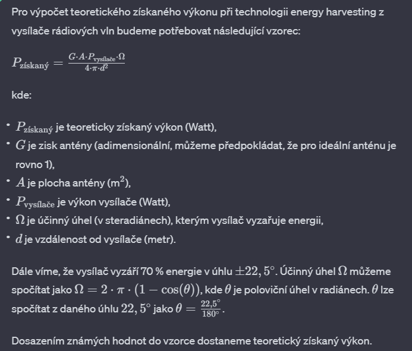
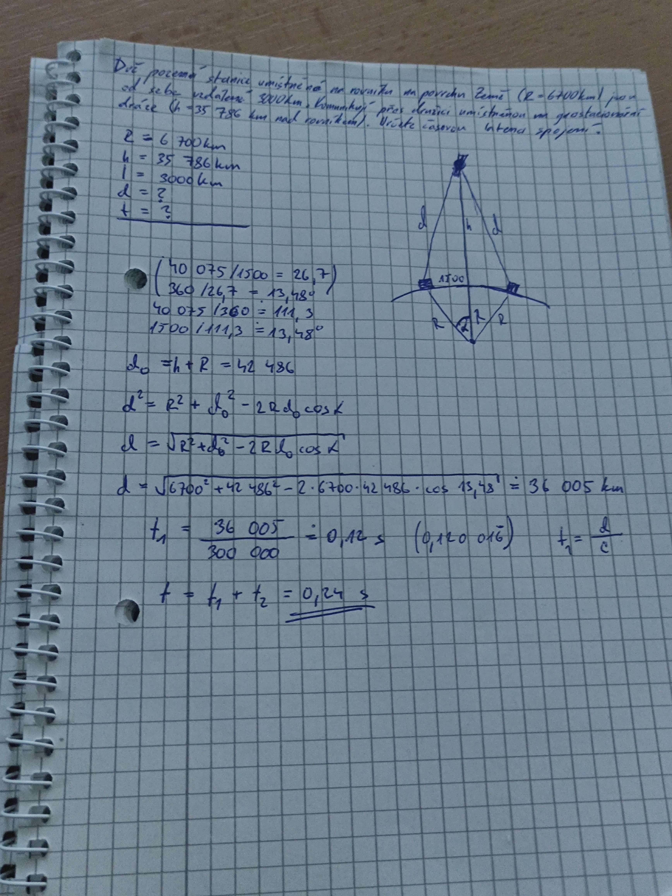

# 
**Príklady, konstanty a vzorce**

## 
1. Príklad

Velmi dlouhé dvouvodičové vedení (např. jeden pár vodičů LAN kabelu) je ze zdroje buzeno harmonickým napětím 1 V o frekvenci 50 MHz. Určete:

1. napětí ve vzdálenosti 3 metry od zdroje, pokud na výstupu zdroje je napětí nulové,
2. délku vlny na vedení,
3. délku vlny na vedení v případě, že je celé ponořené do vody.
>

    V - Napetí V
    f - frekvence Hz
    T - perioda

### Konstanty
**r** - relativní

Permitivita vakua εr₀ = 1 Fm-1

Permeabilita vakua μr₀ = 1 Hm-1

Rychlost světla ve vakuu c = 3×108m/s

Relativní permitivita vody εrH2O = 80 Fm-1

### Vzorce

T = $\frac{1}{f}$

Délka vlny λ = $\frac{c}{f}$

U $_1$ = $U_m\cdot sin 2\pi (\frac{t}{T}-\frac{x}{λ})$

Výpočet rychlosti světla: c $_0$ = $\frac{1}{\sqrt{ε_0μ_0}}$
​
## 
2. Príklad

Popište princip funkce elektromagnetického dipólu a vypočtěte jeho optimální rozměry pro příjem FM vysílání Radia Zlín na frekvenci 91,7 MHz.

K výpočtu budete potřebovat následující konstanty: rychlost šíření vlny ve vakuu (vzduchu).

    L - optimální délka dipólu 
    f - frekvence Hz

### Konstanty

Rychlost světla ve vakuu c = 3×108m/s

### Vzorce

L = $\frac{c}{2f}$

## 
3. Príklad

Přehledový radar letiště umístěný ve výšce 560 metrů nad mořem zachytil letadlo letící ve výšce 10 560 metrů. Čas mezi vysláním signálu a přijetím jeho odrazu od letadla byl 275 µs. Dále určete, jaký je dosah radaru, pracuje-li s opakovací frekvencí 2 kHz.

    d - vzdálenost od radaru k letadlu (delka dráhy signálu)
    t - doba letu signálu od radaru k letadlu a zpět
    R - dosah radaru (polovina délky dráhy signálu)
    c - rychlost šíření elektromagnetické vlny ve vzduchu
    f - opakovací frekvence radaru
    T - doba mezi vysláním signálů radaru

### Konstanty

Rychlost světla ve vakuu c = 3×108m/s

### Vzorce
**t** = $(2\cdot d )/ c$ 

**R** = $(c\cdot t )/ 2$

**f** = $1/T$

## 
4. Príklad

Olejem chlazený třífázový transformátor 3 x 22 kV / 3 x 230 V napájí malou vesnici. Vinutími sekundárních cívek tečou proudy 600 A, 850 A a 770 A. Účinnost transformátoru je 95 %. Určete, jak velký tepelný výkon je nutné uchladit a jaká je teplota oleje na výstupu transformátoru, jestliže rychlost proudění chladicího oleje transformátorem je 0,5 l/s a teplota oleje na vstupu transformátoru (po ochlazení chladičem) je 40 °C.

Hustota transformátorového oleje je 960 kg.m-3 a jeho měrná tepelná kapacita je 2 100 J.kg-1.K-1.

    U - napětí 
    I - proud
    P - výkon
    ρ - hustota 
    V - objem
    c - měrná tepelná kapacita transformátorového oleje
    T - teplota
    T0 - teplota oleje na vstupu transformátoru
    ΔT - je změna teploty oleje
    m - hmotnost oleje.
    W - energie

### Vzorce

P = $U\cdot I$

m = $ρ\cdot V$ 

W = $P\cdot t$ 

W = $m\cdot c \cdot (T - T_0)$

T = $T_0 + (W/(m\cdot c))$

## 
5. Príklad

Výtah o hmotnosti 1,5 tuny má protizávaží o hmotnosti 650 kg. Během 1 minuty vyjede do výšky 45 metrů. Účinnost pohonu je 80 %. Určete:

a) mechanický výkon motoru,

b) příkon výtahu,

c) množství energie změřené elektroměrem a dle aktuální ceny elektřiny na trhu náklady na jednu takovou jízdu.

    P_mechanicky - mechanický výkon motoru
    P_příkon - příkon výtahu
    t - čas
    N - náklady na jednu jízdu
    m - hmotnost výtahu
    g - tíhové zrychlení
    v - rychlost výtahu
    s - dráha

### Konstanty

g = $9.8 m/s^2$

### Vzorce

P $_{mechanicky}$ = $\frac{W}{t}$

W = $F\cdot s$

F = $m\cdot g$

P $_{příkon}$ = $P_{mechanicky}/účinnosť$

N = $Kč\cdot(t\cdot P_{příkon})$

## 
6. Príklad

Rychlovarná konvice ohřeje litr vody z 15 na 95 °C za 2 minuty s účinností 70 % (zejména ztráty sáláním tepla do okolí). Určete:

a) spotřebu energie na uvaření 0,5 litrů čaje,

b) při současných cenách elektřiny náklady na uvaření čaje,

c) vypočtěte, kolik půllitrových čajů lze uvařit pomocí stejného množství energie, které se spotřebuje na celodenní (12 hodin) paření hry Counterstrike na herní stanici s trvalým příkonem 500 W.

Měrná tepelná kapacita vody je 4 200 J.kg-1.K-1. Průběh teploty vody (ohřev a chládnutí) aproximujte lineární funkcí.

    m - hmotnost vody
    c - měrná tepelná kapacita vody
    T - teplota
    ΔT - změna teploty vody
    t - čas
    V - objem
    ρ - hustota 
    W - energie
    P - příkon herní stanice 

### Konstanty

c - 4,200 J/kg·K

1 Wh = 3600 J

### Vzorce 

E = $m\cdot c \cdot (T - T_0)$

ΔT = $T - T_0$

m = $ρ\cdot V$ 

E $_{spotřeba}$ = $E / účinnost$

E $_{hry}$ = $P_{hry} \cdot t_{hry}$ 

## 
7. Príklad

Uprostřed vakua se nachází malá částice, která má hmotnost 1 mg a náboj 0,5 nC. Do času t = 0 je tato částice v klidu. V okamžiku t = 0 na ni začne působit homogenní elektrické pole s intenzitou 30 kV/m. S jakým zrychlením se tato částice bude pohybovat? Jakou dráhu urazí za 0,1 sekundy? Jaká bude velikost okamžité rychlosti částice v čase 0,1 sekundy a jak velká intenzita magnetického pole bude nutná k tomu, aby v čase 0,1 sekundy bylo kompenzováno tíhové zrychlení, které na částici působí?

    m - Hmotnost částice
    q - Náboj částice
    t - čas
    a - Zrychlení částice
    s - Dráha uražená částicí
    g - tíhové zrychlení
    F - síla
    E - elektricke pole
    H - odpoviádajíci intenzita pola

### Vzorce

Zrychlení částice v homogenním elektrickém poli

a = $\frac{F}{m}$

F = $q\cdot E$

a = $\frac{q\cdot E}{m}$

Dráha uražená částicí za čas t

s = $v_0t + \frac{1}{2}at^2$

Okamžitá rychlost částice v čase t

v = $a\cdot t$

Intenzita magnetického pole k zrušení tíhového zrychlení

F $_M$ = $q\cdot v\cdot B$

F $_G$ = $m\cdot g$

F $_M$ = F $_G$ 

>$q\cdot v\cdot B$ = $m\cdot g$

B = $\frac{m\cdot g}{q\cdot v}$

H = $\frac{B}{N_0}$
- N $_0$ permeabilita vakua

## 
8. Príklad

Karel nosí košili s příměsí umělého vlákna, která způsobí, že se na povrchu jeho těla akumuluje náboj o velikosti 1 µC. Jak velké elektrické napětí vzniká mezi ním a okolím? Pokud je odpor jeho kůže 300 Ω, jak dlouho trvá elektrický výboj, když se Karlova ruka přiblíží k uzemněnému předmětu?

Kapacita lidského těla je 150 pF.

    Q - velikost náboje
    R - odpor kůže
    C - kapacita lidského těla
    U - Elektrické napětí
    t - čas

### Vzorce

U = $\frac{Q}{C}$

t = $R\cdot C$

## 
9. Príklad

Jaderná elektrárna dodává do třífázové sítě výkon 3 x 300 MW. Jak dlouhé mohou být vodiče dálkové přenosové soustavy o napětí 400 KV, aby ztráta na vedení nepřesáhla 0,25 % vyrobené energie, uvažujeme-li že jsou použity vodiče o průřezu 150 mm2? Měrný elektrický odpor měděného vodiče je 0,0178 Ω.mm2/m.

    P - výkon elektrárny
    P_max - maximální stráta
    U - napětí
    R - odpor vodiče
    I - proud
    S - průřez vodiče
    ρ - hustota 
    l - délka

### Vzorce

I = $\frac{P}{U}$

R = $\frac{I^2}{P_{max}}$

R = $P\cdot \frac{l}{S}$

>l = $\frac{R\cdot S}{ρ}$

## 
10. Príklad

Hradlo jednoho tranzistoru v procesoru má kapacitu 0,033 pF a jeho prahové napětí je 0,8 V. Napájecí napětí procesoru je 1,15 V.  Na jak vysoké pracovní frekvenci smí procesor pracovat, pokud v jednom taktu spíná průměrně 500 000 tranzistorů a výkonová ztráta procesoru nesmí překročit 20 W?

    C - kapacita jednoho tranzistoru
    U_prah - prahové napětí tranzistoru
    U_napájení - napájecí napětí procesoru
    P_max - maximální výkon procesoru
    N - počet tranzistorů spínajících se v jednom taktu
    f - pracovní frekvence procesoru
    R - odpor vodiče
    I - proud

### Vzorce
R = $\frac{U_{napájení}}{I}$

P $_{max}$ = $R\cdot I^2$ = $\frac{U_{napájení}}{I}\cdot I$ = $U_{napájení}\cdot I$

>I = $\frac{P_{max}}{U_{napájení}}$

I $_{celkovo}$ = $I_{jeden}\cdot N$

Q = $U_{napájení}\cdot U_{prah}$

t = $\frac{Q}{I}$

f = $\frac{1}{t}$

## 
11. Príklad

Bezdrátová nabíječka mobilního telefonu, využívající standard Qi, dodává výkon 15 W. Akumulátor mobilního telefonu má jmenovité napětí 3,7 V, kapacitu 3 200 mAh a nabíjí se s účinností 75 %. Pracovní frekvence nabíječky je 145 kHz. Určete, za jak dlouho se akumulátor nabije z 10 na 90 % své jmenovité kapacity (uvažujeme aproximaci lineární funkcí – přímkou). Vypočtěte, kolik závitů musí mít přijímací cívka, aby se v ní indukovalo špičkové napětí alespoň 4 V, je-li amplituda magnetického indukčního toku nabíjecí cívky 325 nWb a činitel vazby mezi vysílací a přijímací cívkou je 0,6. Určete, jak velký proud teče vinutím nabíjecí cívky, jestliže počet jejích závitů je 20, a její efektivní plocha je 25 cm2. Uvažujeme čtvercovou cívku 5 x 5 cm a harmonické průběhy proudu a napětí, které pro případ derivace magnetického indukčního toku podle času aproximujeme přímkou mezi kladným a záporným maximem harmonické funkce.

    P -výkon nabíječky
    U_akumulator - napětí akumulátoru
    Q_k - kapacita akumulátoru
    n - účinnost nabíjení 
    f - pracovní frekvence nabíječky
    Φ - amplituda magnetického indukčního toku nabíjecí cívky
    k - činitel vazby mezi vysílací a přijímací cívkou
    N - počet závitů přijímací cívky
    S - efektivní plocha nabíjecí cívky
    I - proud tečící vinutím nabíjecí cívky
    t - doba nabíjení akumulátoru

### Vzorce 

t = $\frac{Q_k\cdot(U_{akumulator}\cdot(90\%-10\%))}{n\cdot P}$

$\Phi _{edit}$ = $k\cdot \Phi$

U $_{špičkové}$ = $k\cdot N\cdot \Phi \cdot 2\pi \cdot f$

>N = $\frac{U_{špičkové}}{k\cdot \Phi \cdot 2\pi \cdot f}$

## 
12. Príklad

Při konstrukci Gaussovy pušky máme k dispozici kondenzátory o celkové kapacitě 1000 µF. Na jak vysoké napětí je musíme nabít, abychom v nich naakumulovali energii o velikosti 426 J (odpovídá typické energii pistolového náboje Luger 9x19)? Jak velké zrychlení musí mít náboj, který je urychlován cívkou o délce 3 cm tak, aby urychlení proběhlo v první polovině dráhy cívky (princip funkce Gaussovy pušky), přičemž rychlost náboje má být 400 m/s. Jak velká indukčnost cívky je potřeba a kolik závitů musí cívka mít, je-li její vnitřní průměr 9 mm? Nakonec z energie a rychlosti vypočtěte optimální hmotnost náboje.

    C - celková kapacita kondenzátorů
    U - napětí na kondenzátorech
    E - akumulovaná energie na kondenzátorech
    q - náboj urychlovaný cívkou
    l - délka cívky
    s - polovice délky cívky
    v - rychlost náboje
    L - indukčnost cívky
    d - vnitřní průměr cívky
    r - polomner 
    N - počet závitů cívky
    m - hmotnost náboje

## Vzorce

E = $\frac{1}{2}\cdot C \cdot U^2$

>U = $\sqrt{\frac{2E}{C}}$

v = $a\cdot t$ 

>a = $\frac{v}{t}$

s = $\frac{1}{2} a \cdot t^2$ = $\frac{1}{2}\cdot \frac{v}{t}\cdot t^2$

>t = $\frac{2s}{v}$

r = $\frac{d}{2}$

f = $\frac{1}{2\pi \sqrt{C\cdot L}}$

T = $\frac{1}{f}$ = $2\pi \sqrt{C\cdot L}$

t = $\frac{1}{2} T$ = $\frac{2\pi \sqrt{C\cdot L}}{2}$

L = $\frac{t^2}{C \cdot \pi^2}$

N = $\sqrt{\frac{L\cdot l}{\mu _0 \cdot \pi r^2}}$

m => zakon zachovani energie

E = $E_K$

E $_K$ = $\frac{1}{2} \cdot m \cdot v^2$

m = $\frac{2E}{v^2}$

## 
13. Príklad

Stejnosměrný elektrický motor má rotor o průměru 5 cm a délce 10 cm. Vinutí rotoru je rozděleno na 5 sekcí, z nichž každá má 100 závitů. Magnetické pole statoru je generováno permanentními magnety a jeho velikost je 0,2 T. Komutátor připojí příslušnou sekci vinutí vždy, když je úhel záběru menší nebo roven -36° a odpojí ji vždy, když je úhel záběru větší nebo roven 36°. Střední velikost proudu vinutím je 10 A, motor je napájen z trakční baterie o napětí 48 V. Určete střední velikost krouticího momentu (mění se s úhlem natočení vinutí), výkon (=příkon) motoru a vypočtěte pracovní otáčky motoru při zatížení vypočítaným momentem síly. Všechny ztráty zanedbáváme, počítáme s účinností přeměny energie 100 %. 

    B - velikost magnetického pole statoru | magnetická indukce v prostoru motoru
    N - počet závitů vinutí
    I - střední velikost proudu vinutím
    U - napětí 
    r - poloměr rotoru
    l - délka rotoru
    M - krouticí moment
    P - výkon 
    ω - pracovní otáčky motoru
    F - síla

### Výpočet
Rozdelíme li kruhový tvar rotoru (360°) na 5 sekcí, z nich každá má dvě části (směr tam a směr změt), na každé sekci přidáme 36°. V ideálním případě vinutí zabírá v uhlu -18° od ideální polohy a je vypnuto v úhlu +18° se ideální poloha a jeho funkci převezeme následujíci vinutí.

Pro maximální síly
### Vzorce
F = $2 \cdot B \cdot N \cdot I \cdot l$
- 2 ramena síly
- N počet závitů
- I proud
- l délka 1 vodiče (1 závitu)
- B magnetická indukce v prostoru motoru

M = $F \cdot r$

P = $U \cdot I$

$\omega$ = $\frac{P}{M}$

$\omega$ = $2 \pi f$ -> $2 \pi f$ = $\frac{P}{M}$ -> f =$\frac{P}{2 \pi M}$

## 
14. Príklad

Vysílač rozhlasové stanice FM rádia pracuje s výkonem 5 kW, přičemž jeho vyzařovací diagram je tvarován tak, že 70 % energie je vyzářeno v oblasti ± 22,5° od horizontální roviny protínající osu vysílače (viz obrázek). Vypočítejte, kolik výkonu lze teoreticky získat pro technologii energy harvesting ve vzdálenosti 10 km od tohoto vysílače na ploše 1 m2.

    P - výkon 
    PΩ - výkon v úhlu
    r - vzdálenost od vysílače
    n - % energie vyzářeno v dané oblasti
    Ω - účinný úhel
    S -  plocha antény
    I - Intenzita signálu
### Vzorce

P $_\Omega$ = $n \cdot P$

I = $\frac{P}{4\pi r^2}$

P = $I \cdot A$

**Toto je asi cele zle tak to tak sem ešte pridávam ChatGTP odpoveď**

## 
15. Príklad

Mezi body A a B je nataženo dvouvodičové telefonní vedení. Vedení je zhotoveno z měděného vodiče průměru 3,2 mm. Na vedení došlo k poruše zkratem mezi vodiči. Měřením pomocí ohmmetru v bodě A bylo zjištěno, že zkratované vedení má odpor 51 Ω. V jaké vzdálenosti od bodu A je porucha?

    R - odpor vodiče
    ρ - měrný odpor materiálu
    d - délka vodiče 
    l - vzdálenosti od bodu A
    S - průřez vodiče

### Vzorce

S = $\frac{\pi \cdot d^2}{4}$

$\rho$ = $\frac{R\cdot S}{2l}$
>l = $\frac{R\cdot S}{2\rho}$

## 
16. Príklad

V souvislosti s rozšířením mobilních telefonů pojednejte o problematice specifické míry absorpce (SAR) - co to je, proč se to měří, jakými způsoby se to měří, jak si mobilní telefony stojí a jakým způsobem lze jejich vyzařování omezit (vč. algoritmů řízení radiové části).

**
Fucking teorie
**

## 
17. Príklad

Pojednejte o datových sítích pro technologii IoT (SigFox apod.). Zaměřte se na datové protokoly, pracovní frekvence, intenzitu signálu, rychlosti datových toků.

**
Fucking teorie
**

1.  Sigfox:
    1.  Datový protokol: Sigfox používá svůj vlastní komunikační protokol, který pracuje na nízké úrovni OSI modelu.
    2.  Pracovní frekvence: Typicky v pásmu ISM (Industrial, Scientific and Medical) okolo 868 MHz v Evropě, 902 MHz v Severní Americe a 923 MHz v Asii a Tichomoří.
    3.  Intenzita signálu: Sigfox používá modulaci GFSK (Gaussian Frequency Shift Keying).
    4.  Rychlost datových toků: Sigfox má omezenou rychlost přenosu dat, obvykle v řádu desítek bitů za sekundu.

2.  LoRaWAN (Long Range Wide Area Network):

    1.  Datový protokol: Využívá protokol LoRaWAN pro správu sítě a přenos dat.
    2.  Pracovní frekvence: Využívá licencovaná a nelicencovaná pásmo frekvencí, např. v pásmu 868 MHz v Evropě.
    3.  Intenzita signálu: Používá modulaci chirp spread spectrum.
    4.  Rychlost datových toků: Rychlosti dat mohou být nastaveny podle požadavků aplikace, od několika bitů za sekundu až po několik set kilobitů za sekundu.

3.  NB-IoT (Narrowband IoT):

    1.  Datový protokol: Využívá standardní IP protokoly.
    2.  Pracovní frekvence: Typicky v licencovaných frekvenčních pásmech.
    3.  Intenzita signálu: Využívá schopnost pronikání do vnitřních prostor budov.
    4.  Rychlost datových toků: Nabízí nízkou přenosovou rychlost, obvykle v řádu několika kilobitů za sekundu.

## 
18. Príklad

Pojednejte o součástce zvané varikap a vypočtěte následující příklad: Ladicí obvod FM přijímače pracuje s určitou rezervou v rozsahu od 86 do 110 MHz. V jakém rozmezí se musí měnit kapacita varikapu (poměr) umístěného na čipu ladicího obvodu? 

    f - frekvence

### Vzorce
f = $\frac{1}{2\pi \sqrt{C\cdot L}}$

Pomner = $\frac{f_1}{f_2}$ = $\frac{\frac{1}{2\pi \sqrt{C_1\cdot L}}}{\frac{1}{2\pi \sqrt{C_2\cdot L}}}$ = $\sqrt{\frac{C_1}{C_2}}$

## 
19. Príklad

Dvě pozemní stanice, umístěné na rovníku na povrchu Země (R = 6 700 km) jsou od sebe vzdáleny 3 000 km. Komunikují přes družici umístěnou na geostacionární dráze (h = 35 786 km nad rovníkem). Určete časovou latenci spojení.

    R - poloměr Země
    h - výška geostacionární dráhy nad rovníkem
    d0 - vzdálenost od pozemní stanice ke geostacionární družici
    d_celkova - celková vzdálenost spojení
    l - vzdálenost stanic od sebe
    v - rychlost elektromagnetické vlny (rychlost světla)
    t - čas

d $_0$ = $r + h$

d $_{celkova}^2$ v = $R^2$

## 
20. Príklad

Šířka komunikačního kanálu mobilního telefonu standardu GSM je 30 kHz, frekvence nosné vlny je 960 MHz. Jakou rychlostí se smí mobilní telefon pohybovat kolmo k pozemní stanici, aby nedošlo k „vypadnutí“ z kanálu? (hint: Dopplerův jev)

    f - vyslaná frekvence

    Δv - rychlost objektu

    c - Rychlost světla

    Δf - šířka pásma

Δv = $\frac{\frac{1}{2}\Delta f \cdot c }{f}$