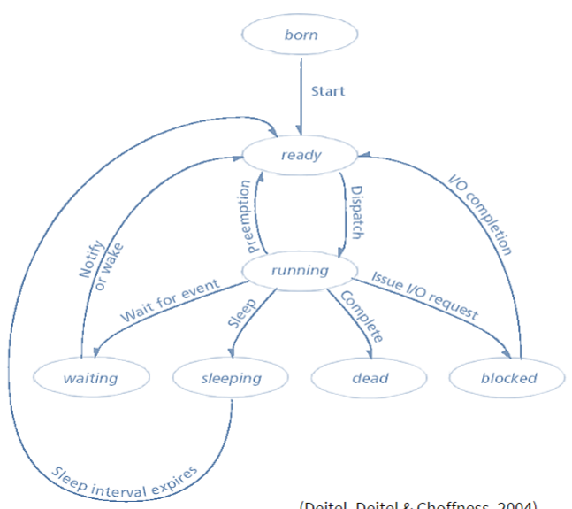

# 
OPSYS

## témy od najčastejšej

    virtualna pamet, strankovanie
    Deadlock
    Suborovy system FAT
    EXT
    subeh
    Zivotny cyklus procesu
    Vlakna
    multitasking
    Prerusenia

## kombinácie tém

- multitasking stránkování a Virtuální paměť
- Virtuální paměť, strankovanie a FAT
- Životní cyklus procesu Uváznutí
- Virtuální paměť, stránkování a Souborový systém EXT
- Virtuální paměť a stránkování + životní cyklus procesu
- Virtuální paměť + stránkování a výběr jakéhokoliv souborového systému
- Vlákna a Virtuální paměť + stránkování

# <b>
Virtuální paměť se stránkováním
</b>

- Swapování - Proces který se uloží z pamněti na disk, vždicky celý, lze tak využít "více" paměti
  - 
- FAP - Fyzický adresní prostor
- LAP - logický adresní prostor
- Dochází k překladu v cpu který kontroluje každý uživatelský přístup

## Stránkování

- Fyzický adresní prostor procesu může být nesouvislý
- FAP rozděluje na části pevné velikosti, nazývané rámce (frames)
- LAP rozděluje na části stejné velikosti, nazývané stránky (pages)
  - Velikost je mezi 512 B až 1 GiB
- Toto řeší externí fragmentaci ale pořád může vznikat interní fragmentace
- Adresa generovaná cpu se rozdělí na dvě části
  - číslo stránky v logické paměti
  - posun od začátku stránky (page offset)
  - 
  - 
- Stránky mají různé atributy
  - generic info - že je platná, jak je velká, komu patří
  - Řízení přístupu - read/write user/root
  - optimalizace - cache
  - statistiky - psalo se do ní, četlo se z ní a kdy
- Tabulka stránek může být dost velká
  - inverzní tabulka
  - dvouúrovňová tabulka
  - více tabulek hiearchivky

## Virtuální pamět

- Oddělení LAP od FAP
- LAP může být mnohem větší než FAP
- Virtuální paměť je implementována pomocí segemtnace nebo stránkování

# <b>
Souborové Systémy
</b>

- Struktura
- Organizují soubory a spravují přístup k datům
- poskytují jmenný prostor pomocí adresářů
- Adresář:
  - zvláštní případ souboru
  - Vytváří se adres. strom který obsahuje soubory a dresáře
  - Každý proces má svůj pracovní adresář
- Acyklická struktura
  - link: jeden soubor se odkazuje na druhý
  - Soft link - obsahuje text s cestou jinam
  - Hard link - fyzicky ve FS zapsaný jako soubor na který odkazuje
  - 
- Fragmentace je:
  - Externí - soubor je rozdělen na více částí
  - Vnitřní - Poslední klastr není plně využit, větší klastry tak způsobují větší ztrátu místa
  - Fragmentace volného místa - Vzniká mazáním malých souborů
- Způsob zápisu na disk
  - Souvisle:
    - Soubor je uložen po blocích za sebou
    - Pro přístup stačí pouze délka a pořáteční pozice
    - Velká fragmentace, nepoužívá se
    - 
  - Vázané přidělování
    - Každý soubor je provázaný seznamem diskových bloků (linked list)
    - Dost blbé je že pokud ztratíe jeden blok, ztratíte i zbytek bloků na který tento soubor ukazoval
    - Musí se vždy číst od začátku
    - 
  - Tabulkové přidělování
    - Udržuje provázaný seznam odkazů v tabulce
    - Položky adresáře označují první blok souboru
    - Aktuální číslo bloku se používá jako index do tabulky přidělování bloků k určení umístění dalšího bloku
    - např. Souborový systém FAT
    - 
  - Indexované přidělovýní
    - každý soubor má indeový blok nebo bloky
    - Obsahují seznam ukazatelů které ukazují přímo na datové bloky souborů
    - 
- Management volného místa
  - Dřív se neřešila
  - Volné pozice lze udržovat v:
    - seznamu
    - V bitmapě - 0vé bity značí volný blok
    - 
- KDE JE ULOŽEN NÁZEV SOUBORU - ADRESÁŘ
- Konzistence dat:
  - žurnálový systém (udžuje záznamy o provedených akcích, atomické operace)
  - Pokud dojde k selhání systému tak by data mohla být nekonzistentní
  - FS si udržuje informace o dokončených a rozdělaných operacích takže lze obnovit při pádu zpět na původní stav
- vysvětlit princip souborového systému -> tabulkový linkovaný seznam

## FAT

- Pojmenován podle způsobu ukládání - File Alocation Table
- Jednoduchý souborový systém původně navržený pro malé disky a jednoduché struktury složek
- Udržuje provázaný s eznam v samostatné tabulce
- Tabulka má dvě kopie
- Svazek formátovaný na FAT je alokován po clustrech
- Kluster - nejmenší možné místo na disku, které lze použít k uložení souboru
- Vyhrazená oblast pro MBR
- Oblast FAT
- kořenový adresář
  - má pevně danou pozici na disku
- Vnitřně umí jen velká písmena, a pokud hledá tak si na to název převádí

## EXT

- BTRFS, JFS, ZFS, EXT,(2,3,4)
- Na začátku je supreblock - obsahuje všechny informace o konfiguraci FS
  -velikost, rozsah adres, stav připojení, ukazatel na tabulku iuzlů, počet iuzlů, kdy byl změnen, UID
- Kopie tohoto bloku jsou uloženy na několika místech
- Obsahuje:
  - Bitmapa bloků
  - Bitmapa uzlů
  - Datové bloky
  - redundantní kopie superbloku
- Primární kopie je uložena v offsetu 1024B od začátku
- Bloky jsou ve skupinách aby se snížila fragmentace a nemuselo tak daleko jezdit hlavou disku
- Dva bloky každé skupiny jsou vyhrazeny pro bitmapu místa
- iuzel:
  - Každý objekt je jím reprezentován
  - Obsahuje ukazatele na bloky
  - metadata
    - oprávnění
    - vlastník
    - data, vytvoření, přístupu zápisu
    - počet odkazů
- velikost bloku se určuje při formátování
  - Má vliv na výkon a max velikost souboru a systému souborů
- Ext2 používal k uložení názvu do adresáře linked list, pozdější verze hash nebo bin stromy
- Ext3 = ext2 + žurnálování
  - 3 úrovně žurnálování
    - writeback - pouze metadata
    - Ordered - Změny metadat ale pouze až se provedou v systému
    - journal - zapúisuje data i metadata, vše se musí stát dvakrát - pomalejší, bezpečnější
- Ext4
  - neomezeně podsložek
  - Umí předpřidělit místo na disku
  - hash metadat v journalu
  - šifrování
  - zpětně kompatibilní

## NTFS

- Podporuje hardlinky - soubor má více než jedno jméno
- Umí dlouhé názvy ale je kompatibilní s 8.3
- Diskové kvóty
- komprese
- šifrování
- Odkazové body - lze spouštět kód před přístupem k nějakým souborům
- Sparse files - mega velký soubor bez dat
- Více dat proudů
- 12 interních souborů pro metadata - vznikají při formátu, nejsou přístupné
- MFT pro ukládání záznamů o souborech, je to relační databáze
  - Obsahuje aspoň jednu položku pro každý záznam na svazku
  - Ve výchozím nastavení je 12.5% vyhrazeno pro MFT
  - Každý záznam je tvořen množinou atributů souboru
- Pokročilé možnosti oprávnění

# <b>
Multitasking
</b>

- Jde o střídání procesů což vytváří iluzi že běží naráz
- Je možný i s jedním procesorem
- Přepínání:
  - přeruŚí se běh procesu
  - uloží se jeho stav
  - načte se stav jiného procesu
- Preemptivní multitasking
  - Používají ho moderní OS
  - preempce je přerušení probíhajícího procesu
  - Používají se přerušení - pokud nastane je přerušen tak že jej lze zase obnovit
- Dochází k přepínání konetxtů
  - Ukládájí se do PCB
  - Každé přepnutí je rižie - žádné pořádně využité cykly
  - O přepínání procesy neví
  - 

# <b>
Vlákna
</b>

- Je to odlehčený proces
- Jsou plánována na CPU
  - Bod běhu
  - Každý proces má minimálně jedno
- Neexistuje samo ale patří do procesu
  - Sdílí mnoho zdrojů
  - regisrty, zásobník a proměnné má každé vlákno vlastní
- Vlastník je stále porces
- Kontext je uložen v TCB (Thread Control Block) - PCB pro vlákna
- Multithreading
  - Více vláknové zpracování odkazuje na schopnost operačního systému podporovat v rámci jednoho procesu více vláken.
- Výhody vláken
  - Lepší škálování pro systémy s více procesory
  - Sdílený adresní prostor má menší režii než IPC
  - Méně času na vytvoření a ukončení vlákna v procesu
  - Méně času na přepínání mezi dvěma vlákny v rámci stejného procesu než na přepínání mezi procesy
  - Existuje šance, že nějaká data procesu zůstanou v cache
  - zvyšují efektivitu komunikace v rámci procesu.
- Operace s vlákny - Vlákna a procesy mají společné operace
- Stavy vláken
  - Born – Initicializace vlákna.
  - Ready – Vlákno je připravené k vykonání, čeká na CPU.
  - Running – Vykonávané vlákno.
  - Waiting – Vlákno čeká na událost.
  - Sleeping – Vlákno je uspáno po definovaný čas.
  - Blocked – Vlákno čeká na provedení I/O požadavku.
  - Dead – Vlákno bylo dokončeno
- 

# <b>
Deadlock (uváznutí a obnova)
</b>

- Dva nebo více procesů čeká na událost ke které může dojít jen pokud jeden z těchto procesů bude pokračovat;
- Může způsobit hodně problémů
- Jednoduché úváznutí Proces1 má zdroj1 a chce zdroj2 ale zdroj2 je momentálně přiřazen procesu2 který čeká na zdroj1

## Cofmannovy Podmínky uváznutí

- Uváznutí může nastat jen když jsou splněny všechny čtyři podmínky současně
  - Mutexová - zdroj může být naráz používán jen jedním procesem
  - Proces drží zdroje a čeká na uvolnění dalších zdrojů aby je získal
  - Přidělené zdroje nejdou násilně odebrat
  - Zacyklení požadavků - více procesů čeká v kruhu na jedn nebo více zdrojů které drží další proces v řetězci

## Řešení uváznutí

- prevence - zajistíme že nikdy nemůže nastat (porušíme podmínky vzniku)
  - Postupné uplatňování
    - pokud proces chce zdroj nesmí mít žádné další zdroje, pokud jich chce víc naráz, musí je uvolnit a znovu zažádat
    - Může docházet k vyhladovění a neefektivnímu využití
- vyhýbání se
  - Pokud je riziko že vznikne tak se prostředek nepřidělí
  - Hrozí vyhladovění
  - Řešení:
    - Lze obejít násilným odebráním zdrojů
      - To je riskantní kvůli potencionální ztrátě dat
    - Zabránění zacyklení
      - zdroje jsou číslovány a lze je odebírat pouze v vzrůstající pořadí
    - Extra info
      - Proces musí deklarovat jaké max využití může chtít
      - Nejjednodušší a nejužitečnější model
    - Dynamické zkoumání stavu
      - Dijsktrův algorytmus
    - Když proces požaduje dostupný zdroj, musí systém rozhodnout zda okamžité přidělení zanechá systém v bezpečném stavu
    - nebezpečný stav neznamená že došlo k uváznutí, jen že to hrozí
- Detekce a obnova - Uváznutí je detekováno a zajistí se obnova na stav před uváznutím
  - Systém uváznutí připouští
  - udržuje čekací graf který pravidelně kontroluje a pokud najde cyklus našel i uváznutí
  - Možnosti obnovy
    - preemce zdrojů - najde si oběť které je odebere
    - Navrácení procesu do původního stavu
    - Zotavení pomocí zabíjení procesů
- Ignorování hrozby
  - Necháme na uživately aby jedenz procesů ručně zabil

# <b>
Souběh
</b>

- Taky race condition
- Situace kdy několik procesů přistoupí ke sdíleným datům naráz a jeden z nich data změní
- Konečná hodnota závisí na tom kdo se tam dostane a skončí dřív
- Aby se mu zabránilo musí být procesy synchronizovány
- Kritická sekce
  - Kritická sekce je ta část kódu kde se přistupuje ke sdílené paměti
  - Může se to posrat i při počítání čísel
  - Operace zápisu musí být vzájemně výlučné
  - Operace zápisu musí být vzájemně výlučné s operacemi čtení
  - Operace čtení (bez modifikace) mohou být souběžné
  - Pro zabezpečení integrity dat se používají zámky
- Co je to vyhladovění
  - Dva procesy se střídají v kritické sekci a třetí se tak nedostane na procesor
- Řešení kritické sekce
  - Mutex (Vzájmené vyloučení)
    - Mutual Exclusion
    - Pokud se nějaký proces nachází ve své kritické sekci, pak žádný další proces nesmí být připuštěn do své kritické sekce
    - Chrání kritickou sekci pomocí zámku
    - při opuštění sekce jej uvolní
  - Aktivní čekání
    - Nepřetržité testování proměnné, dokud se neobjeví nějaká hodnota
    - Plýtvá cykly cpu
    - obvykle nechceme
    - Pokud předpokládáme že čekání bude krátké - spinlock
  - Semafor
    - zobecněný mutex
    - Používá celé číslo
    - Přistupuje se k němu přes atomické operace wait() a down() nebo signal() a up()
  - Semafor & mutex rozdíl
    - Mutex
      - Je zamykací mehanizmus používaný k synchronizaci
      - Pouze jedno vlákno může mít mutex
      - více úkolu má přístup k prostředku ale jen jednotlivě
    - Semafor
      - je signalizační mechanismus
      -Hodnotu může změnit která koliv úloha pracující se zdrojem
      - Umožňuje více úkolům přistupovat k určitému počtu instancí zdroje
  - Spinlock
    - Používá se tam kde by trvalo dýl přepnout proces než prostě čekat
    - používá se v jádře

# <b>
Proces a jeho cykly
</b>

- Pojmy
  - Job - úloha, celková práce skládá se z úkolů
  - task - ukol, často úkol = proces úkol popisuje co a jak proces dělá
  - Program - posloupnost instrukcí
  - proces - běžící program, obsahuje jedno a více vláken
  - Vlákno - bod běhu, jednotka plánování a provádění
  - PCB - procesová tabulka a ProcesControlBlock
    - Deskriptor procesu
- Komunikace mezi procesy
  - Sdílená paměť
  - Roury
  - Sockety
  - Soubory
  - Signály
- Paralelismus X pseudoparalelismus
  - Proces umožnňuje vykonávat paralelní operace
  - Jedno jádro dokáže jedno vlákno
  - 
- Definice procesu
  - jde o instanci běžícího programu
  - Má vlastní izolovaný adresní prostor
  - Textová část (program)
  - datová část (data programu)
  - Obsahuje otevřené soubory, vlákna, stavy registrů
  - Jde jednoznačně určit jeho stav a jím vlastněné zdroje
  - Proces má své PID
  - Podléhá plánování
  - OS na něm vykonává operace jako vytvoření, rušení, odložení, obnovení nebo vzbuzení
  - Stack roste proti haldě, halda začíná na nule, stack na maximu
  - proces může spawnovat další procesy
  - Max jeden rodič ale děcek víc
- Typy
  - IO vázany
    - Více závisí na IO než na výpočtech
    - Mnoho krátkých využití cpu
    - Editory, prezentace
  - CPU vázany
    - většinou hodně počítají
    - Kodování a přehrávání videa
- Stavy procesu
  - Nový - vytvořen
  - running - běžící - je vykonáván
    - byl první ve frontě a bylo mu přiděleno CPU
  - Ready - připravený na výkonání až bude CPU volný
    - Běh procesu byl přerušen
    - Nastala událost na kterou čekal
  - Blokovaný/čekající - čeká na něco (sí I/O vstup, klávesnice; čeká na událost)
    - čeká a nemůže pokračovat
  - Terminated - ukončen ale pořád vlastní nějaké sys prostředky
  - 

# <b>
Plánování
</b>

- Dlouhodobé
  - vybírá procesy které mají být přesunuty do fronty připravených
  - Sopouštěn málo
- Středodobý
  - Odkládá z paměti
  - Stránkjue swapouje
  - Už se tak nepoužívá protoéž hodně paměti
- Krátkodobý
  - Vybírá kdo bude mít cpu jako další
  - Někey je jediný v systému
  - Volán často (ms)
- Různé typy priorit
  - Uživatelské - doba zpracování, odpovědi, dosažení meze
  - Systémové - propustnost, využití cpu, spravedlnost, vyvážení I/O
- Plánovací algorytmy
  - FIFO
  - Nejkratší ukol první
    - Na cpu jde proces který potřebuje nejmíň času na dokonční - nikdo ale neví jak dlouho bude trvat
    - Nejlepší pro rychlou zpětnou vazbu
    - Nelze reálně implementovat
  - Nejkratší zbývající čas
    - Podle toho jak dlouho tam trávil minule se předpokládá že tam bude trávit i teď
  - prioritní
    - Každý proces má číslo
    - Stejná priorita používá jiný algortymus
    - muže dojít k vyhladovění které se řeší stránutím -> zvyšování priorit
  - Multilevel fronta
    - Více front
    - Procesy ve skupinách
    - Fronta má své vlastní plánování
    - fronta má prioritu
  - Multilevel zpětnovazební fronta
    - Proces se pohybuje mezi frontami podle toho jak využívá cpu
    - Ten kdo dlouho čejkal s nízkou prioritou může být přesunut na větší
  - Round robin
    - Všem stejné množství času, jakmile vyprší jde další proces
- Plánování s více járdy
  - Master/slave:
    - Jedno cpu pro jádro
  - Moderní je SMP
    - Všechny jádra sou si rovna
    - každý cpu má svou frontu
    - CPu nemusí nutně běžet na stejných jádrech

ZDROJ: [http://zapisy.synology.me/3sem/OpSystemy/Zkouska.html](http://zapisy.synology.me/3sem/OpSystemy/Zkouska.html)
