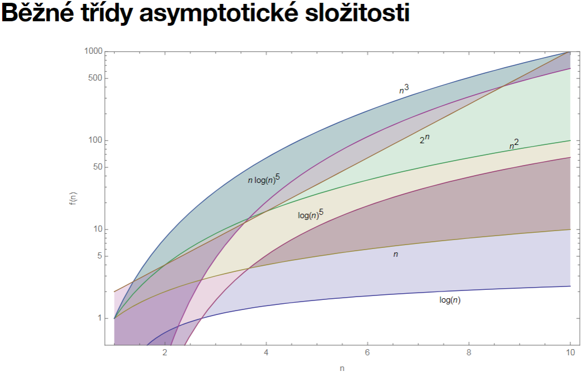
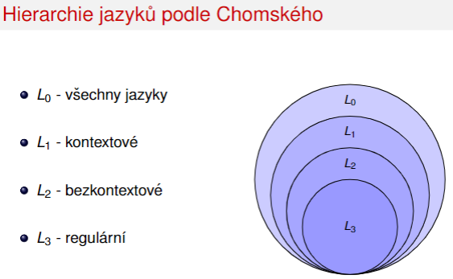
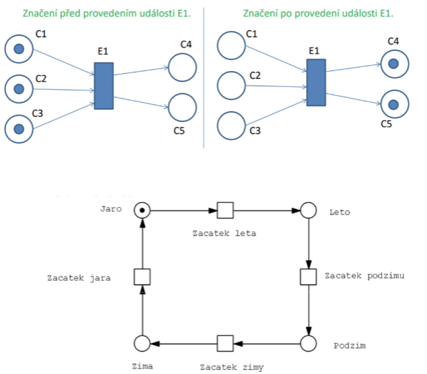
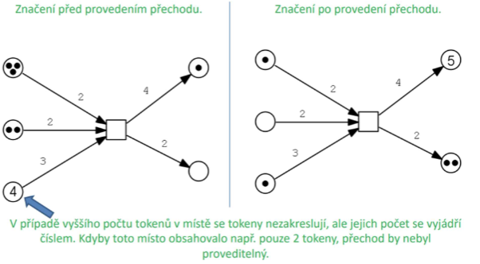
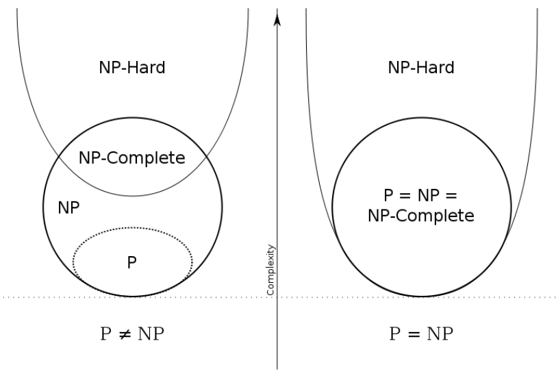

<!-- 
STAG-AUIUI/AP3TI (2023/24, ZS), prezenční Dobrý den, jak jsme se domlouvali na poslední ehm...jakožepřednášce, materiály zrychleně proletíme příště (11.12.), a ukážu Vám  třeba i vzorové otázky (když se mi bude chtít a napečete cukroví) . 
Na pondělí 18.12. je naplánovaný pokusný dobrovolný předtermín. Zde v souborech máte přednášky + podpůrné materiály.
V podpůrných materiálech najdete zejména knížku TZI (teoretické základy informatiky) která se dá jako jedna z mála přečíst, aniž by člověka poléval studený pot a zoufalství. Velice Vám doporučuji zejména úvodní části, týkající se relací, symboliky, predikátového počtu a pak samozřejmě jazyků a automatů a motivací. 

1.
Co se týče zkoušky - z úvodní přednášky o algoritmech, jen výčet vlastností, jaké jsou typy algoritmů a jejich klíčové vlastnosti. 

2.
Z časové složitosti samozřejmě vědět o co jde, na čem závisí, co jsou asymptotické třídy, jaké jsou druhy (best, worst, average scenario), jaké jsou typické třídy + příklady, metody zrychlení. 

3.
Jazyky + gramatiky - co je to gramatika, terminály neterminály, hierarchie, přílklady. 

4.
Formální modely - základni definice, jak to šlo KA, NKA (rozdíl determinismus vs nedeterminismus), zásobník, Churchuv teorém -> turingův stroj a další stroje. 

5.
Petriho sítě - pouze C/E a P/T sítě.  

6.
P-komplexita  - třídy, umět vysvětlit P vs NP, grafické sovislosti, co je spešl na NPC. 

7.
A nakonec rozdíl mezi verifikací a testováním a nějaké pojmy typu vstupní vs výstupní predikát, vektory programu, není potřeba se učit schémata - ta část prezentace je tam jen na odstrašení, jak vypadá prezentace na matfyz  Více si ale řekneme příště. 

Už teď ale vážní zájemci začněte s přípravou a četbou romantických poémů o množinových relacích, algebře v informatice, a formálním modelům s thrillerem v podobě dystopické vize, kdy  P=NP a NP = P ... 
-->

# 
Teorie Informatiky

## 
 **ALGORITMY** 

<!-- 
1.
Co se týče zkoušky - z úvodní přednášky o algoritmech, jen výčet vlastností, jaké jsou typy algoritmů a jejich klíčové vlastnosti. 
-->
### Algoritmus vs. výpočetní metoda
algoritmus musí být konečný, zatímco výpočetní metoda ne

### Vlastnosti algoritmu
1.  Konečnost (finitnost - )musí skončit v konečném počtu kroků
2.  Obecnost (hromadnost, masovost, univerzálnost) - neřeší jeden konkrétní problém (např. „jak spočítat 3×7"), ale obecnou třídu obdobných problémů
3.  Determinovanost - Každý krok algoritmu musí být jednoznačně a přesně definován, pro stejné vstupy dostaneme pokaždé stejné výsledky. 
4.  Výstup (resultativnost) - musí mít alespoň jeden výstup
5.  Vstup
6.  Efektivita

#### Členění algoritmů
1.  Rekurzivní algoritmy, které využívají (volají) samy sebe
2.  Hladové algoritmy, které se k řešení propracovávají po jednotlivých rozhodnutích. Jakmile je učiněno rozhodnutí, není již dále revidováno. 
3.  Algoritmy typu rozděl a panuj dělí problémy na menší podproblémy, na něž se rekurzivně aplikují (až po triviální podproblémy, které lze vyřešit přímo). Pak se dílčí řešení vhodným způsobem sloučí.
4.  Algoritmy dynamického programování
5.  Pravděpodobnostní algoritmy
6.  Genetické a další evoluční algoritmy (podrobněji v 2. ročníku magisterského 
stupně)
7.  Heuristické algoritmy, které nemají za cíl nalezení přesného řešení, ale pouze vhodného přiblížení.

## 
 **Časová Složitost** 

<!-- 
2.
Z časové složitosti samozřejmě vědět o co jde, na čem závisí, co jsou asymptotické třídy, jaké jsou druhy (best, worst, average scenario), jaké jsou typické třídy + příklady, metody zrychlení. 
-->
Obecněřečeno: časová složitost udává, jak dlouho bude algoritmus běžet v závislosti na velikosti vstupních dat.

### Na čem závisí
Obvykle to zahrnuje definování matematické funkce, která určuje závislost **počtu kroků** (časovou složitost algoritmu – time complexity) nebo **velikost potřebné paměti**, kterou algoritmus použije (paměťová/prostorová složitost – space complexity) na velikosti vstupu algoritmu.

### co jsou asymptotické třídy
Pomocí asymptotické analýzy můžeme velmi dobře definovat nejlepší případ, průměrný případ, včetně nejhoršího scénáře algoritmu.

V teoretické analýze algoritmůje běžné odhadovat jejich složitost v asymptotickém smyslu, tj. <b>odhadnout funkci složitosti pro libovolně velký vstup.</b>
#### Cases
1.  Best Case – Minimální čas potřebnýpro provedení programu.
2.  Average Case – Průměrnýčas potřebnýpro provedení programu.
3.  Worst Case – to je maximální čas potřebnýk provedení programu.

#### Notace
1.  O-notation - konkrétně popisuje scénář nejhoršího případu a může být použita k vyjádření potřebného času výpočtu nebo použitého prostoru (např. v paměti nebo na disku) pomocí algoritmu.
2.  Ω-notation (Omega)- formální způsob, jak vyjádřit dolní hranici doby běhu algoritmu. Měří nejlepší časovou složitost nebo nejlepší dobu, kterou může algoritmus případnětrvat.
3.  Θ-notation (Theta) - formální způsob, jak vyjádřit dolní i horní hranici doby běhu algoritmu

#### Běžné třídy asymptotické složitosti
    Θ (1) - čas nezávisí na velikosti vstupu (minimální výskyt)
    Θ (logn) - logaritmický růst (hledání dat v binárních stromových strukturách)
    Θ (n) – lineární růst
    Θ (n * logn) – chytré řadící algoritmy
    Θ (n2) – kvadratický růst (primitivní/naivní řadící algoritmy)
    Θ (n3) – kubický růst
    Θ (n^k) – polynomiální růst pro jakékoli přirozené číslo k
    Θ (k^n) - exponenciální růst pro k > 1 (nejčastěji k = 2)
    Θ (n!) - factoriální růst

### Jak zrychlit
1.    <b>Předpočítání:</b> Některé věci by měly být předem vypočítány na úkor použité paměti. Když je potřebujeme, v konstantní čase je vyhledáme v tabulce.

2.    <b>Preprocessing:</b> Připravit data (redukovat) předem (zvláště když spouštíme vícenásobné analýzy).

3.    <b>Odstranit rekurzi:</b> Například nahradíme faktoriální funkci naprogramovanou rekurzí pomocífor-cyklu. Podobného efektu dosáhneme výběrem správného programovacího jazyka, nebo nepoužíváme věci, které nejsou zrovna nutné a potřeba (například objekty) .

4.    <b>Eliminace opakovaných výpočtů.</b>

5.   <b>Optimalizace výpočtu pro daný HW.</b> Nejčastěji se jedná o přesnou práci s pamětí(neplýtvejte – garbage collector, fit in memory), omezení přístupu k souborům (buďna pevný disk nebo jen psaní textu do terminálu, ukládání do vyrovnávací paměti) atd, vhodně napsaný data collector.

## 
**Jazyky + gramatiky**

<!-- 
3.
Jazyky + gramatiky - co je to gramatika, terminály neterminály, hierarchie, přílklady.  
-->
Pravidlum pro tvorbu slov říkáme <b>gramatika</b>

### Abeceda
- Libovolná neprázdna konečná množina znaku
- Obvykle se vyžadují min. 2 znaky

#### Příklady
- {A,B,C,...,Z },{α,β,γ,...,ω},{0,1}
- {0,1,2,3,4,5,6,7,8,9,+,−,∗,/}
- {begin,end ,if ,then,else,while,repeat ,until ,for ,read ,write,...}

### Slovo [věta]
- Libovolná konečná, případně i prázdna posloupnost
- Řetězec znaku abecedy
#### Značení
- ε prázdne slovo 
- V abeceda
- V * množina všech slov
- V + množina všech neprázdných slov V + = V * / {ε}
#### Příklady
- V = {0,1},V ∗= {ε,0,1,00,01,000,001,010,...},
- V += {1,00,01,000,001,010,...}
- V = {a,b,c},V *= {ε,a,b,c,aa,ab,ac,ba,...}

### Jazyk 
Je-li dána abeceda V, potom libovolná podmnožina množiny V* všech slov nad touto abecedou se nazývá jazyk

### Gramatika
- Systém jak pomocí přepisovacích pravidel vytvořit všechna slova daného jazyka z počátečního symbolu
- Počáteční symbol
    - Počáteční symbol nepatří do abecedy jazyka (terminál)
- Terminální symbol - prvek abecedy jazyka
- Neterminální symbol - proměnná (prvek abecedy proměnných), dále se nahrazuje (za další terminální nebo neterminální symbol)
#### Formální zápis
- V n - neprázdná konečná množina neterminálních znaku
- V t - neprázdná konečná množina terminálních znaku - abeceda
- P - neprázdná konečná množina předpisovacích pravidel
- S - vybraný počáteční symbol
#### Typy
- Typ 0
    - Obsahuje všechny gramatiky a jimi generované jazyky L0
- Typ 1 : Kontextové
    - Levá strane produkčních pravidel obsahuje definice v kontextu
    - Každé produkční slovo musí být typu α X β -> α γ β
        - α, β ∈(Vn ∪ Vt)*
        - X - jeden neterminální symbol
        - γ ∈(Vn ∪ Vt)+ - neprázdný řetězec
- Typ 2 : Bezkontextové
    - Na levé straně se nacházejí pouze neterminálmí symboly
    - Každé produkční slovo musí být typu X -> γ
        - X - jeden neterminální symbol
        - γ ∈(Vn ∪ Vt)*
- Typ 3 : Regulární
    - Každé produkční slovo musí být typu A -> aB nebo A -> a
        - A, B - neterminální symboly 
        - a - terminální symbol
#### Hierarchie

## 
**Formální modely**

<!--
4.
Formální modely - základni definice, jak to šlo KA, NKA (rozdíl determinismus vs nedeterminismus), zásobník, Churchuv teorém -> turingův stroj a další stroje. 
-->
V počítačové vědě a teorii automatu (stroju) je abstraktní stroj teoretickým modelem počítače, tj. hardwaru i softwaru

### Konečné automaty
teoretickým výpočetním modelem pro studium formálních jazyků
Jedním z nejdůležitějších rozdílůmezi třídami konečných automatůje, zda je přechod mezi stavy takzvaně:
- <b>deterministický</b> - existuje pouze jeden stav, do kterého stroj může přejít
- <b>nedeterministický</b> - existuje několik stavů, do kterých může automat vstoupit v jednom časovém okamžiku

#### Definice
- nejjednodušší z formálních výpočetních modelů
- nemá paměť - je realizována stavy, ve kterých automat může být.

### Nedeterministické automaty
Z jednoho stavu může vést několik přechodůpro stejnývstupní symbol
běžně spuštěno více nezávislých procesů nebo vláken. V případě, kdy za daného vstupu není 
jednoznačný přechod do dalšího stavu, dochází k procesu větvení, každou nově vytvořenou 
větev je možno řešit odděleně. Pokud NFA alespoň v jedné větvi dojde ke stavu „přijímá“, 

### NKA vs. KA
- Pro daný nedeterministický konečný automat je možné sestavit deterministický konečný automat řešící stejnýproblém
- Převod nedeterministického konečného automatu na deterministickýjen ilustruje, že vše, co lze nějak nedeterministicky vyřešit, lze řešit i deterministickou metodou
- Nezohledňují se však časové a kapacitní nároky takového výpočtu

#### NKA vs. KA a složitost
Pokud má nedeterministickýkonečnýautomat n stavů, má deterministický konečný automat 2n stavů

### Mealyho a Mooreův Automat
Automat Mealyho a Mooreův: Jsou rozšířením základního modelu konečného automatu. Automat Mealyho přiřazuje výstupní hodnotu ke každému přechodu, zatímco automat Mooreův přiřazuje výstupní hodnotu ke každému stavu.

### Zásobníkové automaty 
- Zásobník poskytuje přídavnou paměť konečného automatu, která je k dispozici ovládacímu prvku
- Zásobník poskytuje konečnému automatu možnost rozeznat bezkontextové jazyky.
- Zásobníkový automat (PDA) je rozšířením konečného automatu s neomezenou pamětí ve formě zásobníku, pracujícím podle principu LIFO. 
- Automat současně zkoumá symbol vstupního slova a vrchol zásobníku, mění svůj stav a ukládá symboly na zásobník. 
- Po přečtení posledního symbolu rozhoduje, zda přijme slovo na základě přijímajícího stavu nebo prázdného zásobníku.
- Zásobníkový automat může řešit úlohy, které jsou pro konečný automat obtížné, například rozpoznání symetrie vstupní sekvence. 

### Turing Machine
- Využívá nekonečnou pásku pro zápis a čtení symbolů, umožňuje pohyb po pásce ve dvou směrech a pracuje s konceptem konfigurací popisujících stav, obsah pásky a pozici hlavy.

#### Churchův teorém
- na vyřešení problému potřebujeme jenom dve promnené 
- pokud zkoumáme pouze to, že problém lze vyřešit, není pro nás účinnost výpočtu podstatná

## 
**Petriho sítě**

<!-- 
5.
Petriho sítě - pouze C/E a P/T sítě.  
-->
- nástroj pro modelování paralelních systémů a systémů s diskrétním časem 
- Grafický popis a analýza systémů, ve kterých se vyskytují synchronizační, komunikační a zdroje sdílející procesy 

### C/E (Condition / Event) Petriho sítě. 
- Model se skládá z událostí (events) a podmínek (conditions), které musí být splněny, aby mohla nastat určitá událost 
- Vazby mezi událostmi a podmínkami jsou znázorněny pomocí orientovaných hran (arcs) 
- Obsahuje tyto prvky: podmínky, udalosti, orientovane hrany, tokeny, počateční značení 
- Př. 

### P/T (Place / Transition) Petriho sítě. 
- Místo podmínek jsou místa (places), místo událostí jsou přechody (transitions) 
- Pomocí míst zpravidla modelujeme stavy systému a pomocí přechodů změny stavů systému. 
Vazby jsou opět znázorněny pomocí orientovaných hran. 
- Používaji také kapacitu (udává maximální počet tokenů, které se mohou v místě v jeden okamžik nacházet) a váhu (kolik tokenů se při provedení přechodu po dané hraně přesouvá) 
- C/E Petriho síť je speciálním případem P/T Petriho sítě, kde kapacita každého místa je rovna 1 a váha každé hrany je taky rovna 1. 

## 
P-komplexita

<!-- 
6.
P-komplexita  - třídy, umět vysvětlit P vs NP, grafické sovislosti, co je spešl na NPC. 
-->

### Třídy
- P-složité problémy (P)
- NP-složité problémy (NP)
- NP-těžké (hard) problémy (NPH)
- NP-úplné (complete) problémy (NPC)

### P-složitost: definice
Třída P je jednou z nejzákladnějších tříd složitosti. Obsahuje všechny problémy řešitelné v polynomiálním čase pomocí deterministického Turingova stroje (tedy algoritmu) nebo RAM/RASP strojů (s přihlédnutím k Churchověteorému)
### NP-složitost: definice
soubor problémů, které lze vyřešit (rozhodnout) v polynomiálněomezeném čase na nedeterministickém Turingověstroji (algoritmu) nebo RASP/RAM stroji
Každýproblém P je zároveňproblémem NP, takže platí NP = P.
Otázka rovnosti P = NP je matematickým problémem tisíciletí a stále není vyřešena.
### Grafická souvislost tříd

### co je spešl na NPC
- NP-úplné problémy - patří do NP a zároveň do NP-hard
- Pokud bychom znali algoritmus pro řešení jakéhokoli problému NPC, vyřešili bychom všechny ostatní problémy NP a NPC současně. 

## 
verifikace a testování

<!--
7.
A nakonec rozdíl mezi verifikací a testováním a nějaké pojmy typu vstupní vs výstupní predikát, vektory programu, není potřeba se učit schémata - ta část prezentace je tam jen na odstrašení, jak vypadá prezentace na matfyz  Více si ale řekneme příště.  
-->

### Predikátový počet
část matematické logiky, která se zabývá popisem vnitřní (sémantické) struktury výroků. Důležitou součástí abecedy predikátového počtu jsou KVANTIFIKÁTORY. 
- Ekvivalence – stejný výsledek, trochu jiný postup
- Izomorfismus – stejný program, stejný výsledek
- Vstupní predikát – jak mají vypadat vstupní data 
- Výstupní predikát – požadovaný vztah mezi proměnnými při ukončení výpočtu 
    - Vztah medzi vnútornými premennými a výstupom
- Vstupní vektor - nabývá vždy daných vstupních hodnot a během výpočtu se nemění 
- Výstupní vektor – obsahuje výstupní hodnoty v okamžiku skončeni vypočtu 
- Vektor programu –obsahuje všechny proměnné (mezivýsledky programu) 

### Verifikace programu
- počítačový program dělá přesně to, co je uvedeno ve specifikaci programu, která udává, co má program realizovat
- zistuje nepřítomnost chyby
### Testováním programu
- lze pouze zjistit přítomnost chyby, nikoliv její nepřítomnost! 

