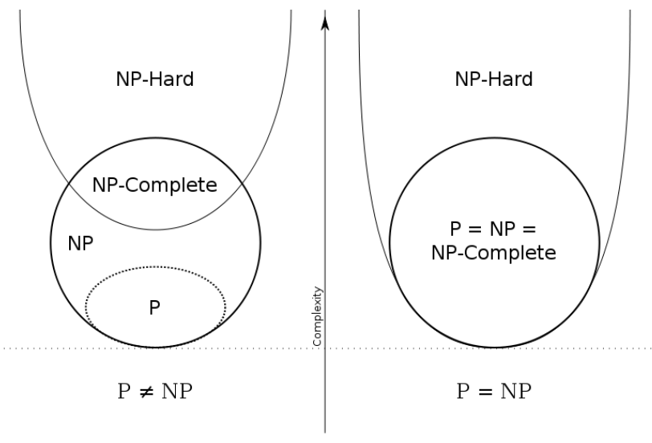

<!-- väčsinu otázok zodpovedal chatGPT -->
# <center>Otázky čo boli a hodine</center>

1. Jaký je rozdíl mezi algoritmem a výpočetní metodou?
    - Algoritmus musí být konečný a výpocetní metoda ne 
2. Vysvetli pojem predikátový počet.
    - Část matematické logiky, která se zabýva popisem vnitřní (sémantické) struktury výroku. Duležitou součástí abecedy predikátového počtu jsou KVANTIFIKÁTORY
3. Definuj RASP stroj
    - stroj s pamětí s přímym přístupem
    - pracuje s registry a s řídící jednotkou
4. Jsou Postuv stroj a Konečný stroj ekvivalentní
    - ne
5. Stručně definuj (popiš 1 větou) Turinguv stroj, co jsou to tzv M-konfigurace?
    - konečný automat dolněný o pamět ve formě pásky
    - M-konfigurace obsahuje informace o stavu, obsahu pásky a pozici hlavy
6. Formálně (matematicky) i obecně (selským rozumem) definuj gramatiku.
    - súhrn pravidel
7. Vysvětlite pojmy vstupní a výstupní predikát, dále vstupní, výstupní a vektor programu. Jaké problemaytiky se to týka?
    - vstupní predikát - jak mají vypadat vstupní data
    - výstupní predikát - požadovaný vztah mezi proměnnými při ukončení výpočtu (vztah mezi vnútornými premennými a výstupom)
    - vstupní vektor - nabýva vždy daných vstupných hodnot a během výpočtu se nemění 
    - výstupní vektor - obsahuje výstupní hodnoty v okamžiku skončeni výpočtu
    - vektor programu - obsahuje všechny proměnné (mezivýsledky programu)
    - Týka sa to predikátového počtu
8. Uveďte alespoň 3 pŕíklady tříd symptotické časové složitoti(+ odpovídající problém/algoritmus)
    - logn - logaritmický rust - binary search
    - nlogn - merge sort
    - n <sup>2</sup> - bubble sort
    - 2 <sup>n</sup> - fibonacci
    - n! - factorial
9. Uveďte alespoň 3 metody zrychlení algoritmu
    - odstranení rekurze
    - Předpočítání
    - eliminace opakovaných výpočtu
    - preprocessing
10. Co je to tzv "epilon přechod" u nedeterministického konečného automatu
    - je to přechod který muže být proveden bez přečtení vstupního symbolu
11. Co má Mealeho automat navíc oproti klasickému konečnému automatu.
    - Přirřazuje výstupní hodnotu ke každému přechodu
12. Co je časová P-složitost, uveďte základní 4 třídy (nikoliv asymptotické typy) a grafickou souvislost mezi nimi.
    - P
    - NP
    - NPC 
    - NPH 
    
13. Vyjmenujte 3 typy programových schémat 
    - Volná schémata
    - Stromová schémata
    - Jonovova schémata
14. Co je to interpretace schématu? Co tím získám?
    - Definuje ako by mal kód vypadať a fungovať
    - záskame program
15. "Nakreslete" libovolný příkaz "switch" pomocí K.A.


# <center>Otázky z discordu</center>
## 1.
<!-- BlackieToT#4774 -->
1. **Algoritmus rozděl a panuj, co to je?**
    - Jedná se o algoritmický návrh, kde se problém dělí na menší podproblémy, které jsou řešeny rekurzivně a následně jsou výsledky kombinovány.
2. **3 způsoby zrychlení algoritmů**
    - Předpočítání, preprocessing, eliminace rekurze, optimalizace výpočtu pro daný hardware, eliminace opakovaných výpočtů.
3. **P-složitost, co to, 4 typy**
    - složitost udává, jak efektivně algoritmus pracuje v závislosti na velikosti vstupu.
    - Čtyři základní třídy:
        - P-složité problémy (P)
        - NP-složité problémy (NP)
        - NP-těžké (hard) problémy (NPH)
        - NP-úplné (complete) problémy (NPC)
        

4. **1 . A 2. Analogová gramatika**
    - 1 .Analogie
        - Základem jazyka jsou písmena abecedy.
        - Písmena skládají slova, slova věty, atd.
        - NE všechny kombinace písmen jsou slova.
        - Jazky je urćen mnoZinou slov jazyka - pravidly pro tvorbu slov 
        - Pravidlum pro tvorbu slov se říka gramatika
    - 2 .Analogie
        - Základem jazyka jsou slova dále nedělitelná
        - Místo z abecedy vycházíme ze slovníku.
        - Gramatika určuje pravidla sestavování vět
        - Jazyk tvoří všechny věty, které lze vytvořit
5. **Matematicky A selským rozumem popsat kontextovou gramatiku**
    - Kontextová gramatika obsahuje pravidla, která specifikují přepisování symbolů za určitých podmínek, zohledňující kontext (okolní symboly).
6. **Dokáže konečný automat přečíst 2. gramatickou třídu**
    - Ne, konečný automat nemůže přečíst kontextovou gramatiku (2. gramatickou třídu).
7. **Turingův stroj stručně popsat, co je M-konfigurace**
    - Turingův stroj je teoretický počítač, který pracuje na nekonečné pásce a čte/zápisuje symboly. M-konfigurace obsahuje informace o stavu, obsahu pásky a pozici hlavy
8. **Jak se zapisuje worst case (nevím přesné znění, odpověď je Big O notace)**
    - Big O notace (O-notation) se používá k popisu asymptotické horní mezí časové složitosti algoritmu
9. **C/E Petriho sítě, co to je, obrázek**
    - C/E Petriho sítě jsou sítě konfliktu a exkluzivity, používané k modelování vzájemného vyloučení mezi procesy nebo událostmi. Obrázek by ukazoval přechody a místa.
10. **Epsilon přechod, co to je?**
    - Epsilon přechod (ε-přechod) je přechod v konečném automatu, který může být proveden bez přečtení vstupního symbolu.
11. **Terminální Neterminální znak, rozdíly**
    - Terminální symbol je prvek abecedy jazyka
    - Neterminální symbol je proměnná, která se nahrazuje za jiné symboly.
12. **Popište výstupní predikát**
    - Výstupní predikát je podmínka, kterou výstupní hodnota algoritmu musí splňovat.**
13. **Mealyho automat, co má navíc** 
    - Mealyho automat přiřazuje výstupní hodnotu ke každému přechodu
14. **Čím je nahrazena paměť u konečného automatu**
    - Paměť u konečného automatu je nahrazena stavy, ve kterých se automat nachází
15. **Je možné testování prokázat nepřítomnost chyby (ano/ne, proč)**
    - Ne, testování může pouze prokázat přítomnost chyby, ale nikdy nemůže prokázat její nepřítomnost ve všech případech.

## 2.
<!-- Mikka#7956 -->
1.  **Co to jsou RASP stroje**
    - RASP (Random Access Stored Program) stroje jsou modely výpočetních zařízení, které kombinují vlastnosti RAM (Random Access Memory) s principy stored-program počítačů. Jedná se o teoretický model, který slouží k popisu a analýze algoritmů a výpočetních procesů. RASP stroje mají paměť s náhodným přístupem, což znamená, že mohou rychle číst a zapisovat do libovolné paměťové buňky. Současně mají programovou řídicí jednotku, která provádí instrukce uložené v paměti.

2.  **K čemu slouží petriho sítě C/E příklad**
    - Petriho sítě C/E (Condition/Event) jsou modely Petriho sítí, kde jsou použity podmínky (conditions) a události (events). Podmínky jsou reprezentovány místy (places), a události jsou reprezentovány přechody (transitions). Vazby mezi podmínkami a událostmi jsou znázorněny orientovanými hranami. Události mohou nastat pouze tehdy, jsou-li splněny všechny příslušné podmínky.

3.  **Nakreslit graf pro switch nebo if, elseif, else s zadanou vstupní abecedou a stavy**
    ```lua
        +---------+        +---------+
        |  Vstup  | -----> |  Switch |
        +---------+        +---------+
                            |
                        +---|---+
                        |       |
                    +----+----+  +-----+
                    | Případ 1 |  | ... |
                    +----------+  +-----+
                    | Případ 2 |  | ... |
                    +----------+  +-----+
                            .
                            .
                            .
                    | Případ n |  | ... |
                    +----------+  +-----+
    ```

4.  **Nedeterministický algoritmus, v čem je lepší od deterministického**
    - Nedeterministický algoritmus je typ algoritmu, kde existuje více možných cest provedení, a výběr mezi těmito cestami může být proveden náhodně nebo nedeterministicky. Tento přístup může být v některých případech efektivnější než deterministický algoritmus, zejména pokud je obtížné předem určit optimální cestu.

5.  **Jaký typ algoritmu použít při optimalizaci**
    - Při optimalizaci je často vhodné použít algoritmy s polynomiální časovou složitostí, tedy algoritmy patřící do třídy P. Tyto algoritmy jsou efektivní a mohou být spolehlivě použity pro velké množství dat. Zároveň je důležité brát v úvahu konkrétní charakteristiku problému a vhodně zvolit algoritmus podle jeho vlastností.

6.  **Nakresli Petriho sítě který nelze sestrojit**
    - Petriho sítě by měly být acyklické, což znamená, že nemohou obsahovat cykly. Petriho sítě, které obsahují cykly, by byly nekonečné a nedalo by se určit, kdy by měly skončit. Nelze tedy sestrojit Petriho síť, která by obsahovala cykly.

7.  **Z čeho se skládá výpočetní složitost**
    - Výpočetní složitost zahrnuje časovou a prostorovou složitost algoritmu. Časová složitost T(f) představuje horní odhad složitosti hledání řešení "bez nápovědy", zatímco prostorová složitost S(f) představuje horní odhad složitosti ověření, zda je nalezené řešení skutečně řešením.

8.  **Jakým způsobem se definují rekurzivní algoritmy**
    - Rekurzivní algoritmy jsou algoritmy, které využívají (volají) samy sebe v průběhu svého vykonávání. Těchto algoritmů je několik typů, včetně:
        - Jednoduchá rekurze: Algoritmus volá sám sebe s jednoduchým podproblémem.
        - Konečná rekurze: Algoritmus volá sám sebe s omezeným počtem volání.
        - Vzájemná rekurze: Více funkcí volá jedna druhou v cyklu.

## 3.
<!-- niath -->

1.  **Popsat hladový algoritmus**
    - Hladový algoritmus je typ algoritmu, který v každém kroku vybírá nejlepší možný výběr na základě aktuální situace, aniž by zvažoval budoucí důsledky. Hladové algoritmy jsou obvykle snadné na implementaci a mají nízkou výpočetní náročnost. Příkladem může být algoritmus výběru mince, kde v každém kroku vybereme minci s nejvyšší hodnotou, která nezpůsobí překročení požadované hodnoty.

2.  **Co musí obsahovat rekurzivní algoritmus + příklady rekurzivních algoritmů**
    - Rekurzivní algoritmus je algoritmus, který volá sám sebe během svého provádění. Musí obsahovat alespoň jednu podmínku ukončení, aby nedošlo k nekonečné rekurzi. Příklady rekurzivních algoritmů zahrnují faktoriál, Fibonacciho posloupnost nebo rekurzivní sčítání.

3.  **Terminální, neterminální znak**
    - Terminální znak: Znak, který patří do konečné abecedy jazyka a nemůže být nahrazen žádným jiným znakem pomocí pravidel gramatiky.
    - Neterminální znak: Symbol, který může být nahrazen (rozvinut) za použití pravidel gramatiky, dokud se nedostaneme k terminálním znakům. Neterminální znaky jsou obvykle proměnné v gramatice.

4.  **Churchův theorém**
    - na vyřešení problému potřebujeme jenom dve promnené 
    - pokud zkoumáme pouze to, že problém lze vyřešit, není pro nás účinnost výpočtu podstatná


5.  **M konfigurace** 
    - M-konfigurace je pojem používaný v kontextu Turingova stroje. M-konfigurace obsahuje informace o stavu pásky, stavu stroje a pozici hlavy na pásce. Formálně se zapisuje jako (*q,w,h*) kde *q* je stav stroje, *w* obsahuje symboly na pásce a *h* je pozice hlavy.

6.  **Ta hierarchie gramatik**
    - Hierarchie gramatik je třídění gramatik podle jejich síly a schopnosti generovat jazyky. Zahrnuje:
        - Typ 0: Gramatiky neomezené (Unrestricted)
        - Typ 1: Kontextové gramatiky
        - Typ 2: Bezkontextové gramatiky
        - Typ 3: Regulární gramatiky

7.  **Existuje jazyk bez gramatiky, jaký**
    - Neexistuje jazyk bez gramatiky. Každý jazyk, který může být generován nebo rozpoznán nějakým formálním systémem, má odpovídající gramatiku nebo automat.

8.  **Co je N-tice (Q, I, f, q0, P) a k čemu patří** 
    - N-tice reprezentuje korektní definici konečného automatu. Obsahuje:
        - Q: konečná množina stavů
        - I: konečná množina vstupní abecedy
        - f: přechodová funkce
        - q0: počáteční stav
        - P: množina přijímajících (koncových) stavů

9.  **(není uvedena otázka)**


10. **Popsat časovou a prostorovou složitost + na čem závisí**
    - Časová složitost: Udává, kolik času (kroků) algoritmus potřebuje k provedení v závislosti na velikosti vstupních dat.
    - Prostorová složitost: Udává, kolik paměti (prostoru) algoritmus potřebuje v závislosti na velikosti vstupních dat
    
    Obě složitosti jsou obvykle vyjádřeny jako funkce velikosti vstupu a vyjadřují se pomocí O-notace.


11. **Rozdíl mezi Koncovým a postovým strojem**
    - Konečný automat (KA): Jednoduchý model výpočtu, který má omezenou paměť a může se nacházet v jednom ze stavů. Rozhoduje o přijetí nebo odmítnutí vstupního řetězce
    - Posuvný automat (PSA): Je rozšířením konečného automatu o pásku, která slouží jako neomezená paměť. Hlava se pohybuje po pásce a může zapisovat nebo číst symboly.


12. **Co jsou petriho sítě**
    - Petriho sítě jsou grafickým nástrojem pro modelování paralelních a distribuovaných systémů. Existují dvě hlavní varianty: C/E (Condition/Event) Petriho sítě a P/T (Place/Transition) Petriho sítě. Tyto sítě slouží k popisu interakcí mezi procesy nebo událostmi v systému.


13. **Nakreslit KA s funkcí SWITCH**
    - idk

14. **Vstupní, výstupní predikát**
    - Vstupní predikát: Definuje, jakým způsobem jsou vyhodnocovány vstupní hodnoty v logickém výroku nebo pravidle. Například, vstupní predikát může být pravdivý, pokud je vstupní hodnota větší než určitá mez.
    - Výstupní predikát: Udává podmínky, za kterých jsou generovány výstupní hodnoty. Je to logický výraz, který rozhoduje o tom, kdy je výstup vygenerován na základě stavu nebo vstupu

15. **Něco typu, jestli může zásobníkový automat rozeznat 2 stejné řetězc**  
    - Zásobníkový automat (PDA - Pushdown Automaton) může rozeznat některé nestandardní jazyky. Pokud je PDA s omezeným zásobníkem (LBA - Linear Bounded Automaton), může rozeznat pouze bezkontextové jazyky.
    - Pokud bychom chtěli zjistit, zda zásobníkový automat může rozeznat dvě identické řetězce, záviselo by to na přesných pravidlech a omezeních automatu. Obecně řečeno, pokud jsou pravidla automatu dostatečně flexibilní, mohl by se naučit rozpoznávat dvě stejné posloupnosti znaků.

## 4.
<!-- notstanko -->
1. Nedeterministický algoritmus
2. Rozdělení rekurzivních algoritmů (2 typy)
3. 3 Příklady typů (třídy) asymptotických složitostí
4. Jakou speciální vlastnost má NPC
5. ?
6. ?
7. Co znamená zkratka BNF?
8. Platí L ⊆ ∑* nebo ∑* ⊆ L, Proč?
9. Co znamená konečný v konečném automatu
10. Jaký automat/stroj má proměnnou x a jaký má typ 
11. Přijímá KA jazyk s gramatikou typu 2?
12. C/E Petriho síť + příklad
13. Verifikace vs. testování
14. Vektor programu
15. Nakreslit konečný automat pro binární IF
- Typy gramatik
- Co je to Terminál/Neterminál?
- Popsat Konečný automat
- Popsat Turingův stroj
- Co je to Vektor programu?
- Co je to Výpočetní složitost?
- K čemu se používá Asymptotická složitost?
- Jak zrychlit algoritmus?
- Popsat Postův stroj
- Rozdíl mezi verifikací a testováním
- Existuje nějaký jazyk bez gramatiky (ASCII)?
- Co jsou to Petriho sítě a k čemu se používají?
- Jako jaké algoritmy se můžou použít u P a NP, rozdíl? 
- Jakou gramatiku využívají konečné automaty?


