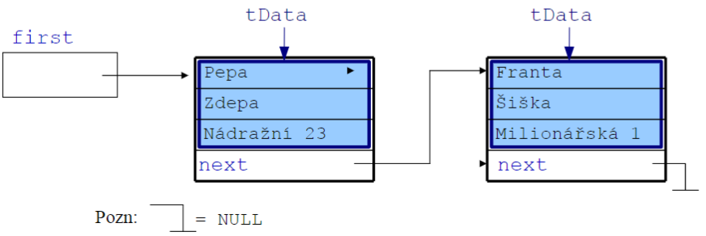

# Prednáška 5.2.

- Treba Gitlab
- projekty budú robené v C
- Bodové hodnocení
  | | |
  | ---------------------------------- | :-------: |
  | Příklady ve cvičeních | 40 bodů |
  | Půlsemestrální test | 10 bodů |
  | Semestrální test | 50 bodů |
  | Prémiový projekt (včetně obhajoby) | 20 bodů |
  | Celkem | 120 bodů |
- Program přednášek
  - Přednáška: Algoritmus. Metoda návrhu algoritmu shora dolů. Popis algoritmu - vývojové diagramy, stavové automaty...Časová a paměťová složitost.
    - Cvičení: Organizační záležitosti, úvod do programování v Pascalu/C.
  - Přednáška: Datové struktury: Základní struktury. Seznam, strom
    - Cvičení: Lineární seznam - implementace
  - Přednáška: AVL stromy. Délka cesty v binárním vyhledávacím stromu. Halda, B-strom, fronta, zásobník, tabulka.
    - Cvičení: Binární vyhledávací strom - implementace
  - Přednáška: Množina, asociativní pole, graf, zásobník.
    - Cvičení: AVL strom - implementace
  - Přednáška: Použití zásobníku. Metody návrhu algoritmu: Rozděl a panuj, hladový algoritmus, dynamické programování.
    - Cvičení: AVL strom - dokončení implementace. Euklidův algoritmus. Hanojské věž
  - Přednáška: Backtracking, obecné metody prohledávání stavového stromu. Některé další metody. Rekurze.
    - Cvičení: jako přednáška
  - Přednáška: Třídění haldou, quicksort, třídění souborů.
    - Cvičení:Hanojské věže. Třídění seznamu, topologické třídění
  - Přednáška: Hledání mediánu. Přihrádkové třídění, lexikografické třídění, abecední řazení.
    - Cvičení: Lexikografické třídění, optimální strom.
  - Přednáška: Optimální binární vyhledávací strom. Seminumerické algoritmy.
    - Cvičení: Důsledky zobrazení čísel v počítači.
  - Přednáška: Algoritmy pro zpracování problémů z oblasti umělé inteligence - neuronové sítě, genetické programování
    - Cvičení: jako přednáška
  - Přednáška: Programování komplexních informačních systémů - relační databáze, ERD, SQL...
    - Cvičení: Návrh jednoduché databázové aplikace
  - Přednáška: Objektové programování. Metody návrhu komplexních informačních systémů - UML.
    - Cvičení: Návrh složité distribuované aplikace v UML

## Algoritmus

- Algoritmus je postup řešení určité úlohy. Ne každý postup je ale algoritmem!
- Algoritmus musí splňovatt n=asledujíci vlastnosti:
  - je konečný = musí skončit po provedení konečného počtu kroku
  - je elementární = je specifikován jako posloupnost elementárn=ich, pro daný provádecí stroj jednoznačne definovyných operací
  - je rezultativní = vede ke správnému výsledku
  - je determinovaný = po každém kroku lze zjistit, zda již algoritmus skončil, a pokud neskončil, jak má dále pokračovat
- Možnosti zápisu
  - Data-flow diagramy
  - Petriho síte
  - Vývojové diagramy
  - ERD diagramy

## Abstraktí datové typy

- snaha o vytvoření zapouzdření
- každý objekt je len c-čková struktura

## Základní ADT a časové složitosti jejich operací

|                 | Vkládání                               | Mazání              | Vyhledávání         | Řazení                          |
| --------------- | -------------------------------------- | ------------------- | ------------------- | ------------------------------- |
| Dynaické pole   | Pokud je buňka volná: O(1) Jinak: O(N) | O(1)                | O(N)                | O(N\*log<sub>2</sub>N)          |
| Lineární seznam | O(1)                                   | O(1)                | O(N)                | O(N\*log<sub>2</sub>N)          |
| Binárni strom   | O(log<sub>2</sub>N)                    | O(log<sub>2</sub>N) | O(log<sub>2</sub>N) | Vždy seřazen                    |
| Hash tabulka    | O(1)                                   | O(1)až O(K)         | O(1) až O(K)        | Lze jen v kombinaci s jiným ADS |

# Prednáška 12.2.

- Je dobré si nakreslit obrázek
- Je taktické používat enum - kompatibilný int

## Príklad enum

```C
#include <stdio.h>

typedef enum {SUDA,LICHA, TRETI=3, CTVRTA, PATA} t_Stavy;

int main() {

  t_Stavy stav= TRETI;
  printf("stav=%d\n",stav);
  for (int i=0;i<10; i++)
    printf("i=%d\n",i);
  return 0;
}

```

## Príklad konečný automat

Spracovanie dvoch stavov


```C
#include <stdio.h>

typedef enum {SUDA,LICHA} t_Stavy;

int main() {

  t_Stavy stav= SUDA;
  int znak;
  znak=getchar();
  while (znak!EOF){ /*EOF = -1 | preddefinovaná premenná*/
    znak=getchar();
  }
  return 0
}

```

Využite swich case

```C
#include <stdio.h>
#include <ctype.h>

typedef enum {SUDA,LICHA} t_Stavy;

int main() {

  t_Stavy stav= SUDA;
  int znak;
  znak=getchar();
  while((znak=getchar())!=EOF)
    printf("stav=%d, znak=%c, ASCII=%d\n ",stav,znak,znak)
    swich (stav) {
      case SUDA:
        if (znak==’1’) {putchar(’L’); stav=LICHA;}
        else if (znak==’0’) putchar(’S’);
        else if (!isspace(znak)){puts("Error, neocakavane pismeno")}
        break;

      case LICHA:
        if (znak==’1’) {putchar(’S’); stav=SUDA;}
        else if (znak==’0’) putchar(’L’);
        else if (!isspace(znak)){puts("Error, neocakavane pismeno")}
        break;
  }
  return 0
}

```

# Prednáška 19.2.

## Datové struktury

- Jeden ze základních stavebních prvku
- Delení
  - Lineární
    - Vector
    - Halda
    - List
    - Frnta
  - Nelineární
    - Strom
    - Graf

## Vektor

- Dynamické pole
- Lineární datová struktura
- schopnost zvětšovat/zmenšovat svoji velikost během běhu programu

- Segfault

```C
#include <stdio.h>
int main(){
  int* ptr = NULL;
  printf("%d\n", *ptr);
  return 0;
} // Spôsobí chybu
```

# Prednáška 26.2.

```C
/*
Príklad alokovania pamäte
*/
#include <stdio.h>
#include <stdlib.h>

int gpole[1000000]; // Fuj, globálne nechceme, spomaluju

int pocitej (int velikost){
  char * lokPole = malloc(velikost); // Dobŕe používať, ale treba na konci uvolniť
  puts("vypocitano OK..");
  for(int i=0;i<velikost>;i++){
    lokPole[i]=i;
  }
  getchar();
  getchar();
  free(lokPole)
  return 0;
  // Lokálna pamäť je super, len má limit 2Mb
}

int main(){
  printf("Kolik potrebujes dat? \n");
  int velikost;
  int status = scanf("%d,velikost");
  char pole[velikost];

  puts("Done");
  picitej(velikost);
  puts("Funkce skoncila Ok..");

  getchar();
  getchar();

  return 0;
}
```

- ADT Lineární seznam

```C
typedef struct _ListNode {
  tData data;
  struct _ListNode * next; // Ukazatel má typ ktorý práve vzniká => _ListNode
} ListNode

typedef struct {
  ListNode * first;
  ListNode * active;
} List;
```

```C
/*
Testování assertem
*/
#include <stdio.h>
#include <stdlib.h>
#include <assert.h>


int pocitej (int velikost){
  char * lokPole = malloc(velikost);
  assert(lokPole!=NULL); // zhodí aplikaci, nemalo by sa moc abusovat lebo znićí progress
  puts("vypocitano OK..");
  for(int i=0;i<velikost>;i++){
    lokPole[i]=i;
  }
  free(lokPole)
  return 0;

}
int main(){
  return 0;
}
```

- Po vložení prvku do seznamu bude seznam vypadat v paměti takto:

  

- Příklad sady metod pro práci s lineárním seznam

```C
void list_init(List * list);
// Provede inicializaci seznamu před jeho prvním použitím
void list_insert_first(List * list, tData data);
// Vloží prvek na začátek seznamu.
void list_seek_first(List * list);
// Nastaví aktivitu seznamu na první prvek.
tData list_get_first_data(List * list);
// Vrátí hodnotu prvního prvku. Pokud je seznam prázdný, volá proceduru Error.
void list_delete_first(List * list);
// Maže 1. prvek. Pokud byl aktivní, aktivita se ztrácí. Pokud byl seznam prázdný, nedělá nic.
void list_delete_next(List * list);
// Maže první prvek seznamu za aktivním prvkem. Pokud nebyl seznam aktivní, nic se neděje.
void list_insert_next(List * list, tData data);
// Vloží prvek za aktivní. Pokud nebyl seznam aktivní, nic se neděje
tData list_get_next_data(List * list);
// Vrátí hodnotu aktivního prvku. Pokud seznam není aktivní, volá se procedura Error.
void list_set_active_data(List* list, tData data);
// přepíše obsah aktivní položky.  Pokud není žádná položka aktivní, nedělá nic.
void list_next(List * list);
// posune aktivitu na následující prvek seznamu.
bool list_is_active(List * list);
// Je-li seznam aktivní, vrací True.  V opačném případě vrací false.
```

# Prednáška 4.3.

## ADT zásobník

- Implementace zásobníku polem

# Prednáška 11.3.

- linked list

# Prednáška 18.3.

# Prednáška 25.3.

- hash
