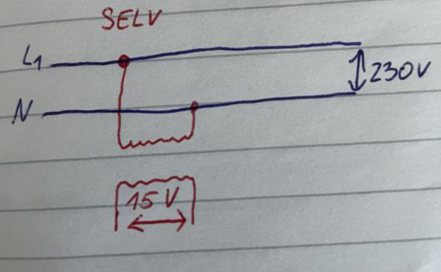
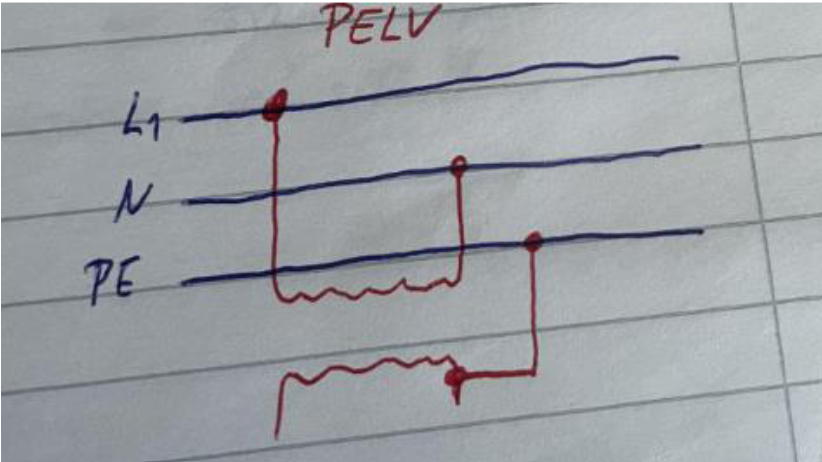
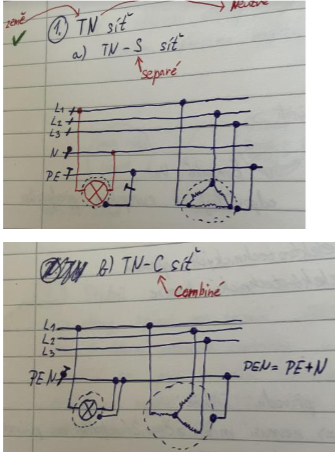

- Relé - je elektromag. spínač, řídícím proudem spíná (rozpíná) malé proudy
- Stykač - elmag. Spínač pro spínání větších proudů
- Jističe - (ochranný vypínač) odpojí spotřebič od sítě, dojde-li k přetížení nebo k průniku nebezpečného napětí s následným zkratem
- Výkonový vypínač - umožňuje bezpečně vypnout provozní proudy a zároveň vypíná proudy při přetížení a zkratu

### Bezpečnostní předpisy pro zařízení nízkého napětí

- CEE – Evropská komise pro shodu elektrických výrobků
- CE – Evropská správní značka
- EZÚ – Elektronický zkušební úřad

### Ochranné třídy

- I – musí mít zemnící kolík na přívodní šňůře (pračka, PC, NTB, cirkula)

- II – má dodatečnou izolaci => nemusí mít zemnící kolík na přívodní šňůře (holící strojek, vrtačka, NTB)
- III
  - SELV – neuzemněné velmi nízké napětí
  - PELV – uzemněné velmi nízké napětí

### Krytí elektrických spotřebičů

- kryje proti mechanickým částicím (prach) a proti vodě
- IP68 – jemné částice, trvalý ponor ve vodě
- IP69 – trvalý ponor ve vodě, ve velké hloubce

### Rozvod SELV a PELV se liší uzemněním:

- SELV – nemá uzemněnou sekundární stranu transformátoru, na které jsou připojeny spotřebiče a nesmí být galvanicky propojován se zemí nebo jiným obvodem

  

- PELV – má jeden konec sekundární strany transformátoru, na kterém jsou připojeny spotřebiče uzemněný

  

### Druhy rozvodných sítí:

- IT – izolovaná
  - v síti IT nesmí být uzemněny ani střed hvězdy, ani žádné živé (aktivní) prvky obvodu
  - Povoluje se uzemnění rozvodné sítě před odpor vysoké hodnoty. Kostry elektrických zařízení jsou uzemněny.
- TT – zemněná zemí
  - je jen jeden bod soustavy u výrobce uzemněn
- TN – zemněná neutrální

  - TN-C – kombinace zemněného a izolovaného vedení
  - TN-S – zemněná neutrální s ochranným vodičem
  - TN-C-S – kombinace TN-C a TN-S

  

- Vodič PE – ochranný zemnící vodič: Je určen k ochraně osob před úrazem el. Proudem. Jeho hlavní funkcí je poskytovat zemnící spojení pro el. Zařízení a zařízení se zemnícím bodem. Žlutozelená barva.
- Vodič PEN – ochranný a neutrální vodič je spojen v jednom vodiči. Vodič PEN slouží k přivádění neutrálního bodu sítě do spotřebičů. Modrobílá brava.

### Proudový chránič

- úlohou proudového chrániče je během 0,2 až 0,4 odpojit spotřebič, ve kterém vinou porušení izolace vzniklo nebezpečné dotykové napětí

### Princip FI jističe

- v bezchybném stavu je součet proudů (přicházející a odcházející) roven nule. Střídavé magnetické pole všech vodičů se vzájemně vyruší a v součtovém trafu se neindukuje žádné napětí.
- při zkratu na zem, na kostru nebo ochranný vodič teče část zpětného proudu zemí nebo ochranným vodičem. V součtovém trafu se indukuje napětí, které rozpojí jistič

### ochrana zesílenou a dodatečnou izolací

- například vrtačka (izolace mezi motorem a převodovkou)

### El. Náboj

- základní vlastnost hmoty, nelze ho vytvořit ani zničit, lze ho jen odvést (nejmenší náboj = elementární náboj)

### El. Obvod

- prostorově ohraničený systém složený se vzájemně propojených obvodových prvků za účelem určitě funkce (např. přenos a zobrazení informace)

Stejnosměrné: U ≠ U(t) I ≠ I(t)

Střídavé: u = u(t) i = i(t)

### Pojmy v el. Obvodech:

- Svorka – jednotlivé obvodové prvky jsou vzájemně spojeny pomocí svorek
- Uzel – místo, kde se setkávají alespoň tři vodiče
- Větev – část obvodu mezi dvěma uzly
- Smyčka – uzavřená dráha v elektrickém obvodu
- Topologické schéma: dává představu o konfiguraci obvodu

**Veličiny v el. Obvodu**

- El. Napětí – U
- El. Proud – I
- Energie a výkon

### Rezistor a odpor

- Rezistor – ideální obvodový prvek, který mění el. Energii na jinou formu energie
- Odpor – reálný obvodový prvek (pozn: Odpor je vlastností rezistoru!)

### Třídění odporů:

- Dle provedení (pevné, proměnlivé)
- Dle materiálu (drátové, vrstvové)
- Dle použití (stabilní odpory, vysokoodporové, vysokonapěťové)

### Vztah mezi napětím a proudem na rezistoru a odporu

- ve ss obvodech: R= U/I
- ve st obvodech: Z=Û/Î
- na rezistoru nedochází k fáz. Posuvu mezi napětím a proudem
- na odporu: chová se stejně jako na rezistoru

### Kapacitor a kondenzátor

- Kapacitor – ideální obvodový prvek, má za úkol akumulovat el. Energii
- Kondenzátor – reálný obvodový prvek, vlivem nedokonalosti dielektrika vznikne svodový (ztrátový) odpor

### Inuktor a cívka

- Induktor: ideální obvodový prvek, který akumuluje energii magnetického pole
- Cívka: reálný obvodový prvek, vinutí má ohmický odpor

### Setrvačné a nesetrvačné prvky: 
  - **Nesetrvačné prvky = rezistory** 
    - Jakákoliv změna napětí vyvolá okamžitou změnu proudu 
  
  - **Setrvačné prvky = kapacitory** 
    - Akumulují energii 
    - Časové průběhy U na C jsou spojité 
    
    **= induktory** 
    - Indukují energii magnetického pole 
    - Časový průběh I na L je spojitý 
    
### Rozdělení periodických funkcí: 
- Střídavé – plochy omezené nad osou t a pod osou t jsou stejné |P+|=|P-| 
- Kmitavé fce – nabývají kladných i záporných hodnot, přižemž plochy nad osou t a pod osou t nejsou stejné 
- Pulsující fce – nemění znaménko 
 
 
### Druhy výkonů 
1) Činný výkon – charakterizuje nevratnou přeměnu energie v užitečnou energii (teplo) 
   - Jednoutkou je Watt [W] 
   - U*I*cosFi 
2) Zdánlivý výkon – je mírou výkonové zatížitelnosti střídavých zařízení 
   - Jednotkou je voltampér [VA] 
   - S = U*I 
3) Jalový výkon – vyjadřuje vratnou proměnu energie na vytvoření elektrického a magnetického pole 
   - vyjadřuje energii, která se přesouvá mezi zdrojem a spotřebičem (tam a zpět) 
   - jednoutkou je voltampér reaktanční [VAr] 
   - Q = U*I*sin Fi 
 
### Dvojbran 
- má vstupní bránu (vstup) a výstupní bránu (výstup) 
- slouží pro úpravu vstupního signálu na výstupní signál podle účelu (např. zesílení signálu, zeslabení  signálu, změna frekvenčního spektra signálu) 
 
- Metrologie – zabývá se poznatky a činností měření, definuje jednotky měření 
  1) Fundamentální – soustavy měřících jednotek 
  2) Průmyslová – obsluha měřidel v průmyslu, správnost měření ve výrobě 
  3) Legální – zabezpečuje jednotnost a správnost měření, kde má vliv na správnost obchodování, zdraví a bezpečnost 
 
 
1) **Číslicové měřící přístroje** – měří stejnosměrné napětí (zobrazení pomocí displeje) 
2) **Analogové měřící přístroje** – stupnice, pohyblivá ručička 
 
### Transformátory 
1) Ideální trafo 
2) Reálné trafo 
 
### Druhy transformátoru 
1) Malé transformátory 
2) Zvláštní transformátory (autotransformátor, rozptylové transformátory, svářecí transformátory, měřící transformátory, trojfázové transformátory)