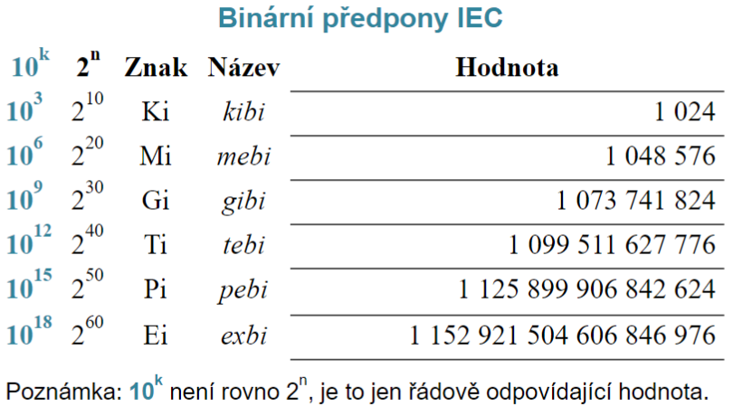

# Prednáška 6.2

- Na konci bude certifikat CISCO ak budeme mať nad 70%
- Na prvom pokuse pridáva pol boda ale iba k lepšej známke
- stiahnut Cisco Packet Tracer v 4. ročníku

## Základní síťová terminologie

- internet
  - akákolvek sústava vzájomne prepojených sieti
  - má vlastníka
- Internet
  - www
  - Jako celek nemá žádného vlastníka
- intranet
- extranet

- Typy sítí jejich rozhlednost
  | Skratka | Co to je | Vzdálenost|
  | --- | --- | --- |
  |PAN | Personal Area Network |metry|
  |LAN| Local Area Network| desítky až stovky metru|
  |CAN| Campus Area Network | Stovky metru až kilometry|
  |MAN|Metropolitan Area Network|Kilometry až desítky kilometru|
  |WAN| Wide Area Network| Desítky až tisíce kilometru|
  |GAN| Global Area Network| Celosvětově|
  |VLAN| Virtual LAN| |
  |WLAN| Wireless LAN| |
  | VPN| Virtual Private Network|
  |SAN| Storage Area Network|

- Zpráva
  - balík dat, který přenášíme po síti
  - balíky date povecsinou nemajú rovnakú dĺžku
- Přenosová a modulační rychlost
  - mocnincy při základu 10 - přenosová rýchlosť
  - mocniny při základu 2 - přenosová kapacita
  - 

# Prednáška 13.2.

- 2.7 - 5.2
[Počítačové síte](Počítačové%20sítě%2021.12.23.pdf)

# Prednáška 20.2.
- 5.2 - 9
  
# Prednáška 27.2.
- 9 - 9.19