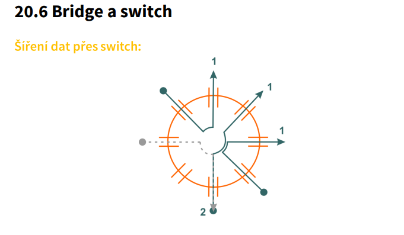
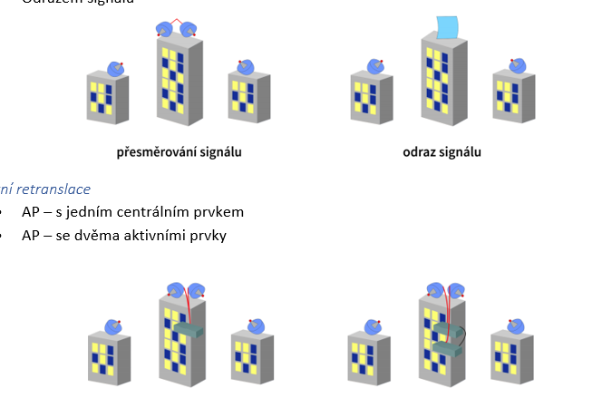

- Adresa 127.255.255.254 je adresa typu:

  - loopback + reserved, cannot assign to any device (loopback = 127.x.x.x)

- Adresa 210.25.148.64/26 je adresa typu:

  - adresa subsítě (/x na konci)

- Adresa 210.25.148.63/25 je adresa typu:

  - host (adresa počítače)u

- Adresa 210.25.148.63/26 je adresa typu:

  - broadcast

- Adresa 0.0.0.0 je adresa typu:

  - zařízení ještě nemá přidělenou adresu

- Adresa v třídě B 0.0.125.131 je adresa typu:

  - adresa počítače adresa nepatří do třídy B a nedá se určit o jaký typ adresy se jedná (nemá subnet mask). Adresa patří do třídy A.

- Adresa v třídě B 147.225.0.0/16 je adresa typu:

  - adresa sítě

- Adresa protokolu NetBIOS se skládá:

  - ze jména NetBIOSu a NetBIOS service identifikátoru (NSI)

- Adresa typu 196.265.148.63/26 je adresa typu:

  - žádná z uvedených (není validní adresa)

- Adresa v třídě C 255.255.255.255 je adresa typu:

  - omezený broadcast

- Adresa ve třídě C 200.228.131.0/26 je adresa typu:

  - adresa subsítě

- Adresa ve třídě C 192.168.16.131 je adresa typu:

  - adresa za proxyserverem (za NATem) áno aj nie, záleží na konfikurácii siete

- Aktivní retranslaci u WLAN můžeme uskutečnit:

  - 1- centralizovanou architektúrou s jedným centrálnym elementom a 2- distribuovanou architektúrou s viacerými aktívnymi elementami

- Aplikační vrstva modelu OSI:

  - poskytuje síťovým aplikacím přístup ke komunikačnímu síťovému systému

- Baseband je přenos signálu:

  - V základním pásmu

- Bezdrátová komunikace může probíhat ve dvou frekvenčních pásmech, licencované:

  - 3,5; 26; 28 GHz

- Bezdrátová komunikace může probíhat ve dvou frekvenčních pásmech, bezlicenční:

  - 2,4; 5; 10 GHz

- Bezdrátová síť je obecně označována jako:

  - WLAN

- Broadband je přenos signálu:

  - v rozšířeném pásmu

- Co je to broadcastová MAC doména:

  - Část sítě, v které se šíří rámec s MAC adresou FF.FF.FF.FF.FF.FF

- Co je diagram (na 3. Vrstvě modelu OSI):

  - je paket, který je schopen se samostatně pohybovat po síti

- Co je to EMI:

  - vyzařování elektromagnetického rušení

- Co je to numerická aperatura u FO:

  - míra schopnosti vlákna shromažďovat světlo

- Co je to skin efekt u vodičů:

  - se zvyšující frekvencí střídavého proudu se proud přesouvá k povrchu vodiče

- Co se stane s hodnotou TTL u TCP/IP protokolu při průchodu routerem:

  - hodnota TTL se zmenší o 1

- Co udělá stanice používající metodu CSMA/CA, která má data k odvysílání, když zjistí, že na komunikačním kanále vysílá jiná stanice:

  - odmlčí se na náhodnou dobu a pak testuje, je-li komunikační kanál volný

- Co udělá stanice používající metodu CSMA/CA, která má data k odvysílání, když zjistí, že komunikační kanál je volný:

  - vyčká náhodně zvolený časový interval (tzv. DIFS - Distributed Inter-Frame Space) a poté začne vysílat své data. Pokud během tohoto intervalu zjistí, že kanál byl obsazen jinou stanicí, opět vyčká náhodně zvolený interval a pokusí se znovu odeslat dataCoax vykazuje dobré přenosové parametry do frekvence přibližně:
  - 1GHz

- Datagram je:

  - balík dat o stanovené pevné délce

- Distribuované přidělování:

  - je bezkonfliktní přidělování komunikačního kanálu súčasne

- DIX předložil standard Ethernetu podskupině IEEE 802.?:

  - 3

- DNS revolver zajišťuje:

  - dotazy k DNS serverům

- DNS server zajišťuje:

  - řešení dotazů od revolverů, návrat vyřešeného dotazu k dotazujícímu resolveru

- DNS server obsahuje:

  - DNS server i DNS revolver

- DNS systém se skládá z těchto základních částí:

  - DNS revolverů, DNS serverů, DNS cache paměti

- Do kolika kanálů je rozděleno pásmo 2.4 GHz v ČR:

  - 13 kanálov so šírkou 20 MHz

- Do kolika subpásem je rozděleno pásmo 5GHz:

  - 3 low mid high (oprava 24)

- Do kolika vzájemně se nepřekrývajících kanálů je rozděleno subpásmo 5,470 – 5,725 GHz:

  - 11

- Doba nutná k odvysílání 1b u 1Gb/s Ethernetu je:

  - 1ns

- Doba nutná k odvysílání 1b u 10Gb/s Ethernetu je:

  - 0.1ns

- Doba nutná k odvysílání 1b u 100Mb/s Ethernetu je:

  - 10ns

- Doba nutná k odvysílání 1 b u 10Mb/s Ethernetu je:

  - 100ns

- Doména cz v Internetu je doménou:

  - nejvyšší úrovně (TLD - Top Level Domain

- FO se spojují:
  - svařenim, slepením, mechanicky

Frekvenční multiplex (FDMA) rozdělí celkovou kmitočtovou šíři kanálu do několika subkanálů

Frekvenční multiplex (FDM) rozděluje celkovou frekvenční šířku kanálu na několik subkanálů, kde každý subkanál je použit pro přenos samostatného signálu. Signály jsou přiděleny do subkanálů na základě jejich frekvence a každý subkanál je obvykle oddělený ochrannými pásmy

- Fresnelova zóna má tvar:

  - paraboloidu

- Fyzická topologie sítě:

  - je dána zapojením kabelů a způsobem propojení jednotlivých uzlů

- Fyzická vrstva modelu OSI:

  - přenáší posloupnost bitů po přenoso vedení, definuje přenosové medium

- Hodnota adresy počítače u IPX/SPX adresy:

  - se skládá z 32bitového identifikátoru sítě a 48bitového identifikátoru počítače (další 🡪 se zkopíruje z MAC adresy 🡪 další - hodnotu určí správce sítě.)

- Index lomu je definován vzorcem (c - rychlost světla ve vakuu, v — rychlost světla v materiálu):

  - n=c/v

- Jádro FO má v průřezu konstantní hodnotu indexu lomu:

  - Pravda

- Jak je označen Ethernet s kroucenou dvojlinkou:

  - BaseT

- Jak je označen Ethernet s optickými vlákny:

  - BaseS, BaseL, BaseF, BaseE toto je prijebana otazka nechapem co chce ta skamenelina XDDDD BaseLX BaseSX BaseFX BaseBX BaseE – stare oznacenie, 1000BASE-LX je novy druh oznacenia

- Jak se jmenuje nástroj pro adjustáž vodičů TP o patch panelů a některých zásuvek:

  - Narážecí nástroj

- Jak se jmenuje ve zkratce protokol pro sdílení souborů a tiskáren pod protokolem NetBEUI:

  - SMB

- Jak vytvoříme diagram na 3. Vrstvě OSI:

  - k PU z transportní vrstvy přidáme cílovou a zdrojovou adresu

- Jaká je binární předpona gigabyte IEC:

  - GiB

- Jaká je binární předpona kilobyte IEC:

  - KiB

- Jaká je binární předpona megabyte IEC:

  - MiB

- Jaká je délka nejkratšího rámce u 100Mb/s Ethernetu v bitech:

  - 512

- Jaká je délka nejkratšího rámce u 10Mb/s Ethernetu v bitech:

  - 512

- Jaká je délka nejkratšího rámce u 1Gb/s Ethernetu v bitech:

  - 4096

- Jaká je délka nejkratšího rámce u 10Gb/s Ethernetu v bitech:

  - není aplikováno na danou přenos rychlost

- Jaká je maximální teoretická přenosová rychlost dle standardu IEEE 802.11b:

  - 11Mb/s

- Jaká je maximální teoretická přenosová rychlost dle standardu IEEE 802.11a:

  - 54Mb/s

- Jaká je maximální teoretická přenosová rychlost dle standardu IEEE 802.11g:

  - 54Mb/s

- Jaká je maximální teoretická přenosová rychlost dle standardu IEEE 802.11n:

  - 600Mb/s

- Jaká je přibližně propustnost základní verze ALOHY v % vyslaných paketů (celé číslo):

  - 18

- Jaká je přibližně propustnost taktované ALOHY v % vyslaných paketů (celé číslo):

  - 36

- Jaké typy logické topologie znáte:

  - kruh, dvojbodový spoj, sběrnice + hvězdicová topologie, stromová topologie a síť s plným propojením (mesh)

- Jakou frekvenci v Hz potřebujeme k praktickému přenesení 1 b/s:

  - 2 (prakticky všetko nad 1 Hz, obecně pro přenos 1 b/s nám stačí frekvence minimálně 1 Hz)

- Jakou hodnotu impedance v ohmech má TP pro LAN:

  - 100

- Jakou hodnotu má druhý byte z leva v dekadické soustavě při dělení sítě třídy A na ½:

  - 128

- Jakou impedanci v ohmech má koaxiální kabel pro televizní rozvody:

  - 75

- Jakou impedanci v ohmech má koaxiální kabel pro Wi-Fi a Ethernet:

  - 50

- Jakou maximální rychlostí můžeme přenášet data jedním optickým vláknem na jedné délce:

  - 100Gb/s

- Jaký je číselný rozdíl v zisku antény uvedený v dBi a dBd:

  - dBi je o 2,15 dB větší než v dBd

- Jaký je maximální počet HUBů u 10BaseT s huby zapojenými v kaskádě mezi koncovými počítači:

  - 4

- Jaký je maximální počet segmentů u 10BaseT s huby zapojenými v kaskádě mezi koncovými PC:

  - Huby v kaskádě tvoří pouze jeden segment a celkový počet segmentů v síti závisí na počtu aktivních prvků. celkový počet opakovačů v řetězci by neměl přesáhnout 3-4

- Jaký je maximální vyzářený výkon v pásmu 2.4 GHz v ČR:

  - 20dBm, 100mW

- Jaký je správný vzorec pro výpočet výkonu v dBm:

  - dBm = 10 x Log (P [W] / 0.001)

- Jaký je útlum nejkvalitnějšího jednovidového optického vlákna b dB/km (číslo):

  - 0.2

- Jaký jiný název má datový rozvaděč (skříň) pro strukturovanou kabeláž:

  - RACK

- Jaký obvyklý název má kabel propoj switch s rozvodným panelem v datovém rozvaděči:

  - Patch kabel

- Jaký obvyklý název má rozvodný panel v datovém rozvaděči:

  - Patch panel

- Jaký typ adres se nachází v hlavičce paketu:

  - adresy síťových protokolů

- Jaký typ adres se nachází v hlavičce paketu:

  - logické i fyzické

- Jaký typ adres se nachází v hlavičce rámce:

  - MAC adresy

- Jaký typ adres se nachází v hlavičce segmentu:

  - čísla portů (Adresy se v hlavičce segmentů nevyskytují, protože segmenty pracují na nižší vrstvě modelu OSI a nepracují s adresami.)

- Jaký typ útlumu FO způsobují nečistoty v jádře vlákna:

  - rozptyl, absorbci (útlum disperze)

- Jaký typ útlumu FO způsobují venkovní mechanismy ve vlákně:

  - micro-ohyb, macro-ohyb

- Jednotka dBm je:

  - decibel mili Wat

- Jednotlivé úrovně doménového jména v Internetu se oddělují:

  - tečkou

- Jednotlivé vodiče TP kabelu jsou navzájem v párech zkroucené. Toto kroucení způsobuje:

  - -minimalizaci přeslechů; vyšší odolnost vůči EMS; snížení ztrát způsobených kapacitním odporem

- K čemu je nutná mezirámcová mezera mezi Ethernet rámci:

  - ke stabilizaci komunikace v médiu, zpracování přijatého rámce

- K čemu vede ztráta potvrzovacího PDU u pozitivního potvrzování:

  - k opakovanému vyslání datových PDU

- K rozdělení broadcastové domény v síti je možné použít:

  - router

- K rozdělení kolizní domény v síti je možné použít:

  - switch; router

- K totálnímu odrazu paprsku v optickém vlákně dochází v případě, že paprsek dopadá do optického vlákna pod úhlem:

  - menším nebo stejným jak kritickým

- Každá doména v Internetu:

  - musí mít alespoň dva DNS servery (zajištěna redundance a dostupnost při výpadku jednoho serveru)

- Každá vrstva modelu OSI:

  - má přidělenou činnost, má přiřazenou sadu protokolů, má dvě rozhraní

- Ke které vrstvě modelu OSI patří protokol SPX:

  - 4

- Kdy byl zahájen vývoj TCP/IP protokolu:

  - 1973

- Kolik Byte má Ethernetová MAC adresa:

  - 6

- Kolik bitů za sekundu lze teoreticky převést frekvencí 1 Hz (číslo):

  - 1 (nekódovaný signál)

- Kolik je na obrázku broadcastových domén:

  - 3

- Kolik osazených kontaktů má konektor RJ-45:

  - 8

- Kolik použitelných IP adres (pro síťová zařízení) je v sítí, která má délku síťového prefixu /25?:

  - 126

- Kolik použitelných IP adres (pro síťová zařízení) je v sítí, která má délku síťového prefixu /23?:

  - 510

- Kolika páry prochází signál u Ethernetu 1GBaseT:

  - 4

- Kolika páry prochází signál u Ethernetu 10GBaseT:

  - 4

- Kolika páry prochází signál u Ethernetu 10BaseT:

  - 2

- Kolika páry prochází signál u Ethernetu 100BaseTx:

  - 2

- Kolik tříd IP adres verze 4 se používá k adresování jednotlivých PC:

  - 3

- Kolik vodičů má běžný TP kabel pro LAN:

  - 8

- Kolika vodiči se přenáší signál u TP pro 100Mbps Ethernet:

  - 4

- Kořenová doména DNS serveru je označena znakem:

  - tečka

- Kroucená dvojlinka se vyrábí v několika provedeních. Pokud jsou jednotlivé páry navzájem zkrouceny, celek je obalen stíněníma uložen v obalu z PVC, jde o kabel:

  - ScTP

- Která adresa není vyhrazenou adresou:

  - 195.178.90.15 (V případě IPv4 jsou to například adresy 127.0.0.0/8 pro loopback, 169.254.0.0/16 pro Automatic Private IP Addressing (APIPA) nebo 224.0.0.0/4 pro multicast. Adresa 195.178.90.15 není žádnou z těchto vyhrazených adres.)

- Která doporučeni popisují bezdrátové sítě v pásmu 2.4 GHz:

  - IEEE 802.11b, IEEE802.11g

- Která doporučeni popisují bezdrátové sítě v pásmu 5 GHz:

  - IEEE 802.11a, IEEE 802.11n, IEEE 802.11ac, IEEE 802.11ax (IEEE 802.11h je standard pro optimalizaci použití bezdrátových sítí v Evropě, ale nespecifikuje pásmo používané pro přenos dat.)

- Která firma vyvinula protokol NetBIOS:

  - IBM

- Která přenosová metoda nepoužívá Ethernet:

  - Rádiové vlny (bezdrátová síť)

- Která vrstva modelu OSI/ISO pracuje s pakety:

  - síťová vrstva

- Která vrstva modelu OSI/ISO pracuje se sériovou posloupností bitů:

  - fyzická vrstva

- Která vývojová posloupnost Ethernetu je správná:

  - DIX Ethernet, IEEE802.3, Ethernet II, upravený IEEE 802.3

- Které adresy je možné použít v aplikacích v Internetu (např. v IE):

  - Doménové adresy, IP adresy

- Které fyzické topologie používají součastné nejrozšířenější verze Ethernetu:

  - hvězda

- Které kategorie TP můžete použít na 1Gb/s Ethernet:

  - 5E, 6, 6A, 7

- Které kategorie TP můžete použít na 10Mb/s Ethernet:

  - 5E,5,6,7

- Které kategorie TP můžete použít na 100 Mb/s Ethernet:

  - 5E, 5, 6, 6A

- Které kódování se používá u COM portu na PC:

  - bipolarni NRZ (alebo NFEZ)

- Které MAC adresy jsou v hlavičce rámce:

  - fyzická

- Které MAC adresy jsou v hlavičce rámce:

  - cílová, zdrojová

- Které nepřekrývající kanály v pásmu 2.4GHz se doporučují používat v ČR:

  - 1, 7, 13

- Které porty používá FTP protokol z rodiny protokolů TCP/IP:

  - 20, 21

- Které porty používá SMTP protokol z rodiny protokolů TCP/IP (celé číslo):

  - 25

- Které sítě byli vyvinuty nejpozději:

  - WLAN

- Které stanice vyšlou kolizní signál JAM:

  - jen ty co vysílají a detekují kolizi

- Které šifrování je u Wi-Fi nejúčinnější :

  - WPA3

- Které šifrování můžete použít ve WLAN ad-hoc:

  - WEP (WEP je zastaralé a ne bezpečné. Doporučuje se šifrování WPA2 )

- Které šifrování u Wi-Fi není v dnešní době dostatečně silné:

  - WEP

- Které třídy adres IPV4 používáme adresování jednotlivých počítačů:

  - A, B, C

- Které typy konektorů nepatří k FO:

  - RJ-45, RJ-11, BNC

- Které varianty IEEE 802.11 jsou zpětně kompatibilní:

  - „g“ je zpětně kompatibilní s „b“

- Které vlnové délky se používají u FO:

  - 1300; 850; 1550; 1310

- Které vrstvy modelu OSI ISO pracují se zprávami:

  - prezentační, aplikační, relační

- Do které vrstvy modelu OSI patří protokol IPX:

  - 3

- Které zařízení nepracuje s přístupovými metodami sítě:

  - repeater, hub

- Které zařízení opět spojí fragmenty PDU vzniknutých důsledkem menších hodnot MTU v následující části sítě:

  - zařízení na síťové vrstvě (Koncové zařízení však musí být schopno správně přijímat a sestavovat fragmenty PDU do původního celku.)

- Které zařízení používá ke směřování dat adresy síťového protokolu:

  - router, routing switch

- Které zařízení používá k přeposílání dat MAC adresy?:

  - bridge, switch

- Kterou logickou topologii používá Ethernet:

  - sběrnici (BUS)

- Kterou přenosovou rychlost nepoužívá Ethernet:

  - 1Mb/s

- Kterou skupinu adres IPV4 používáme pro skupinové adresování počítačů:

  - D

- Který popis odpovídá bipolárnímu kódování NRZI:

  - Log. 0 = zůstává napěťová úroveň předchozího bitu -Log. 1 = mění se napěťová úroveň na opačnou

- Který port využívá HTTP protokol z rodiny protokolů TCP/IP (celé číslo):

  - 80

- Který port využívá POP3 protokol z rodiny protokolů TCP/IP (celé číslo):

  - 110

- Který port využívá SMTP protokol z rodiny protokolů TCP/IP (celé číslo):

  - 25

- Který poštovní protokol pro příjem pošty ponechává vždy maily na poštovním serveru:

  - IMAP

- Který protokol není routovatelný:

  - NetBEUI, NetBIOS

- Který protokol přiděluje dynamicky IP adresy:

  - DHCP

- Který protokol slouží k převodu IP adresy na MAC adresu:

  - ARP

- Který standard IEEE 802 popisuje logické řízení spoje (poskytuje služby nezávislé použitému …):

  - 802.2

- Který standard IEEE 802 popisuje bezdrátové síťě:

  - 802.11

- Který standard IEEE 802 popisuje LAN s přístupovou metodou CSMA/CD:

  - 802.3

- Který standard IEEE 802 popisuje LAN s přístupovou metodou Token Ring:

  - 802.5

- Který standard IEEE 802 popisuje rozhraní k vyšším vrstvám modelu OSI, otázky adresace, … :

  - 802.1

- Který standard IEEE 802 popisuje sítě MAN:

  - NEEXISTUJE (v pôvodnom dokumente je 802.6)

- Který standard IEEE 802 popisuje technologii Bluetooth:

  - IEEE 802.15

- Který typ kódování používá Ethernet 100Mb/s:

  - nejprve 4B/5B, pak MTL-3 nebo NRZI

- Který typ kodování používá Ethernet 1Gb/s:

  - PAM5 nebo 8B/10B.

- Který typ rámce dnes preferuje Ethernet:

  - upravený 802.3+802.2 (+ Ethernet II nebo také DIX rámec)

- Který typ TP je ohebnější a lépe se s ním pracuje:

  - UTP

- Kroucená dvojlinka se vyrábí v několika kategoriích. Pro rozvody LAN s přen rych 1Gbps:

  - 5E a vyšší

- Lepený spoj u FO má obecně lepší přenosové vlastnosti než svařovaný spoj:

  - Nepravda

- Linková vrstva modelu OSI:
  - převádí pakety na rámec a naopak, může zabezpečovat potvrzování dat

(spravuje spojení mezi dvěma sousedními uzly v síti. převádění síťových datových jednotek (pakety) na rámce, posílání a přijímání rámů mezi sousedními uzly, zabezpečování správného přenosu dat mezi nimi a řízení přístupu k přenosovému médiu pomocí různých přístupových metod (např. CSMA/CD))

- Logická topologie sítě:

  - je dána způsobem vzájemné komunikace jednotlivých uzlů

- Maximálně kolik vlnových délek můžeme použít na jednom vlákně u technologie DWDM:

  - 160

- Metropolitní síť se označuje zkratkou:

  - MAN

- Mezi medody neposlechu nosné patří:

  - CSMA/CD

- Mezirámcová metoda má délku doby nutné k odvysílání:

  - 96b

- Mnohavidové vlákno je buzeno:

  - LED s clonou

- Modulační rychlost:

  - udává počet změn za sekundu (Hz)

- Modulační rychlost se udává v:

  - Bd

- Nálepku Wi-Fi u WLAN uděluje v součastné době organizace:

  - Wi-Fi aliance

- Na jakou maximální hodnotu se zvětšuje hodnota k sloužící k výpočtu intervalu 0 – 2^k pro generování intervalu o maximální hodnotě XYZ:

  - je potřebné manuálně vypočítat, 2^10 = 1024, 2^11 = 2048..

- Na kolik subsítí je možno max rozdělit síť třídy C, aby v každé subsíti byly volné adresy pro PC:

  - 64

- Na které vrstvě modelu OSI pracuje gateway:

  - 7

- Na které vrstvě modelu OSI pracuje protokol NetBIOS:

  - 5

- Na které vrstvě modelu OSI pracuje DNS protokol:

  - 3

- Na které vrstvě modelu OSI pracuje HTTP protokol:

  - 7

- Na které vrstvě modelu OSI pracují poštovní protokoly:

  - 7

- Na které vrstvě modelu OSI pracuje TCP protokol:

  - 4

- Na které vrstvě modelu OSI pracuje IP protokol:

  - 3

- Na kterých vrstvách modelu OSI jsou síťové protokoly nezávislé na cestě:

  - 4,5,6,a 7

- Na kterých vrstvách modelu OSI pracuje nádstavba NetBEUI:

  - 3,4

- Největší odolnost vůči EMS má:

  - FO

- Neomezená topologie:

  - se využívá nejčastěji pro WAN sítě

- Newhallův kruh v distribuovaném přidělování můžeme charakterizovat:

  - v síti koluje jen jeden rámec, nejčastěji v sítích LAN

- O jakou hodnotu v dB má anténa větší zisk pokud je zisk vztažen k izotropnímu dipólu oproti … :

  - 2,15

- O homogenní síť se jedná když:

  - všechny PC v síti mají stejný OS, je používán stejný přenos protokol, hardware,..

- O nehomogenní síť se jedná když:

  - jsou používány různé přenosové protokoly, Pc v síti různý OS

- Obal u optického vlákna je vyroben:

  - z neprůhledného barevného plastu

- Obecně, pokud vedou v přepínané síti k jednomu zař. redundantní cesty:

  - -obvykle slouží k zajištění vyšší dostupnosti a odolnosti sítě vůči výpadkům. \*Pokud jsou však tyto cesty špatně nakonfigurovány, může dojít k problémům s broadcasty

- Obecně v přepínané (switchované) sítí nesmí nikdy vzniknout kruh:

  - Pravda

- Označení Ethernet se dnes vztahuje:

  - k Ethernetu II, ke standardu IEEE802.3 (ďalšie varianty ako 10BASE-T a 100BASE-TX..)

- Paket je:

  - balík dat o stanovené pevné délce

- Pasivní retranslaci signálu u WLAN můžeme uskutečnit:

  - přesměrováním, odrazem signálu

- Páteřní síť:

  - se využívá nejčastěji pro WAN sítě

- PDU mohou být potvrzovány pomocí:

  - pozitivního, negativního potvrzování; skupinového potvrzování

- Plášť světlovou optického vlákna může být vyroben:

  - ze skla nebo plastu

- Podle kterých údajů se demultiplexují příchozí data u Ethernetu:
  -čísla IP protokolu; typu rámce (Ethernet typ); čísla portu

- Podvrstva LLC linkové vrstvy je nezávislá na použitých typu media a přístupových metodách:

  - Pravda

- Podvrstva MAC linkové vrstvy je nezávislá na použitých typech medií a přístupových metodách:

  - Nepravda

- Pokud je na optickém kabelu napsáno 9/125, jde o vlákno:

  - jednovidové

- Pokud je na optickém kabelu napsáno 62,5/125 jde o vlákno:

  - mnohavidové

- Pokud uvedeme cílovou IP adresu 127.0.0.1 neopustí data:

  - PC

- Pokud vysíláme u WLAN více kanály a příjmáme pouze jedním kanálem, mluvíme o technologii:

  - MISO

- Pokud vysíláme u WLAN více kanály a příjmáme více kanály, mluvíme o technologii:

  - MIMO

- Pokud vysíláme u WLAN pouze jedním kanálem a příjmáme více kanály, mluvím o technologii:

  - SIMO

- Pracovní stanice obsahuje:

  - DNS revolver

- Pro činnost sítě u centrálního přidělování není třeba centrální stanice:

  - Nepravda

- Pro přenos informace v počítačových sítích se používají signály:

  - elektrické, optické, elektromag

- Pro TP kabeláž se používají konektory:

  - RJ-45

- Proč je doporučeno v ČR v pásmu 2.4 GHz používat v jednom místě kanály 1,7, a 13:

  - pro větší odstup

- Proč ve VF technice postříbřujeme vodiče:

  - Snížíme oxidaci vodiče, Zlepšíme vodivost, znížíme korozivní vlivy, zmenšíme impedanci

- Protokol který není routovatelný:

  - NetBIOS, NetBEUI

- Protokol FTP slouží:

  - k přenosu souborů mezi FTP serverem a FTP klientem

- Protokol IPX je:

  - nepotvrzovaná nespojovaná služba

- Protokol POP3 slouží:

  - k příjmu pošty z poštovního serveru do poštovního klienta

- Protokol SMTP slouží:

  - k odesílání pošty z klienta na server, k předávání mailů mezi poštovními servery

- Protokol SPX je:

  - Spojovaná potvrzovaná služba

- První adresa v síti nebo subsíti je:

  - adresa sítě nebo subsítě

- První standard Ethernetu se jmenoval:

  - DIX

- Přenášený signál by měl mít:

  - mít i stejnosměrnou složku = špatně
  - mít nulovou stejnosměrnou složku -ChatGPT

- Přenosová rychlost se udává v:

  - bps nebo b/s

- Přenosy přes FO jsou náchylné na EMS:

  - NepravdaOSI pracují

- Přeslech mezi vodiči:

  - udává rušení signálem ze sousedního vedení

- Při centrálním přidělování komunikačního kanálu je centrální stanice:

  - pověřena úkolem přidělovat kapacitu kanálu těm podřízeným stanicí, které ji skutečně potřebují

- Při centrálním přidělování na výzvu:

  - centrální stanice se periodicky dotazuje všech podřízených stanic zda nemají připravena data k vysílání

- Při centrálním přidělování na žádost:

  - každá stanice má pro sebe vyhrazenou malou část přenosové kapacity kanálu, po které může kdykoli žádat centrální stanici o přidělení volného přenos kanálu

- Při dosažení jaké hodnoty TTL u protokolu TCP/IP router zahodí PDU:

  - 0

- Při distribuovaném přidělování typu Newhalův kruh:

  - v síti koluje vždy jen jeden rámec; v kruhu -koluje pešek nebo datový rámec; posuvný registr nemusí mít velikost rámce

- Při distribuovaném přidělování typu Newhalův kruh má-li stanice data k vysílání se postupně dějí tyto činnosti:

  - stanice, které je datový rámec určen jej přečte a potvrdí; změní příznak peška na data, rozpojí kruh a zahájí vysílání; vysílací stanice odejme datový rámec z kruhu, vygeneruje a vyšle peška

- Při datagramu služeb na 3. Vrstvě OSI:

  - datagramy mohou být dynamicky směřovány, se nenavazuje spojení

- Při virtuálním spoji:

  - je paket opatřen pouze identifikátorem virtuálního spoje

- Příjmač u FO se skládá:

  - procesor, fotodetektoru, zesilovače

- Přímý kabel se pouŽívá u Ethernetu 10 a 100Mb/s k propojení následujících zařízení (bez autodetekce křížení):

  - PC-switch; hub-router; bridge- router; switch-router; PC-hub

- Rámec je:

  - paket, ke kterému jsou připojeny další informace (MAC adresy, CRC, …)

- Registrované porty jsou v rozsahu:

  - 1024 až 49151

- S kterým aktivním prvkem ztrácí CSMA/CD u Ethernetu s TP v plně duplex prov smysl:

  - switch; u routeru je to méně výrazné

- Segment je:

  - balík dat o stanovené pevné délce

- Seřaďte jednotlivé sítě podle rozlehlosti od nejmenší po největší:

  - PAN, LAN, MAN, WAN

- Seřaďte názvy bezdrátových sítí od nejrozsáhlejší do nejméně rozsáhlé:

  - WLAN, 802.11 a Wi-Fi (táto otázka nedáva zmysel a ak to je reálne v tom teste tak sa pôjdem sťažovať)

- Seřaďte způsoby Šifrování u WLAN podle účinnosti vzestupně:

  - WEP, WPA, WPA2

- Signál mezi dvěma anténami se šíří:

  - uvnitř Fresnelovy zóny

- Síť označená jako LAN patří mezi sítě:

  - SOUSTREDENE (distribuované vrámci miestneho rozsahu obmedzeného na určitú oblasť)

- Síť označená jako WAN patří mezi sítě:

  - rozlehlé

- Síť CAN má typickou rozlehlost řádově:

  - ve stovkách metrů až jednotkách km

- Síť LAN má typickou rozlehlost řádově:

  - v desítkách až stovkách metrů

- Síť MAN má typickou rozlehlost řádově:

  - v jednotkách až desítkách km

- Síť PAN má typickou rozlehlost řádově:

  - v metrech

- Síť WAN má typickou rozlehlost řádově:

  - v desítkách km a více

- Síť typu Client to server můžeme charakterizovat následujícími výroky:

  - Většinou komunikace probíhá mezi klientem a serverem; Ostře vyhraněná funkce počítačů.

- Síť typu peer to peer můžeme charakterizovat následujícími výroky:

  - každý počítač může pracovat -jako klient i jednoduchý server; nejsou ostře vyhraněné funkce počítačů

- Síťová vrstva OSI:

  - se stará o směrování v síti, pracuje s protokolem IP, Její hlavní úlohou je přenos dat mezi různými sítěmi a jejich směrování na základě adresace IP

- Síťový protokol je:

  - Soubor pravidel umožňující výměnu dat přes počítačovou síť

- Skoková změna indexu lomu se používá:
  - u jednovidovych i mnohovidovych vláken

- Snížení napětí signálu v dB na 25% 
  - -12

- Snížení napětí signálu v dB na 50% 
  - -6

- Snížení výkonu signálu v dB na 25% 
  - -6

- Správný tvar IPX/SPX adresy je:

  - 32bitová adresa sítě a 48bitová adresa stanice, což celkově dává délku adresy 80 bitů

- SSM s hodnotou 255.255.255.192 nebo /26 rozděluje síť třídy C na:

  - 4SS

- SSM s hodnotou 255.255.255.224 nebo /27 rozděluje síť třídy C na:

  - 8SS

- SSM s hodnotou 255.255.255.240 nebo /28 rozděluje síť třídy C na:

  - 16SS

- SSM s hodnotou 255.255.255.248 nebo /29 rozděluje síť třídy C na:

  - 32SS

- SSM s hodnotou 255.255.255.252 nebo /30 rozděluje síť třídy C na:

  - 64 SS

- Stínění koaxiálního kabelu:

  - se může uzemnit

- Stínění koaxiálního kabelu může být provedeno:

  - vodivým opletem, hliníkovou fólií, jejich kombinací

- Šířka pásma u digitálního signálu se uvádí v:

  - b/s (bps)

- Technologie IEEE 802.11 nebyly původně určeny pro WMAN a WWAN:

  - Pravda

- Technologie IEEE 802.11 se správně označují „Bezdrátový ethernet“ :

  - Nepravda

- Technologie WDM umožňuje na jednom vlákně:

  - plněduplexní provoz; použít více vlnových délek; simplexní provoz

- Topologie fyzická sběrnice:

  - musí být zakončena odpory; přerušení sběrnice způsobí výpadek sítě; -zpráva vyslaná z daného uzlu se šíří ke všem ostatním uzlům na sběrnici

- TP můžeme charakterizovat těmito parametry:

  - snadné připojování jednotlivých zařízení; možnost využití i pro telefonní (popř. jiné) rozvody; STP má velmi dobrou ochranu proti EMI; nízká cena; snadná instalace

- Transport vrstva modelu OSI:

  - rozkládá zprávy na segmenty nebo datag, vytváří transportní spoje

- Třída A má v první byte zleva IP adresy hodnoty:

  - 1-127

- Třída A používá k adresování sítí a uzlů:

  - 1B pre identifikáciu siete a 3B pre identifikáciu uzlov (8b a 24b)

- Třída B používá k adresování sítí a uzlů:

  - 16b a 16b

- Třída C používá k adresování sítí a uzlů:

  - 24b a 8b

- U FO se používá v rámci jednoho vlákna většinou:

  - plně duplexní provoz

- U kterého kódování v základním pásmu jsou zakódovány binární 1 a 0 změn úrovní signál:

  - fázové NRZ

- U kterého kódování v základním pás jsou zakódovány binární 1 a 0 do úrovní signálu:

  - bipolární NRZ(I)

- U kterých typů potvrzování PDU pokud nejsou v hlavičce Číslovány dojde ke zdvojení datového PDU ztrátou potvrzovacího PDU:
  - U potvrzování typu pozitivního potvrzení (ACK) nedochází ke zdvojování datových PDU, protože je potvrzen každý doručený datový PDU.;

U potvrzování typu negativní potvrzení (NAK) může dojít ke zdvojení datového PDU ztrátou potvrzovacího PDU. Pokud totiž potvrzovací PDU (NAK) nebyla doručena včas, odesílatel PDU ji může chápat jako ztracenou a odeslat PDU znovu. Pokud ovšem potvrzovací PDU nakonec dorazí, přijímač ji pošle odesílateli a ten ji zpracuje jako NAK, což vede ke zdvojení datového PDU.;

U kombinace pozitivního a negativního potvrzení dochází ke zdvojení datového PDU podobně jako u potvrzování typu NAK. Pokud ovšem odesílatel PDU dostane pozitivní potvrzení (ACK), ale potvrzovací PDU (NAK) se ztratila, může odeslat PDU znovu a tím dojde ke zdvojení datového PDU.

- U náhodného přístupu není třeba centrální stanice:

  - Pravda

- U stromové topologie:

  - se při havárii kořenového uzlu se celá síť stane nedostupnou. A rozdeli se na vic podsiti jestli- však došlo k havárii některého z větví stromu, zůstaly by stále dostupné ostatní větve.

- U TP typu STP bývají jednotlivé páry stíněny:

  - hliníkovou folií

- U TP typu STP bývají všechny páry stíněny:

  - hliníkovou folií nebo vodivým opletem

- UDP protokol je:

  - Nepotvrzovaná nespojovaná služba

- UTP je citlivější na šum než koaxiální kabel:

  - Pravda

- Útlum signálu můžeme vypočítat z následujících vzorců:

  -

- Útlum napětí:

  - 20 \* log10(U2/U1);

- Útlum výkonu:

  - 10 \* log10(P2/P1)

- V čem se odlišují verze Ethernet II a IEEE 802.3:

  - formátem rámce

- V hlavičce které vrstvy pětivrstvého modelu TCP/IP se nachází hodnota TTL:

  - 3

- V jakých jednotkách se uvádí přeslech mezi vodiči:

  - dB

- V jakých případech musíme k propojení sítí použít gateway:

  - v případě neslučitelných formátů dat síťových aplikací elektronické pošty; v případě, že spojované sítě používají odlišný síťový protokol

- V kterém období vznikly první počítačové sítě:

  - V počátku 60. Let 20. století (Mezi první a nejznámější sítě patří například ARPANET, která byla spuštěna v roce 1969. V průběhu 70. let se počítačové sítě stávaly stále rozšířenější a začaly být využívány i v komerčních aplikacích.)

- V kterém roce vznikly WWW stránky:

  - 1989

- V kterých sítích se dnes pouŽívají technologie IEEE 802.11:

  - WLAN, WMAN, WWAN

- V přeloženém pásmu signál modulujeme:

  - Amplitudově, Fázově, Frekvenčně

- V rozlehlé síti se v daném okamžiku šíří:

  - více paketů

- V soustředěné síti se v daném okamžiku šíří:

  - 1 paket

- V topologii typu fyzický kruh:

  - existuje jednosměrný řízený tok dat; každý počítač je propojen s následujícím a předchozím v kruhu; každý PC připojen s síti elektronicky i logicky regeneruje signál

- V tzv. náhodném přístupu:

  - mohou stanice vysílat kdykoli

- V základním pásmu může koaxiální kabel přenášet:

  - pouze jeden signál

- Ve kterém roce v ČSFR zahájil Internet komerční provoz:

  - 1992

- Ve fyzické topologii hvězda:

  - vypadne-li centrální uzel, havaruje síť; výpadek stanice neovlivní celou síť

- Ve frekvenčním pásmu 2,4 GHz pracují zařízení podle standardu:

  - IEEE 802.11b, IEEE 802.11g

- Ve frekvenčním pásmu 5 GHz pracují zařízení podle standardu:

  - IEEE 802.11n, IEEE 802.11a

- Vidová disperze u FO představuje:

  - jev, kdy se světlo různých vlnových délek šíří optickým vláknem různou rychlostí. To způsobuje rozdílnou dobu průchodu světla optickým vláknem, což v konečném důsledku způsobuje zkreslení signálu.

- Vidová disperze u FO se vyjadřuje v:

  - ns/km

- VLAN je označení pro:

  - Virtuální lokální počítačovou síť

- Vlastnosti sítě s přepojováním paketů jsou:

  - použito v Internetu a vzájemně propojených LAN, pakety putují z uzlu na uzel, pokud je volný kanál

- Vodice pro VF techniku potahujeme běžně tenkou vrstvou kovu:

  - Stříbra

- VPN je označení pro:

  - Virtuální privátní síť

- Vstupní body SAP v modelu OSI umožňují:

  - přístup k jednotlivým vrstvám modelu OSI a zajišťují správné doručení dat mezi nimi. Konkrétně se jedná o přístupový bod k dané službě v každé vrstvě modelu OSI.

- Vyberte vlastnosti jednovidového optického vlákna:

  - malé jádro, zdrojem světla je laserová dioda, Používá se pro dlouhé vzdálenosti a vysokou propustnost

- Vyberte vlastnosti mnohavidového optického vlákna:

  - velké jádro, zdrojem světla je LEDka, kratší vzdálenosti přenosu

- Wi-Fi u WLAN je:

  - pouze „nálepka“

- WLAN je označení pro:

  - Bezdrátovou lokální počítačovou síť

- Z jakých částí se skládá rámec:

  - synchronizační posloupnosti, cílové a zdrojové adresy MAC, paketu a CRC

- Z kolika byte je složena IP adresa verze 6:

  - 16

- Z kterých částí je složeno optické vlákno:

  - obal, plášť, jádro

- Za proxy serverem s NATem se mohou použít:

  - neveřejné, veřejné, veřejné i neveřejné IP adresy

- Zkratka GAN označuje:

  - Celosvětovou síť (global)

- Zkratka MAN označuje:

  - Městskou síť

- Zkratka PAN označuje:

  - osobní síť

- Zkratka WAN označuje:

  - rozlehlou síť

- Zkreslení signálu přenosovým kanálem u metaliky je způsobeno:

  - Svodem v izolaci vodičů; Indukčností vodičů; Sériovým odporem vodičů; Kapacitou mezi vodiči

- Zpráva je:

  - balík dat (mail, soubor, …), který přenášíme po síti

- Časový multiplex(TDMA):

  - rozděluje sdílenou kapacitu na posloupnost časových úseků,z nichž každý je plně přidělen jedné stanici

- Z kolika byte je složena SSM IPV4:

  - 4

- Sestavte správné pořadí jednotlivých částí coaxu:

  - vnitřní vodič,dielektrikum,vodivé opletení,plášť

- UTP typu STP bývají jednotlivé páry stíněny:

  - hliníkovou folií

- Co se stane s hodnoutou TTL u TCP/IP protokolu při průchodu routerem:

  - hodnota TTL se zmenší o 1

- Sít LAN má typickou rozlehlost řádově:

  - v desítkách až stovkách metrů

- Které vrstvy modelu OSI zahrnuje aplikační vrstva TCP/IP protokolu:

  - 5 a 6; 6 a 7

- Přístupová metoda ALOHA patří do:

  - náhodného přístupu

- Při pozitivním potvrzování v kombinaci s negativním potvrzováním se posílají potvrzovací PDU:

  - ACK i NACK

- FO se skokovou změnou indexu lomu mají lepší přenosové vlastnosti než FO s průběžnou změnou indexu lomu v jádře

  - Nepravda

- Šířka pásma u digitalniho signálu se uvádí v:

  - b/s (bps)

- Která přenosová media nepoužívá Ethernet:

  - Rádiové vlny (bezdrátová sít)

- Z kolika byte je složena IP adresa verze 4:

  - 4

- Seřaďte protokoly dle rychlosti od nejrychlejšího k nejpomalejšímu »! izolované LAN do 10 PC:

  - NetBEUI, IPX/SPX, TCP/IP

- V kterém roce vznikla sít' ARPANET:

  - 1969

- Do kolika vzájemně nepřekrývajících se kanálů je rozděleno subpásmo 5,4?0 —5,?25(3Hz (číslo bez znaménka):

  - 11

- Pokud je jádro u FO vyrobeno z plastu má lepší přenosové vlastnosti než jádro skleněné

  - Nepravda

- Které kategorie TP můžete použít na 1 Gb/s Ethernet:

  - 7; 5E; 6

- Který port využívá POP3 protokol z rodiny protokolů TCPIIP (celé číslo):

  - 110

- Jak vytvoříme datagram na 3. vrstvě modelu OSI:

  - k PDU z transportní vrstvy přidáme cílovou a zdrojovou adresu síťového protokolu a další pomocné údaje

- Aby zařízení pracující ve WLAN obdrželo nálepku Wi-Fi musí:

  - vyhovovat standardům (IEEE 802.11) a sPokud jplňovat požadavky na vzájemnou kompatibilitu

- Převeďte binární číslo 11111110 na dekadické (jen významné číslice bez označení soustavy):

  - 254

- Která vrstva modelu OSI ISO pracuje s pakety:
  - sít'ová vrstva

Které zařízení používá ke směrování dat adresy sít'ových protokolů? router, routing switch ve funkci routeru

- Transportní vrstva modelu OSI:

  - vytváří transportní spoje, které zajišťují potvrzovanou výměnu mezi dvěma koncovými body; rozkládá zprávy na segmenty nebo datagramy a naopak

- Na které vrstvě modelu OSI (ne modelu TCPIIP) pracuje DNS protokol:

  - 5

- U kterého kódování v základním pásmu jsou zakódovány binární 1 a 0 do změn úrovní (hran) signálu:

  - fázové NRZ

- Která firma vyvinula protokol IPX/SPX:

  - XEROX

- Jednovidové vlákno je buzeno:

  - laserovou diodou

- Každá doména v Internetu:

  - musí mít alespoň jeden DNS server

- Který standard IEEE 802 popisuje sítě typu MAN:

  - 802.6

- Adresa 192.265.148.63/26 je adresa typu:

  - žádná z uvedených

- Které fyzické topologie používají současné nejrozšířenější verze Ethernetu:

  - hvězdu; strom

- Mezi metody příposlechu nosné patří:

  - CSMA/CA; CSMA/CD

- Adresa v třidě C 192.168.16.131 je adresa typu:

  - adresa za proxyserverem (za NATem)

- Mezirámcová mezera ma délku doby nutné k odvysílání:

  - 96b

- Kolik bitů za sekundu lze teoreticky přenést frekvencí 1Hz (číslo):

  - 2

- Co je datagram (na 3. vrstvě modelu OSI):

  - je paket, který je schopen se samostatně pohybovat po síti

- Jaky obvyklý název má kabel propojující switch s rozvodným panelem v datovém rozvaděči:

  - Patch kabel

- Pokud je možné vysílat data po spojovacím vedení oběma směry, ale ne současně,jde o přenos:

  - poloduplexní

- O nehomogenní síť se jedná, když:

  - jsou používány různé přenosové protokoly; počítače v síti používají různý OS

- Signál mezi dvěma anténami si šíří:

  - uvnitř Fresnelovy zóny

- Full Duplex označuje přenos:

  - který je možný oběma směry současně

- Zkratka LAN označuje:

  - Lokální síť

- Vyjádřete dekadické číslo 254 binárně (jen významné číslice bez označení soustavy):

  - 11111110

- Jaky je správný vzorec pro výpočet výkonu v dBm:

  - dBm = 10 x Log (P [W] / 0.001)

- Které šifrování jen u Wi-Fi nejúčinnější:

  - WPA2

- "Nálepku Wi-Fi u WLAN uděluje v současné době organizace:

  - Wi-Fi aliance

- Sít' WAN má typickou rozlehlost řádově:

  - v desítkách km a více

- Které sítě byly vyvinuty nejpozději:

  - WLAN

- Bez retranslace signálu se může signál pomocí jednovidových FO přenášet až na vzdálenosti přes:

  - 100km

- Co je to numerická apertura u FO:

  - míra schopnosti vlákna shromažďovat světlo

- Převeďte binární číslo 11100000 na dekadické (jen významné číslice bez označení soustavy):

  - 224

- Aby zařízení pracující ve WLAN obdrželo nálepku Wi-Fi musí:

  - vyhovovat standardům (IEEE 80211) a splňovat požadavky na vzájemnou kompatibilitu

- Vyjádřete octalové číslo 177? binárně (jen významné číslice bez označeni soustavy):

  - 1111111

- Síť, poskytující služby a aplikace uvnitř organizace, se nazývá:

  - intranet

- Celosvětová síť se nazývá:

  - Internet

- Převeďte binární číslo 11111100 na dekadické (jen významné číslice bez označení soustavy):

  - 252

- Vyjádřete dekadické číslo 183 binárně (jen významné číslice bez označení soustavy):

  - 10100011

- Jaky typ adres se nachází v hlavičce paketu:

  - logická

- Jakákoliv soustava vzájemně propojených sítí (např. i v jednom pokoji) se nazývá:

  - internet

- Útlum signálu se uvádí v:

  - dB

- Jaky je maximální vyzářeny výkon v pásmu 2.4GHz v ČR:

  - 100mW; 20dBm

- Jaky typ útlumu u FO způsobují venkovní mechanismy ve vlákně:

  - macro-ohyb; micro-ohyb

- Vyjádřete dekadické číslo 192 binárně (jen vyznamné číslice bez označení soustavy):

  - 1 1000000

- Přijímač u FO se skládá:

  - zesilovače; procesoru, fotodetektoru

- Sít' CAN má typickou rozlehlost řádově:

  - ve stovkách metrů až jednotkách km

- Vyjádřete dekadické číslo 248 binárně (jen významné číslice bez označení soustavy):

  - 11111000

- Pokud vysíláme u WLAN více kanály (anténami) a přijímáme více kanály (anténami) mluvíme o technologii:

  - MIMO

- V rozlehlé sítí se v daném okamžiku šíří:

  - více paketů

- Pokud je možné vysílat data po spojovacím vedení pouze jedním směrem, jde o přenos:

  - simplexní

- Metropolitní počítačová síť se označuje zkratkou:

  - MAN

- Převeďte binární číslo 1101110 na osmičkové (jen významné číslice bez označení soustavy):

  - 156

- Které varianty IEEE802.11 jsou zpětně kompatibilní:

  - "g" je zpětně kompatibilní s "b"

- Která doporučení popisují bezdrátové sítě v pásmu 5GHz:

  - IEEE 802.11h; IEEE 802.11a

- Převeďte binární číslo 11000000 na dekadické (jen významné číslice bez označení soustavy):

  - 192

- Jádro u FO má v průřezu konstantní nebo proměnlivou hodnotu indexu lomu

  - Pravda

- Přenosová ryclost:

  - udává počet přenesených bitů za sekundu

- Co je to EMS:

  - odolnost proti vnějšímu elektromagnetickému rušení

- Stínění u koaxiálního kabelu:

  - se může uzemnit

- Dekadická hodnota hexadecimálního čísla FF je (jen významné číslice bez označení soustavy):

  - 255

- Jaky obvyklý název má rozvodny panel v datovém rozvaděči:

  - Patch panel

- Seřaďte jednotlivé sítě podle rozhlehlosti od nejmenší po největší:

  - PAN, LAN, MAN, WAN

- Lokální počítačová síť se označuje zkratkou:

  - LAN

- Hexadecimální číslo AA zapište binárně (jen významné číslice bez označení soustavy):

  - 10101010

- V kterém období vznikaly první počítačové sítě:

  - V počátku 70. let

- Které nepřekryvající kanály v pásmu 2.4GHz se doporučují používat v ČR:

  - 1, 7 a 13

- Převeďte binární číslo 10001100 na osmičkové (jen významné číslice bez označení soustavy):

  - 214

- V soustředěné sítí se v daném okamžiku šíří:

  - 1 paket

- Vyberte vlastnosti mnohovidového optického vlákna (v porovnáním s jenovidovym):

  - velké jádro, zdrojem světla je LED

- Které šifrování u Wi-Fi není v dnešní době dostatečně "silné":

  - WEP

- Jaky obvyklý název má rozvodny panel v datovém rozvaděči:

  - Patch panel

- Síť, poskytující služby a aplikace vnějším organizacím a uživatelům, se nazývá:

  - extranet

- Vyjádřete dekadické číslo 240 binárně (jen významné číslice bez označení soustavy):

  - 11110000

- Vidová disperze o FO představuje:

  - rozdíl mezi nejrychlejším a nejpomalejším světelným průběhem

- Coax vykazuje dobré přenosové parametry do frekvence přibližně:

  - 1GHz

- Převeďte binární číslo 10010110 na hexadecimální (jen významné číslice a velká písmena bez označení soustavy):

  - 96

- Kroucená dvojlinka se vyrábí v několika kategoriích. Pro rozvody LAN s přenosovou rychlostí1 Gbps je možné použít kabeláž kategorie:

  - 5E 

- Pasivní retranslaci u WLAN můžeme uskutečnit:

  - odrazem signálu; přesměrováním signálu

- Proč je doporučeno v ČP v pásmu 2.4GHz používat v jednom místě kanály 1 , 7 a 13 a ne kanály 1 , 8 a 11 jako v USA:

  - pro větší odstup mezi kanály

- Lepeny spoj u FO má obecně lepší přenosové vlastnosti než svařovaný spoj

  - Nepravda

- Jednovidové vlákno je buzeno:

  - laserovou diodou

- Snížení vykonu signálu v dB na 25% = (číslo se znaménkem bez jednotek)

  - -6

- Pokud je na optickém kabelu napsáno 9/125,jde o vlákno:

  - jednovidové

- Pokud vysíláme u WLAN více kanály (anténami) a přijímáme pouze jedním kanálem (anténou), mluvíme o technologii:

  - MISO

- Plášť světlovodu optického vlákna může byt vyroben:

  - ze skla nebo plastu

- Jaky typ adres se nachází v hlavičce segmentu:

  - čísla portů

- Vyjádřete octalové číslo 777 binárně (jen významné číslice bez označení soustavy):

  - 111111111

- Jakou impedancí v ohmech má koaxiální kabel pro televizní rozvody:

  - 75

- Technologie IEEE 802.11 nebyly původně určeny pro WMAN a WAN

  - Pravda

- Jaky je útlum nejkvalitnějšího jednovidového optického vlákna v dB/km (číslo):

  - 0,2

- Jaky typ útlumu u FO způsobují nečistoty v jádře vlákna:

  - rozptyl; absorbci

- Jádro optického vlákna může byt vyrobeno:

  - ze skla nebo plastu

- Bezdrátová sít' je obecně označena jako:

  - WLAN

- Mnohovidové vlákno je buzeno:

  - LED s clonou

- Předměty zasahující do Fresnelovy zony zeslabují přenášeny signál

  - Pravda

- Vyberte vlastnosti jednovidového optického vlákna (v porovnání s mnohovidovým):

  - zdrojem světlaje laserová dioda; malé jádro;

- Průběžná změna indexu lomu v jádře se používá:

  - pouze u mnohovidových vláken

- Převeďte binární číslo 00000000 na dekadické (jen významné číslice bez označení soustavy):

  - 0

- Vyjádřete dekadické číslo 128 binárně (jen významné číslice bez označení soustavy):

  - 10000000

- Kroucená dvojlinka se vyrábí v několika kategoriích. Pro rozvody LAN s přenosovou rychlostí 1 Gbps je možné použít kabeláž kategorie:

  - 5E a vyšší

- Za Proxyserverem s NATem se mohou použít:

  - veřejné i neveřejné IP adresy; veřejné IP adresy; neveřejné IP adresy

- Kdy byl zahájen vývoj TCP/lP protokolu:

  - 1977

- Vyjádřete dekadické číslo 240 binárně (jen významné číslice bez označení soustavy):

  - 11110000

- Při distribuovaném přidělování typu Newhallův kruh má-li stanice data k vysílání se postupně dějí tyto činnosti:

  - stanice, které je datový rámec určen jej přečte a potvrdí; změní příznak peška na data, rozpojí kruh a zahájí vysílání datového rámce; vysílající stanice odejme datový rámec z kruhu, vygeneruje a vyšle peška svému následovníkovi v kruhu

- Jaká je délka nejkratšího rámce u 1Gb?s Ethernetu v bitech:

  - 4096

- Síťová vrstva modelu OSI:

  - se stará o směrování v síti a síťové adresování; pracuje s datagramovou službou nebo virtuálními spoji; řeší výběr nejvhodnější cesty

- Jaky je číselný rozdíl v zisku antény uvedeny v dBi a dBd:

  - dBi je o 2,15 dB větší než v dBd

- Adresa 196.265.148.63/26 je adresa typu:

  - žádná z uvedených

- U kterého kódování v základním pásmu jsou zakódovány binární1 a 0 do úrovní signálu:

  - bipolární NPZI; bipolární NPZ

- Při datagramové službě na 3. vrstvě modelu OSI:

  - datagramy mohou byt dynamicky směrovány; se nenavazuje spojení, ale jen posílají datagramy

- Na které vrstvě modelu OSI pracuje repeater a hub:

  - 1

- Pokud je na optickém kabelu napsáno 82,5/125, jde o vlákno:

  - mnohovidové

- Při dosažení jaké hodnoty 'FI'L u protokolu TCP/IP router zahodí PDU:

  - 0

- Jak se jmenuje 5 vrstva modelu TCPIIP (pětivrstvý model):

  - aplikační vrstva

- Která vrstva modelu OSI ISO pracuje se sériovou posloupností bitů:

  - fyzická vrstva

- Adresa v třídě B 172.20.18.131 je adresa typu:

  - adresa za proxyserverem (za NATem)

- V kterém roce byl zaveden protokol TPC/lP do ARPANETu:

  - 1983

- Který typ kódování používá Ethernet 10Mb/s:

  - Fázové NRZ

- Přenášeny signál by neměl mít:

  - stejnosměrnou složku

- Na kolik subsítí je možné maximálně rozdělit sít'třídy C, aby v každé subsíti byly volné adresy pro PC:

  - 64

- Při distribuovaném přidělování typu Newhallův kruh:

  - v kruhu koluje pešek (rámec token) nebo datový rámec; posuvny registr nemusí mít velikost rámce; v síti koluje vždy jen jeden rámec

- Na které vrstvě modelu OSI pracuje bridge a switch:

  - 2

- V kterém roce byl do ARPANETu zaveden DNS systém:

  - 1984

- Adresa v třidě C 192.168.16.131 je adresa typu:

  - adresa za proxyserverem (za NATem)

- Při centrálním přidělování na vyzvu:

  - centrální stanice se periodicky dotazuje všech podřízených stanic, zda nemají připravena data k vysílání

- U kterých typů potvrzování PDU pokud nejsou v hlavičce číslovány dojde ke zdvojení datového PDU ztrátou potvrzovacího PDU ACK:

  - u kombinace pozitivního — negativního

- Doba nutná k odvysílání nejkratšího rámce musí být:

  - delší než je doba nutná k přenosu signálu k nejvzdálenější stanici a zpět

- Co udělá stanice používající metodu CSMA/CD, která má data k odvysílání, když zjistí, že na komunikačním kanále vysílá jiná stanice:

  - počká až vysílající stanice dovysílá a po mezirámcové mezeře zahájí vysilání

- Adresa v třídě A 10.5.16.131 je adresa typu:

  - adresa za proxyserverem (za NATem)

- Adresa v třídě B 147.228.0.0/16 je adresa typu:

  - adresa sítě

- Z kolika byte je složena IP adresa verze 8:

  - 16

- Které porty využívá FTP protokol z rodiny protokolů TCP/lP:

  - 20; 21

- Co je datagram (na 3. vrstvě modelu OSI):

  - je paket, který je schopen se samostatně pohybovat po síti

- Kolikrát se pokusí odvysílat data Ethernetovská stanice pracující s přístupovou metodou CSMA/CD, než nahlásí chybu při vysílání:

  - 16

- PDU mohou byt potvrzovány pomocí:

  - pozitivního potvrzování; negativního potvrzování; skupinového potvrzování

- Která přenosová media nepoužívá Ethernet:

  - Rádiové vlny (bezdrátová sít)

- Adresa v třídě C 200.228.131.0/26 je adresa typu:

  - adresa subsítě

- Jakou hodnotu má druhy byte z leva v dekadické soustavě při dělení sítě třídy A na 1/2:

  - 128

- Jak vytvoříme datagram na 3. vrstvě modelu OSI:

  - k PDU z transportní vrstvy přidáme cílovou a zdrojovou adresu síťového protokolu a další pomocné údaje

- Kterou třídu adres IPV4 nepoužíváme pro žádné adresování (je vedena jako rezerva):

  - E

- V kterém roce v ČSFR zahájil Internet komerční provoz:

  - 1992

- SSM s hodnotou 255.255.255.192 nebo /26 rozděluje sít'třídy C na:

  - 4 SS

- Jak se jmenuje 1. vrstva modelu OSI ISO:

  - fyzická vrstva

- Kterou třídu adres IPV4 používáme pro skupinové adresování počítačů:

  - D

- Jakou hodnotu má SM třídy C:

  - 255.255.255.0

- Jaké jsou výhody datagramové služby:

  - síť nezatěžujeme servisními pakety, pakety mohou být dynamicky směrovány

- Jakou hodnotu má SM třídy B:

  - 255.255.0.0

- Jakou jednotku má impedance vodiče:

  - ohm

- DNS resolver zajišťuje:

  - dotazy k DNS serverům

- Siťová vrstva modelu OSI:

  - pracuje s datagramovou službou nebo virtuálními spoji; řeší výběr nejvhodnější cesty; se stará o směrování v síti a síťové adresování

- Jakou hodnotu má SM třídy A:

  - 255.0.0.0

- V rozlehlé sítí se v daném okamžiku šíří:

  - více paketů

- Při datagramové službě na 3. vrstvě modelu OSI:

  - datagramy mohou byt dynamicky směrovány; se nenavazuje spojení, ale jen posílají datagramy;

- Jaká je délka prefixu pro dělení třidy B na čtvrtiny (číslo bez Iomítka):

  - 18

- Jak se jmenuje 2. vrstva modelu TCP/IP (pětivrstvy model):

  - linková vrstva

- Jak se jmenuje 6. vrstva modelu OSI ISO:

  - prezentační vrstva

- U náhodného přístupu není ;třeba centrální stanice

  - Pravda

- Na které vrstvě modelu OSI (ne modelu TCP/IP) pracuje DNS protokol:

  - 5

- Ve kterém období vznikaly první počítačové sítě?

  - V počátku 70.let.

- Na jakou hodnotu se nastaví automaticky adresa sítě u IPX/SPX protokolu:

  - 00000000H

- Jaká je délka nejkratšího rámce u 10Mb/s Ethernetu v bitech:

  - 512

- Jaké má výhody virtuální spoj:

  - Data jsou do cíle doručena ve správném pořadí

- Která IPv6 adresa odpovídá veřejné unicastové adrese IPv4:

  - globální unicastové

- Co vyjadřuje hodnota MTU u TCP/IP protokolu:

  - maximální délku PDU v dané části sítě

- Pokud použijeme TP v budově k přenosu dat LAN i telefonních linek, mluvíme pak o:

  - strukturované kabeláži

- Který protokol z rodiny protokolů TCP/IP zabezpečuje např. zavádění OS na bezdiskové stanice a zálohování konfigurace routerů v síti s TCP/IP protokolem:

  - TFTP

- Které standardy popisují bezdrátové sítě v pásmu 2.4 GHz (neuvádějte standardy se zpětnou kompatibilitou pro pásmo 2,4 GHz):

  - IEEE 802.11n, IEEE 802.11g, IEEE 802.11b

- Model OSI rozděluje činnost v počítačové síti na:

  - sedm vrstev

- Pro vlastní komunikaci mezi hosty v LAN s IPv6 se používají globální unicastové adresy:

  - Nepravda

- Křížený kabel se musí použít při propojení zařízeni ze stejných skupin, pokud zařízení nemají autodetekci křížení, u Ethernetu o rychlosti:

  - 10 Mb/s, 100 Mb/s

- Které třídy IP adres můžeme dělit na subsítě:

  - A, B i C

- U kterých typů potvrzování PDU, pokud nejsou v hlavičce číslovány, dojde ke zdvojení datového PDU ztrátou potvrzovacího PDU ACK:

  - nesamostatného potvrzování, skupinového potvrzování

- V kruhové fyzické topologii:

  - počítač přijatá data určená jinému převezme a pošle dál. data se pohybují v kruhu od odesílatele postupně přes všechny následníky až k příjemci. musí být spoje zakončeny terminátory

- Kolik byte zleva charakterizuje výrobce NIC:

  - 3

- U TP typu S/\*TP bývají všechny páry (jako celek) stíněny:

  - vodivým opletem

- Pokud vysíláme u WLAN přes anténu více kanálů a přijímáme anténou více kanálů, mluvíme o technologii:

  - MIMO

- Vyjádřete dekadické číslo 224 binárně (jen významné číslice bez označení soustavy):

  - 11100000

- Mezi metody náhodného přístupu patří:

  - ALOHA, příposlech nosné

- Do které vrstvy modelu OSI patří protokol IPX:

  - 4

- Na které vrstvě modelu OSI pracuje FTP protokol:

  - 7

- Adresa v třídě B 0.0.125.131 je adresa typu:

  - adresa počítače

- Jaký typ útlumu u optických vláken způsobují venkovní mechanismy působící na vlákno:

  - micro-ohyb, macro-ohyb

- V IPv6 adresování se používá broadcastová adresa stejně jako v IPv4

  - Nepravda

- Na jakou maximální hodnotu se zvětšuje hodnota k sloužící k výpočtu intervalu <0 - 2k> pro generování náhodného čísla, kterým se násobí doba nutná k odvysílání nejkratšího rámce pro získání doby, po kterou se stanice nesmí pokusit o přístup na Ethernetovskou sít':

  - 10

- Vstupní body SAP v modelu OSI umožňují:

  - paralel poskytování nezávis služeb několika uživatel současně

- Který typ potvrzování je použit u TCP transportního spoje?

  - Pozitivni potvrzovani

- Fyzická topologie typu hvězda:

  - je charakteristická centrálním uzlem, veškerá komunikace probíhá přes centrální uzel

- Která adresa má správný tvar a hodnotu IPX/SPX adresy:

  - 000000F5:
    -00A78DE0004B.

- Na které vrstvě modelu OSI pracují protokoly ARP a RARP (zařaďte dle použití IP adres v protokolech ARP a RARP)?

  - 3

- U Ethernetovského rámce IEEE 802.3+802.2 má položka data délku:

  - 46-1500

- Nejvyšší vrstva modelu OSI je:

  - Aplikační vrstva

- Subsíťová maska s hodnotou 255.255.255.128 nebo /25 rozděluje síť třídy C na:
  - 2 subsítě

Obrázky:

