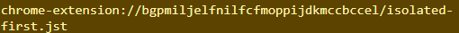
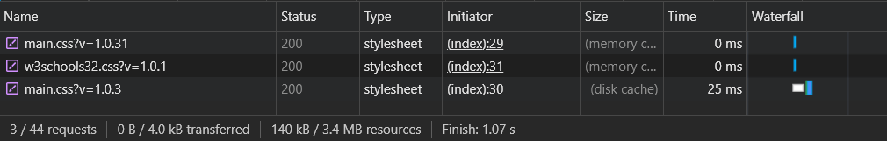
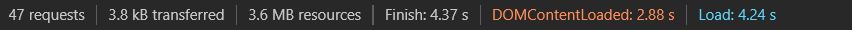

<!-- Otevřete pomocí Google Chrome stránku w3schools.com a pomocí Dev tools o ní zjistěte následující informace:

1. Sources panel (ladění JS)

a) Zjistěte, zda úvodní stránka w3schools provádí nějakou komunikaci s API a jaké jsou URL adresy serverů, se kterými komunikuje. 

Nemusíte psát všechny, stačí cca 3. -->
<!-- 1. -->

<!-- 2. -->

<!-- nejdele se stahuje -->
isolated-first.jst
<!-- requests -->

<!-- 3 -->
[performance](https://developer.chrome.com/docs/devtools/performance)
<!-- 4 -->
[memory](https://developer.chrome.com/docs/devtools/memory-problems)

<!-- 5 -->
Local používa.. asi? 2 a obe sú null.

Cookies používa, 5 ich tam je.

<!-- 6 -->
Ano ano

<!-- 7 -->
☺♥☻