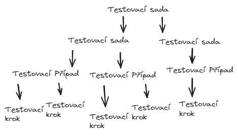

# Cviko 8.2.

- Testy v Moodlu
  - Budou dva -> 5. + 10. týden
    - 5.týden -> vše z prvních 4 týdnů
    - 10.týden -> vše z 5. – 9. týdne
  - Obsah – probraná látka (přednášky + cvičení)
  - Test bude obsahovat 25 otázek
  - Potřeba získat alespoň 60 % bodů z každého z obou testů -> 60 + 60 (ne 60% dohromady) -> (Nezaokrouhluje se 59.999 <> 60)
  - Přednášky a cvičení budou k dispozici na Moodlu

Pro získání klasifikovaného zápočtu je potřeba splnit následující podmínky – 3. Semestrální projekt

- Semestrální projekt – originální a samostatný (kontrola plagiátorství)
  - Možné vypracovávat už nyní (pouze prohlížeč chrome, jedna verze)
  - Testování zvolené webové stránky (webové aplikace) – mnou schválené
    - Viz informace cvičení a oznámení Moodle (mail)
  - Vypracování Word + Excel
  - Návrh 60 manuálních testovacích případů + 40 z nich vyberete a zautomatizujete pomocí Robot Frameworku (Selenium)
  - Celkový možný zisk 150 bodů
    - 60 za manuální testovací případy v patřičném tvaru a rozsahu (1 bod za test)
    - 60 za automatizované testovací případy v patřičném tvaru a rozsahu (1,5 bodu za test)
    - 30 bodů za celkovou formu a uspořádání do testovacích sad a kreativitu (může být subjektivní)
  - Potřeba získat alespoň, opět, 60 % bodů -> 90 bodů (Nezaokrouhluje se 59.999 <> 60)

# Cviko 15.2

<b>[krakovany.sk](https://www.google.com/url?sa=t&rct=j&q=&esrc=s&source=web&cd=&cad=rja&uact=8&ved=2ahUKEwj3_L7Cva2EAxUo3wIHHTyCAF4QFnoECBIQAQ&url=https%3A%2F%2Fwww.krakovany.sk%2F&usg=AOvVaw3STrm75z8TWCEdQbPir6TG&opi=89978449)
</b>

# Cviko 22.2

- Nainštaloval som robot framework

  - pip install robotframework

- Test case je nedílnou součástí testování -> základní stavebni prvek testu

- Testovací případ

  - muže byt jeden krok až tsíce
  - sdružuje se do testovacích sad (Test Suite)
  - Obsahuje testovací kroky (Test Step)
    - mali by na seba navazovat (krok po kroku)
  - Musí vždy obsahovat očekávaný výsledek
    - Muže být pro jednotlivé kroky -> spojení pak celý TC (Test case)

- Testovací případ obsahuje

  - Název + ID
  - Očekávaný výsledek
  - Testovací kroky
  - Možné nastavení před začátkem testu spuštení testu (pre-conditions)
  - Možné výstupní kroky (post-conditions)
    - nastavení, nejaké akce po skončení testu
    - Vyprázdnit pamět
    - Smazat dočastné soubory
    - Export logu
  - Popis (stručná sumarizace, k čemu slouží)
  - Vstupní data
    - cokoliv čo vstupuje do testú
    - napr. kontrolovaný text, šablony obrázku
  - Dále muže obsahovat
    - Prioritu spuštení
    - Datum vytvoření, autora
    - Odhadovaný čas doby spuštení
    - Manuální/automatizovyný
    - Verzi

- Testovací případy je vhodné sdružovat do testovacích sad
  
