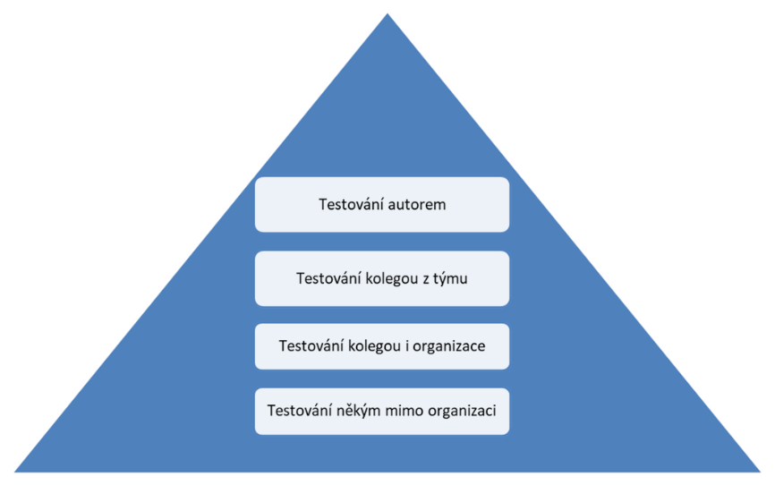
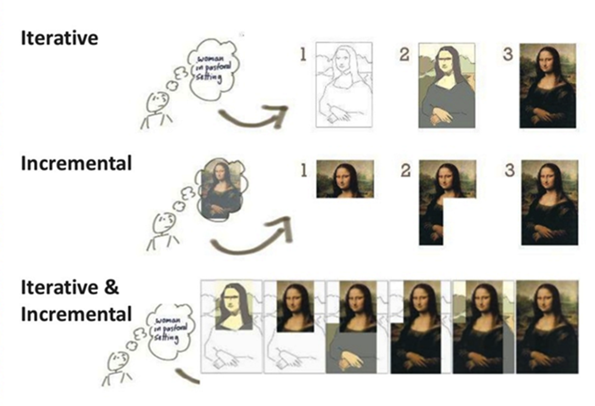
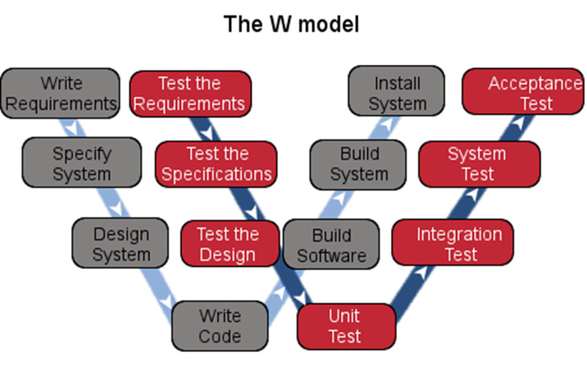

# 8.2.

- Proč je duležité testovat?

  - prevence - aby chyby nevznikli
  - aby sa našli chyby

- Software

  - je nedílnou součástí života a softwarové defekty a zejména pak selhání mohou mít závažný dopad
  - Software, kteŕy nepracuje správne muže vést ke
  - ztráte peňez, času
  - ztráte obchodní reputace
  - atď.

- Therac-25 (1985-87)

  - Dva zpusoby ozařování: elektronový nebo x-ray paprsek
  - 6 známych případu predávkování, 4 osoby zemřely
  - hlavní príčiny:
    - žádna nezávislá softwarová revize
    - Testování probíhalo až na místě sestavení

- Mars Climate Orbiter (1999)

  - Určená pro sledovýní podnebí na Marsu
  - Shořela v atmosféře
  - dodavatel pouzival imperialni jednotky

- USA Blackout (2003)

  - severo-východ USA
  - 55 mil postižených na nekolik dnú
  - ztráta 6 miliard dolaru
  - Příčina: bug v Unixu, který vypnul vizuální i zvukové alarmy, následné nezpracované události byly převedeny na záložní systém, který po čase zkolaboval

- Corrupted Blood (2005)

  - Wow, pouze 1 lokace
  - Nákaza šířící se z postavy na postavu, ale tato postava se mohla teleppo

- Rozdíl medzi verifikaci a validaci
  - verifikace
    - Dle požadavku
      - modely
      - normy
      - specifikace
    - Před zákazníkem
    - Stavame spravny produkt?
  - Validace
    - Dle potřeby uživatelu
    - Akceptace
    - Postavili sme spravny produkt?
- Omyl
  - produkují defekty (chyby, bugy) v programu
  - Pokud je defekt v kódu proveden, systém muže selhat
    - Omyl (lidský faktor)=> defekt (chyba, bug)=> |incident| =>selhání
    - 
  - Príčiny softwarových defektu
    - Lidé sú omylní
    - Software a infrastruktura jsou složité
    - Časová tíseň
    - Menící se technologie
    - Mnoho systémových interakcí
    - Selhání zaviněné okolími podmínkami

# 15.2

- Root Cause (Kořenová příčina)

  - Příčina vzniku chyby (prvotní omyl)
  - řešením lze zabránit podobným selháním/defektum
    - prevence
  - Typické kořenové příčiny
    -Nesrozumitelnost, neúplná specifikace, komunikace
    - Myslel jsem...
    - Nezkušenost
    - Časový tlak

- Statické vs Dynamické testování

  - Statické
    - Statická analýza - automatizované
    - Revize - manuální
  - Dynamické - vyžaduje spuštení
    - Hledáme selhání

- Kdy přestat s testováním?

  - Nikdy, testování není nikdy dost
  - musíte brát v úvahu rizika
    - Technický
    - Bezpečnostní
    - Obchodní
  - Měli byste (vy nebo vedoucí projektu) brát v úvahu omezení
    - Rozpočet
    - Čas
    - Termíny odevzdání

- Přínos testování ?

  - Včas -> odhalení defektů a prevence selhání
  - Hodnotit -> kvalitu
  - Pomoc s rozhodnutím
    - Co/jak/proč ?
  - Pochopení -> potřeby/uživatelé
  - Regulatorní podmínky
  - Ponaučení

- Typické cíle testování

  - Poskytnout iformace pro rozhodování
  - Zvýšení duvěry v kvalitu
  - Kontrola funkcionalit a očekávání všech zúčastněných stran
  - Podpora a zpětná vazba pro QA
  - Prevence

- Cíle závisí na kontextu

  - Kontext dle
    - SDLC -> Zvolený životní cyklus vývoje SW
    - Konkurence
  - SW pro jadrovou elektrárnu
    - rizika, hledání selhání a defektu
    - smluvní, právní, regulatorní požadavky
    - dokumentace
  - SW pro e-shop
    - hledání selhání a defektu
    - minimální dokumentace
    - nefunkcionální testy - uživatelská přívětivost, zátěž, kompatibilita a další

- Quality Assurance vs. Testování (Quality Control)

  - QA
    - Preventivní prístup
    - Zavádení a zlepsování procesu
    - Procesy pro kompletní vyvoj (včetne testováni)
    - Cely tym
  - Testováni
    - Analyzuje aktuální stav/kvalitu
    - "nápravny přístup"
    - Lesson Learned -> informace pro opravu + QA

- Testování vs. Ladëní (Debugging):
  - Vazba na-> omyl/defekt/selháni
  - Testování-> selhání a tím hledáni defektû
    - tester
  - Ladeni-> hledá priciny selháni a odstranit je
    - vyvojár

# 22.2

### Princípy testování

- Princip 1. - Testování poukazuje na přítomnost defektu
  - nikoliv na jejich nepřítomnost
  - nedokáže nepřítomnost
  - Snižuje pravděpodobnost výskytu
  - žadné defekty nalezeny neznamená, že defekty nie sú
- Princíp 2. - Kompletní testování není možné
  - Vše otestovat nejde -> myslíme opravdu vše
  - co testovat první
- Princíp 3. - Včasné testování šetři čas a peníze
  - chyba nalezená ve specifikaci / na produkci
  - čím dřív -> lépe
    - statistické testování
    - Vývojář -> Unit testy
- Princíp 4. - Shlukování defektu
  - Paretovo pravidlo -> 80:20 (80% problémú je v 20% kódu)
  - Faktory
    - Období
    - Vývojář
    - Část aplikace
    - Technologie
- Princip 5. - Testy se opotřebovávají
  - Stejné testy neodhalí nové chyby
  - regresní testy (konfirmační testy)
  - Změny v SW => změny v testech
    - Testy
    - Data
    - Přidání/modifikace/odebírání
- Princíp 6. - Testování je závislé na kontextu
  - Každou věc testujeme jinak
- Princíp 7. - Nepřítomnost defektu je klam
  - Business cíle zákazníky nejsou naplněny
  - Praktické využití
  - Očekávání
  - Subjektivní kvalita
  - Konkurence
  - "Použitelnost"

# 
1. TEST DONE

# 14.3.

### Testware

- je jakýkoliv produkt související s testováním
  - Testovací plán
  - Testovací sady
  - Testovací skripty
  - Testovací data
  - Simulátory a další
- Cokoli co přináši podporu testování

- Role v testování -> Tester vs Manažer testování

  - Záleží na kontextu
  - Obě role mohou vykonávat ruzní lidé na projektu
  - Tester - technická stránka
  - Manažer - procesy

- V praxi dělíme na více rolí dle odpovědnosti

### Testovací činnosti

- Plánování testování (QA + QC)
  - Testovací analýza
  - Návrh testu
  - Implementace testu
  - Provádění testu
- Dokončení testování (QA)
- Monitoring a řízení (QA)

### Plánování testování

- Hlavní činnosti
  - Definování cílu testování
  - Výběr přístupu, technik
- Testare
  - Harmonogram/plán
  - Rizika
  - Vstupní a výstupní kritéria

### Testovací analýza -> CO

- Hlavní činnosti
  - Analýza testovací báze -> posouzení testovatelnosti + revize
  - Identifikace "features" a testovacích podmínek
- Testware
  - Reporty o defektech v bázi
  - Seznam testovacích podmínek

### Návrh testu -> JAK, KDE, ČÍM

- Hlavní činnosti
  - Prvotní návrh testovacích případu
  - Stanovení potřeby testovacích dat
  - Návrh testovacího prostředí, infrastruktury
  - Volba technik
  - Volba nástroju
- Testware
  - Reporty o defektech v bázi
  - Seznam testovacích podmínek

### Implementace testů

- Hlavní činnosti
  - Tvorba a prioritizace TS + TC -> Testovací procedury
  - Harmonogram spouštění testů
  - Příprava testovacího prostředí a ověření
  - Zajištění testovacích dat
  - Konfigurace nástrojů
- Testware
  - Testovací procedury
  - Testovací data
  - Testovací prostředí + připravené nástroje

### Spouštění / provedení testů

- Hlavní činnosti
  - Manuální / automatizované testování
  - Vyhodnocení PASSED/FAILED
  - Report incidentů (bugů)
- Testware
  - Test logy
  - Reporty incidentů (defektů)

### Dokončení testování

- Hlavní činnosti
  - Kontrola „milníku“ projektu – kontrola výstupních kritérií
  - Testovací úroveň, iterace, nasazení
  - Tvorba souhrnné reportu testování
  - Vyhodnocení incidentů – co s nimi ?
  - Archivace testware
  - Zpětná kontrola procesů (Poučení)
- Testware
  - Report z testování (souhrn)
  - Změny + vylepšení
  - Dokumentace do budoucna

### Faktory, které ovlivní proces testování

- Potřeby, očekávání -> cíle
- Dovednosti a znalosti týmu
- Typ software (princip č. 6)
- Rizika a omezení
- SDLC (životní cyklus projektu)
- Nástroje

### Na co budou mít vliv faktory ?

- Techniky testování
- Míra testování (hloubka)
- Míra automatizace
- Míra podrobnosti – dokumentace, reportů

# 21.3.

Základní dovednosti a postupy

### Dovednosti testera ?

- Znalost testování a principů
- Znalost domény
- Důkladnost, pečlivost, zvídavost, „puntičkář“
- Metodická práce
- Analytické, kritické a logické myšlení
- Technické znalosti
- Nástroje
- Psychologie

### Tester poskytuje informace … i ty špatné.

- Opět lepší incident => bug
- Něčí práce/výstup -> „neukazovat prstem“
- Konstruktivnost
- Práce/vývoj je „tým“ => spokojený tým => kvalitní produkt => spokojený zákazník => spokojené vedení => spokojený tým :)

### Podpora komunikace

- Komunikace je základ
- Věcnost, důraz na fakta, konstruktivnost
- Neutrální nezaujaté reportování
- Spolupráce nad „souboj“
- Komunikace musí být oboustranná
- Odpovědnost má celý TÝM.

### Nezávislé testování ?

- Autor vs. Vývojář vs. Tester vs. Zákazník
- Další nezávislý pohled na věc.

  - Je nezbytný

- míra zaujetí

  

<!-- 2. prezentácia -->

### Testování v kontextu SDLC

- Modely SDLC

  - Sekvenční (Tradiční)
    - Vodopádový, V-Model
  - Iterativní (Agilní)
    - Spirálový model, prototypování
  - Inkrementální (Agilní)
    - RUP
  - Iterativně-inkrementální

  

### Specifické přístupy

- Extrémní programování
  - Velmi prísné (dbá se nekdy i na jídlo)
- Scrum
  - Agilní, volné
- Kanban
  - deelání vecí ktré na sobě nesovisí najednou, šetření času
- TDD, ATDD, BDD, DDD, FDD
  - … driven development

# 28.3.

### TDD – Test Driven Development

- Tvořím test
- Spouštím test
- Pokud fail -> vyvíjím dokud neprojde
- Ověřuji že procházejí všechny testy
- Refactoring -> opět ověřuji všechny testy

### ATDD, BDD a další

- Více k akceptační úrovni
- Zápis testů „Gherkin“
  - Given, When, Then

### SDLC ovlivní v testování

- Rozsah a načasování (kdy začít)
- Úroveň detailu dokumentace
- Volbu technik a přístupu
- Míra automatizace
- Role a odpovědnost testera

- Tester by měl znát specifikace a přizpůsobit se

### Tradiční vs. Agilní

| Sekvenční                          | Iterativní a inkrementální                        |
| ---------------------------------- | ------------------------------------------------- |
| Více plánuje, odhady dříve         | Iterace => funkční prototyp                       |
| Intenzivní statické testy a revize | Statické + dynamické každou iteraci               |
| Dynamické testy až na závěr        | Co iterace všechny úrovně testování               |
| Důraz na dokumentaci               | Změny jsou „vítané“                               |
| Méně automatizace                  | Méně dokumentace                                  |
| Black and white-box                | Více využívání technik založených na zkušenostech |
| Úrovně testů postupně              | Regresní testy + automatizace                     |

### Praktické postupy nezávislé na SDLC

- Vývojová aktivita má svou testovací aktivitu
- Testování má své úrovně
- Testovací aktivita by měla začít paralelně s vývojovou
- Testeři by se měli zapojit do revizí

  - Podpora včasného testování a shift-left principu

  

### Shift-left“ princip

- Zaměřuje se na prevenci
- Návrh testů před kódem
- Statické testování
- Revize
- Princip č. 3

## Úrovně testování a typy testů

### Specifika pro testovací úroveň

- Testované objekty – CO testujeme
- Cíle testování – CO chceme dosáhnout
- Testovací báze – z ČEHO vycházíme 
- Typické defekty – CO může být za problém
- Přístupy a role – KDO a JAK testuje 

### Testovací úrovně dle SDLC

- Sekvenční – navazují 
- Iterativně-inkrementální – překrývají 

### Testovací úrovně

- Testování komponent
- Integrační testování
  - Komponent
  - Systémů
- Systémové testování
- Akceptační testování

### Testování komponent

- Testování „elementárních“ částí
- V izolaci -> neřešíme okolí <!-- IMPORTANT -->
- Obvykle vývojář
- Speciální nástroje -> míra pokrytí 
- Jednotkové testy
- Testovací báze
  - Detailní technický návrh
  - Datový model
  - „kód“ <!-- Muzeme měřit pokriti kodu, ale nikdy byhc nemnel navrhovat unit-testy v souvislosti s kódem => nevycházim z kódu -->

### Testování komponent

- Stuby, drivery (Test harness – náhrady)
  - Stub (volaná komponenta)
  - Driver (volající komponenta)

### Integrační testování - komponent

- Interakce komponent <!-- Rozhrani - tlumočnník, spojnice --> 
- Kdo s kým a jak komunikuje
- Typicky testuje vývojář
- Defekty spočívají v chybějícím rozhraní nebo kompatibilitě
- Testovací báze
- Detailní technický návrh
- Specifikace rozhraní

### Integrační testování - komponent

- Shora – dolů
- Zespodu – nahoru
- „Big-bang“ -> nahodile

### Systémové testování

- Obvykle tester<!-- Testuje výhradne tester -->
- End-to-end testování (celek)
  - Vše je zintegrované
- Máme zde funkcionální a nefunkcionální testy
  - CO a JAK
- Testovací báze
  - Funkcionální specifikace <!-- Funkcionální (Co ten systém delá) a nefunkcionální (jak to ten systém delá, jak rychle?...) -->
  - Případy užití (Use cases)
- Po sem verifikace <!-- Deláme správne? -->

### Akceptační testování

- Validace <!-- Udelalli sme správny? -->
- Provádí výhradně uživatel
- Zde už není prostor pro hledání defektů
- Potvrzuje shodu se zákazníkovým očekáváním

### Akceptační testování
<!-- Akceptačních testu je více -->
- UAT -> Uživatelské akceptační testy
- Alfa a Beta testování <!-- Neplést si s alpha a beta verzemi -->
  - Alfa – interně externí
  - Beta – externí
- Smluvní a regulatorní akceptační testy
- Provozně akceptační testy
