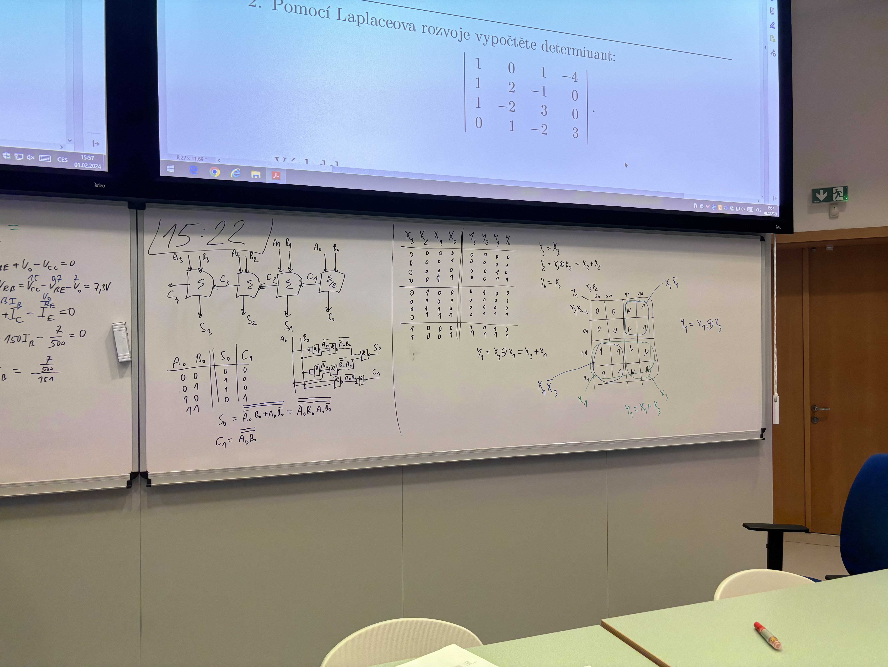
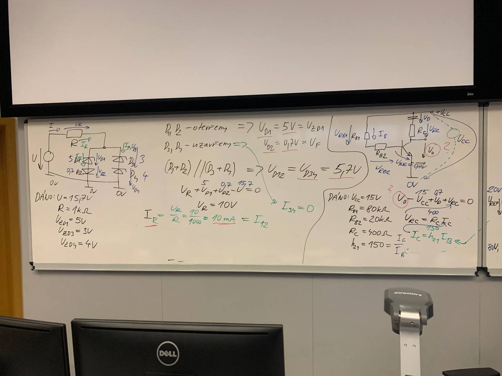

# OTÁZKY

1. **Energetická pásová struktura pevných látek; izolanty, polovodiče, kovy; typy vodivostí, drift a difúze.**
2. **Druhy polovodičů (vlastní a nevlastní polovodiče); generace a rekombinace páru elektron – díra.**
3. **P – N přechod, OPN, Schockleyho rovnice a voltampérová charakteristika P – N přechodu, měření charakteristiky, jevy na přechodu P – N.**
4. **Parametry polovodičových diod, technologie výroby polovodičů, druhy diod.**
5. **Diodové usměrňovače jednocestné, dvojcestné; porovnání vlastností jednotlivých typů usměrňovačů.**
6. **Stabilizátory napětí se Zenerovou diodou, integrované stabilizátory napětí.**
7. **Bipolární tranzistory, režimy tranzistorů, hybridní a admitanční charakteristiky, parametry bipolárních tranzistorů.**
8. **Základní zapojení bipolárních tranzistorů (SB, SC, SE), tranzistor ve funkci spínače.**
9. **JFET, odporový a saturační režim, mezní parametry, základní zapojení.**
10. **MESFET, ochuzovaní a obohacovací režim. IGBT a technologie CMOS.**
11. **MOSFET, zabudovaný a indukovaný kanál, mezní parametry, základní zapojení.**
12. **Tyristor, závěrný, blokovací a propustný režim. Tyristor jako spínač.**
13. **Diak a triak, voltampérové charakteristiky. Využití vícevrstvých součástek.**
14. **Fotoodpor, LED dioda, fototranzistor, fototyristor.**
15. **Fotodioda, odporový a hradlový režim. Optron, jeho využití.**
16. **Operační zesilovač, ideální a reálný OZ. Parametry OZ. Invertující a neinvertující zesilovač. Ochrana vstupů a výstupů OZ.**
17. **OZ jako napěťový sledovač; součtový, rozdílový OZ.**
18. **OZ ve funkci derivačního zesilovače a integračního zesilovače. OZ jako komparátor.**
19. **Číselné soustavy, převody mezi číselnými soustavami, aritmetické operace v číselných soustavách.**
20. **Kódy a kódování dat. Ochrana při přenosu kódů.**
21. **Logické funkce a základní logické členy, normy US, ČSN a IEC. Minimalizace logických funkcí.**
22. **Základní typy logik: logika DL, DTL, DCL, RTL a TTL.**
23. **Princip činnosti hradla NAND a NOR v TTL logice. Mezní parametry TTL logiky.**
24. **Statické (převodní, vstupní, výstupní, zatěžovací) a dynamické parametry TTL hradel. Měření parametrů hradel.**
25. **Logický zisk. Typy výstupů hradel TTL (s aktivním a pasivním výstupem, s otevřeným kolektorem, s třístavovým výstupem). Modifikace obvodů TTL.**
26. **Obvody CMOS. Princip činnosti investoru CMOS, princip činnosti hradla NAND v technologii CMOS. Charakteristiky CMOS obvodů. Propojení TTL a CMOS obvodů.**
    - Přednosti CMOS technologií:
      - malá statická spotřeba
      - větší hustota obvodů
      - jednodušší výroba
    - 
27. **Princip dekodérů, konstrukce dekodérů. Dekodér BIN na 1 ze 4, dekodér BCD na 1 z 10. Integrované verze dekodérů.**
    - Dekodér - převádí informaci z jiného druhu kódu na kód k z n
    - 
28. **Kodéry a rekodéry. Kodér 1 z 10 na BCD, dekodér z 8421 na 2421. Rekodér pro sedmisegmentový displej, jeho režimy.**
29. **Multiplexery a demultiplexery, multiplexerová logika.**
    - Multiplexer - elektronické přepínače logických signálů. Přepínání je ovládáno výběrovým (adresovým) signálem
    - Demultiplexer - přepíná v závislosti na výběrovém kódu jediný logický vstupní signál na jeden u n výstupů
30. **Elektronické komparátory, využití funkce XOR a XNOR pro konstrukci komparátorů.**
31. **Číslicové obvody pro aritmetické operace. Binární polosčítačka a úplná sčítačka, BCD sčítačka. Aritmeticko – logická jednotka.**

    - BCD - Binary Coded Decimal
    - Aritmeticko-logická jednotka (ALU) je část procesoru, která provádí aritmetické a logické operace.

32. **Klopné obvody RS a D, jednotlivé typy.**
    - RS klopný obvod
      - vstup R (reset) – nulovací
      - vstup S (set) - nastavovací
      - výstupy Q a !Q
      - vstupní hodnoty:
        - R = 0, S = 0 – stav paměti
        - R = 0, S = 1 – stav reset
        - R = 1, S = 0 – stav set
        - R = 1, S = 1 – nedovolený stav X
    - D klopný obvod
      - jde o synchronní klopný obvod
      - má jeden vstup D
      - výstupy Q a !Q
      - vstupní hodnoty:
        - D = 0 – stav reset
        - D = 1 – stav set
33. **Klopné obvody JK, využití klopných obvodů pro návrh sekvenčního obvodu.**

    - JK klopny obvod je nejvíce univerzální klopný obvod.

    |     | J   | K   | Qn    |
    | --- | --- | --- | ----- |
    | 1   | L   | L   | Qn-1  |
    | 2   | H   | L   | L     |
    | 3   | L   | H   | H     |
    | 4   | H   | H   | !Qn-1 |

    - řádek 2, 3 – výstup odpovídá vstupu na J
    - řádek 1 - pamatuje předchozí stav
    - řádek 4 – inverzní k předchozímu stavu

34. **Posuvné registry, statické a dynamické registry.**
    - Posuvné registry - slouží k posouvání vstupní sériové nebo paralelní informace
    - Statické - vstupní informace se zapisuje do vstupních klopných obvodů a výstupní informace se zapisuje do výstupních klopných obvodů
    - Dynamické - vstupní informace se zapisuje do vstupních klopných obvodů a výstupní informace se zapisuje do výstupních klopných obvodů a zároveň se posouvá do dalšího klopného obvodu
35. **Asynchronní čítače, princip činnosti, integrované verze.**
    - odinový puls je vázán na výstup předchozího vstupu
36. **Synchronní čítače, princip činnosti, integrované verze.**
    - hodinové vstupy jsou navázány paralelně na
      vstupní impulsy
37. **Dělič frekvence, konstrukce pomocí čítačů.**
38. **Vzorkovače, princip činnosti, chyby vzorkovačů.**
39. **A/Č převodníky, princip činnosti, typy převodníků a jejich chyby.**
    - jde o analogovědigitální převodník
    - princip činnosti:
      - vzorkování – odběr vstupního signálu v definovaných okamžicích, daných vzorkovacími impulsy
      - kvantování – odebraný vzorek je zaokrouhlen na hodnotu odpovídající nejbližší kvantovací úrovni
      - kódování – kvantované hodnoty jsou vyjádřeny čísly v určitém kódu
    - chyby:
      - chyba zesílení – je dána odchylkou sklonu skutečné převodní charakteristiky A/D od ideální
      - chyba nuly – je dána posunem převodní charakteristiky ve směru osy N
      - chyba linearity převodu
      - Kvantizační šum - rozdíl kvantovaného a vstupního spojitého signálu
    - Typy:
      - unipolární – vstupní rozsah 0 až Umax
      - bipolární – vstupní rozsah –Umax až Umax
      - komparační (neintegrační) – převádí na číslo okamžitou hodnotu vstupního napětí v určitém časovém okamžiku převodu
      - integrační – převádí na číslo průměrnou hodnotu napětí za určitý časový interval
40. **Č/A převodníky, princip činnosti, typy převodníků a jejich chyby.**
    - jde o digitálněanalogový převodník
    - princip činnosti:
      - převádí binární datová slova D na analogovou hodnotu napětí U
      - využívají se např. k nastavení analogových regulátorů pomocí PC
        
    - typy:
      - DA převodník s odstupňovanými rezistory
        - obsahuje odporový převodník jednotlivých cifer binárního čísla na proudy odpovídající vahám těchto cifer
      - DA převodník s rezistorovou sítí
        - obsahuje rezistorovou síť, která je připojena k operačnímu zesilovači

# SKÚŠKA

Často sa opakuje <!-- Rark — 15/01/2024 13:47 -->

- napětí v obvodu s tranzistorem tam párkrát bylo - společný kolektor/emitor/báze a hodnoty napětí na operačních zesilovačích, viz tohle
- jinak 3 a 4 jsou nějaké karnaughovy mapy/zapojení/logické funkce
- předpokládám že to nějak vyloženě nemění ale idk

## Variany

### 1. Varianta

1. diody obrz
2. tranzistor obrz
3. tabulka, k. mapa a zapojení polosčítačky a poté nakreslit 4-bit sčítačku

4. zase k. mapa jako u toho testu předem

5. Dvojcestný usměrňovač

   - 

6. co je to diak, schematická značka a k čemu se používá

   - dioda pre striedavý prúd
   - značka sú dve diody velda seba preškrtnuté
   - 
   - používa sa na prepínanie obvodov, sepne překročením blokovacího napětí

7. popis rozdíl mezi logickým a analogovým komparatorem
   - logický - vyhodnocuje pouze rovnost či nerovnost srovnávaných čísel (1 nebo 0)
   - analogový - vyhodnocuje relace =, >, <
8. k čemu slouží multiplexer

   - elektronické přepínače logických signálů.Přepínání je ovládáno výběrovým (adresovým) signálem

   
   

### 2. Varianta

1. diody obrz
1. tranzistor obrz
1. tabulka, polosčítačka pomoci NAND hradel a poté nakreslit 4-bit sčítačku
1. zase k. mapa jako u toho testu předem
1. dvoucestný můstkový usměrňovač
1. co je to diak, schematická značka a k čemu se používá
1. popis rozdíl mezi logickým a analogovým komparatorem
1. k čemu slouží multiplexer

   - Elektronické přepínače logických signálů. Přepínání je ovládáno výběrovým (adresovým) signálem

   
   

### 3. Varianta

5. parametry polovodicovych diod
   - Medzi polovodičom P a polovodičom N je hraničná plocha (PN prechod)
6. neco s tyristorem a jake mame druhy

   - Princíp:

     - Tyristor je polovodičová součástka, která má tři vrstvy polovodiče (NPN nebo PNP) a je schopna udržet vodivý stav i po odebrání spínacího signálu. Tyristor se spíná pomocí krátkého pulzního signálu na jeho řídící elektrodě (gate). Tyristor se spíná do vodivého stavu až po překročení určitého prahového napětí na anodě a zároveň přivedení spínacího signálu na gate. Tyristor se vypíná až po snížení proudu na nulu. Tyristor je nespínatelný zpět do blokovacího stavu, dokud proud nepoklesne na nulu.

   - Druhy tyristorů:
     - Tyristor
     - Triak
     - Diak

7. jake zname cislicove soustavy
   - binární
   - osmičková
   - desítková
   - hexadecimální
8. co je to multiplexer a k cemu se pouziva

   
   

### 4. Varianta

.

### 5. Varianta

.

## Random

