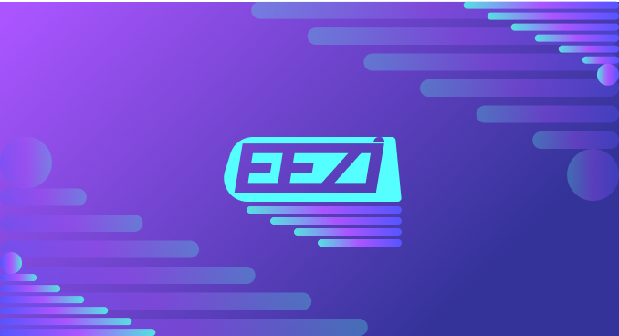

# EEZI
## Čo je to EEZI?
Eezi je socíalna sieť pre hudobníkov, umelcov a fanúšikov. 
Je to kombinácia sociálnej siete a hudobnej platformy.
(Kombinácia Instagramu, Soundcloudu a Spotify)
## Návrh entit/databázy
- ER diagram
  - 
- Schéma vzťahov
  - 
## Funkčné požiadavky
### 1. Používateľské účty
- Používateľské účty sú chránené heslom.
- Používateľ môže komentovať posty.
- Používateľ môže lajkovať posty.
- Používateľ môže sledovať iných používateľov.
### 2. Profily
- Používateľ môže vytvoriť svoj profil.
- Profil obsahuje informácie o používateľovi.
- Profil obsahuje informácie o hudobných skupinách, v ktorých používateľ hrá.
### 3. Posty
- Používateľ môže vytvoriť post.
- Post obsahuje textový obsah.
- Post obsahuje obrázok/video.
### 4. Singly
- Používateľ môže vytvoriť singel. (Audio súbor)
- Singel obsahuje názov.
- Singel obsahuje dátum vydania.
- Singel obsahuje cover obrázok.
### 5. Albumy
- Používateľ môže vytvoriť album. (Zoznam singlov)
- Album obsahuje názov.
- Album obsahuje dátum vydania.
- Album obsahuje cover obrázok.

## Nefunkčné požiadavky
### 1. Rýchlosť
- Stránka musí byť rýchla.
- Stránka musí byť responzívna.
- Stránka musí byť optimalizovaná pre mobilné zariadenia.
### 2. Bezpečnosť
- Heslá používateľov sú chránené.
- Heslá sú hashované.

## UI návrh
- Ukážka postov a albumov
  - 
  - 
- Ukážka postov a albumov na mobilnom zariadení
  - 
- Návrh loga 
    - 
    - 
