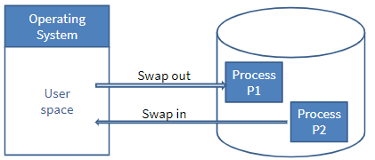
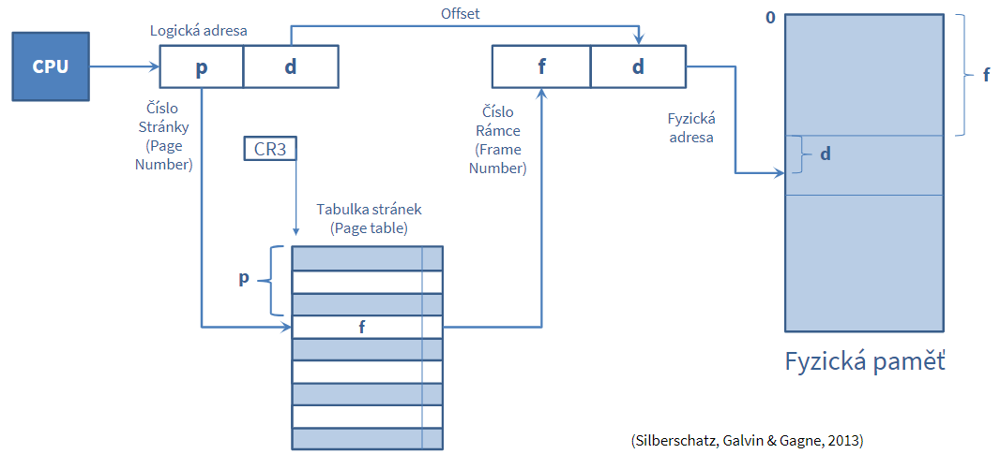
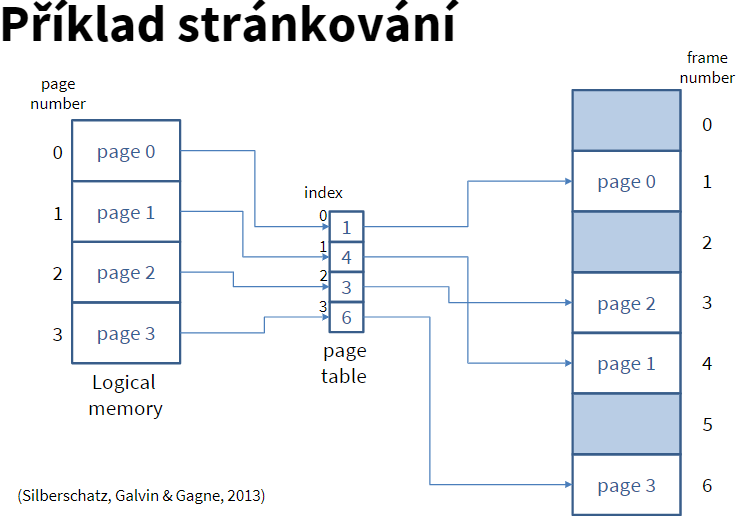
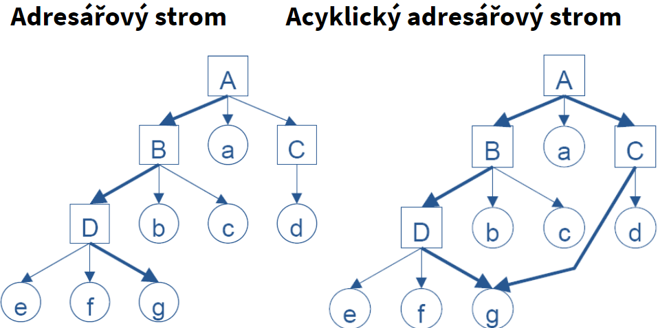
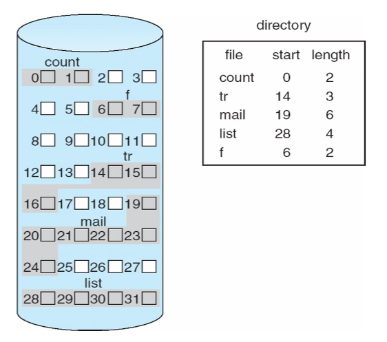
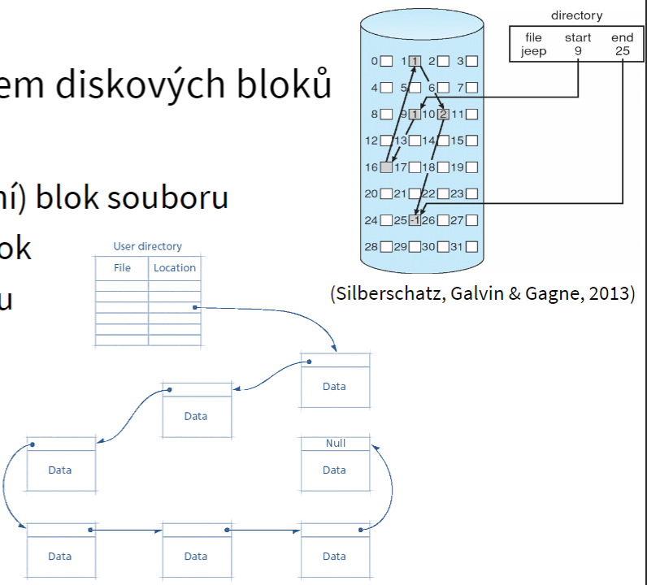
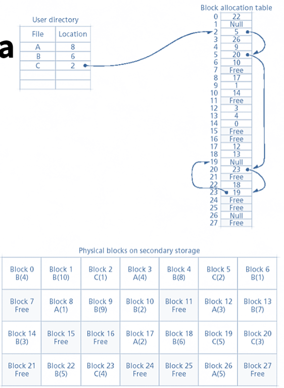
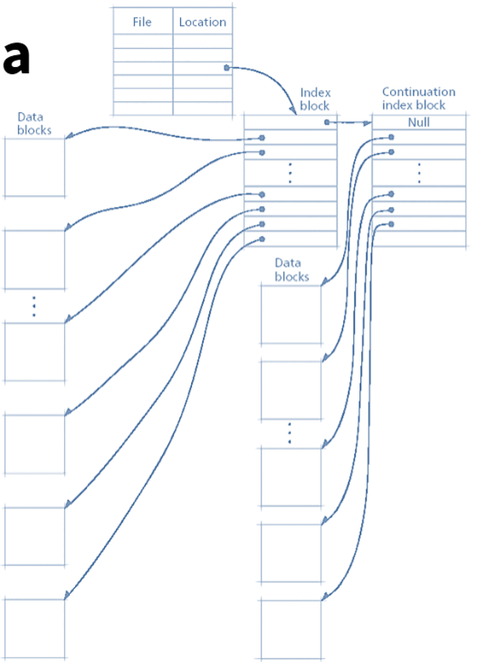
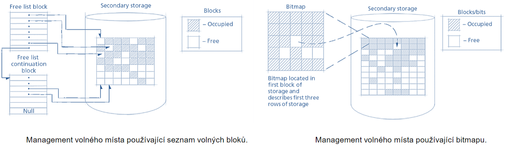

# 
OPSYS

## Témy na skúšku

- multitasking stránkování a Virtuální paměť
- Virtuální paměť, strankovanie a FAT
- Životní cyklus procesu Uváznutí
- Virtuální paměť, stránkování a Souborový systém EXT
- Virtuální paměť a stránkování + životní cyklus procesu
- Virtuální paměť + stránkování a výběr jakéhokoliv souborového systému
- Vlákna a Virtuální paměť + stránkování

### témy

    virtualna pamet, strankovanie
    Deadlock
    Suborovy system FAT
    EXT
    subeh
    Zivotny cyklus procesu
    Vlakna
    multitasking
    Prerusenia

# 
Virtuální paměť se stránkováním

- Swapování - Proces který se uloží z pamněti na disk, vždicky celý, lze tak využít "více" paměti
  - 
- FAP - Fyzický adresní prostor
- LAP - logický adresní prostor
- Dochází k překladu v cpu který kontroluje každý uživatelský přístup

## Stránkování

- Fyzický adresní prostor procesu může být nesouvislý
- FAP rozděluje na části pevné velikosti, nazývané rámce (frames)
- LAP rozděluje na části stejné velikosti, nazývané stránky (pages)
  - Velikost je mezi 512 B až 1 GiB
- Toto řeší externí fragmentaci ale pořád může vznikat interní fragmentace
- Adresa generovaná cpu se rozdělí na dvě části
  - číslo stránky v logické paměti
  - posun od začátku stránky (page offset)
  - 
  - 
- Stránky mají různé atributy
  - generic info - že je platná, jak je velká, komu patří
  - Řízení přístupu - read/write user/root
  - optimalizace - cache
  - statistiky - psalo se do ní, četlo se z ní a kdy
- Tabulka stránek může být dost velká
  - inverzní tabulka
  - dvouúrovňová tabulka
  - více tabulek hiearchivky

## Virtuální pamět

- Oddělení LAP od FAP
- LAP může být mnohem větší než FAP
- Virtuální paměť je implementována pomocí segemtnace nebo stránkování

# 
Souborové Systémy

- Struktura
- Organizují soubory a spravují přístup k datům
- poskytují jmenný prostor pomocí adresářů
- Adresář:
  - zvláštní případ souboru
  - Vytváří se adres. strom který obsahuje soubory a dresáře
  - Každý proces má svůj pracovní adresář
- Acyklická struktura
  - link: jeden soubor se odkazuje na druhý
  - Soft link - obsahuje text s cestou jinam
  - Hard link - fyzicky ve FS zapsaný jako soubor na který odkazuje
  - 
- Fragmentace je:
  - Externí - soubor je rozdělen na více částí
  - Vnitřní - Poslední klastr není plně využit, větší klastry tak způsobují větší ztrátu místa
  - Fragmentace volného místa - Vzniká mazáním malých souborů
- Způsob zápisu na disk
  - Souvisle:
    - Soubor je uložen po blocích za sebou
    - Pro přístup stačí pouze délka a pořáteční pozice
    - Velká fragmentace, nepoužívá se
    - 
  - Vázané přidělování
    - Každý soubor je provázaný seznamem diskových bloků (linked list)
    - Dost blbé je že pokud ztratíe jeden blok, ztratíte i zbytek bloků na který tento soubor ukazoval
    - Musí se vždy číst od začátku
    - 
  - Tabulkové přidělování
    - Udržuje provázaný seznam odkazů v tabulce
    - Položky adresáře označují první blok souboru
    - Aktuální číslo bloku se používá jako index do tabulky přidělování bloků k určení umístění dalšího bloku
    - např. Souborový systém FAT
    - 
  - Indexované přidělovýní
    - každý soubor má indeový blok nebo bloky
    - Obsahují seznam ukazatelů které ukazují přímo na datové bloky souborů
    - 
- Management volného místa
  - Dřív se neřešila
  - Volné pozice lze udržovat v:
    - seznamu
    - V bitmapě - 0vé bity značí volný blok
    - 
- KDE JE ULOŽEN NÁZEV SOUBORU - ADRESÁŘ
- Konzistence dat:
  - žurnálový systém (udžuje záznamy o provedených akcích, atomické operace)
  - Pokud dojde k selhání systému tak by data mohla být nekonzistentní
  - FS si udržuje informace o dokončených a rozdělaných operacích takže lze obnovit při pádu zpět na původní stav
- vysvětlit princip souborového systému -> tabulkový linkovaný seznam

## FAT

- Pojmenován podle způsobu ukládání - FileAlocationTable
- Udržuje provázaný seznam v samostatné tabulce
- Tabulka má dvě kopie
- Svazek formátovaný na FAT je alokován po clustrech
- Kluster - nejmenší možná věc kterou uložit na disk
- Vyhrazená oblast pro MBR
- Oblast FAT
- kořenový adresář
- Kořenový adresář má pevně danou pozici
- Vnitřně umí jen velká písmena, a pokud hledá tak si na to název převádí
